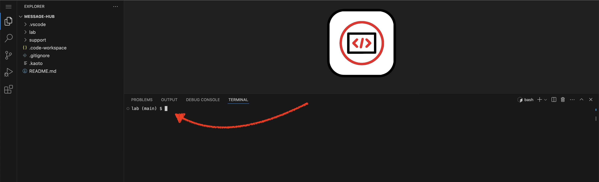
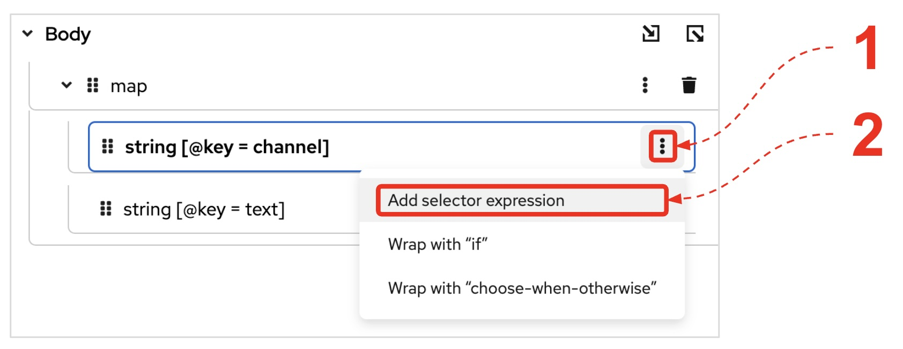

:walkthrough: Matrix to Rocket.Chat bridge ()
:user-password: openshift
:namespace: {user-username}-devspaces
:invite-url: http://invite-webapp.{openshift-app-host}

:url-element: https://element-matrix.{openshift-app-host}
:url-rocketchat: https://rocketchat-rocketchat.{openshift-app-host}
:url-codeready: http://devspaces.{openshift-app-host}/
:url-devconsole: {openshift-host}/topology/ns/{namespace}

:experimental:

:pen-btn: pass:[<svg height="2em" width="2em" viewBox="0 0 16 16" version="1.1" xmlns="http://www.w3.org/2000/svg" xmlns:xlink="http://www.w3.org/1999/xlink"><path fill="#444" d="M1 11.9l-1 4.1 4.1-1 9.2-9.2-3.1-3.1-9.2 9.2zM1.5 15l-0.4-0.5 0.4-2 2 2-2 0.5zM10.9 4.4l-8.1 8-0.6-0.6 8.1-8 0.6 0.6z"></path><path fill="#444" d="M15.3 0.7c-1.1-1.1-2.6-0.5-2.6-0.5l-1.5 1.5 3.1 3.1 1.5-1.5c0-0.1 0.6-1.5-0.5-2.6zM13.4 1.6l-0.5-0.5c0.6-0.6 1.1-0.1 1.1-0.1l-0.6 0.6z"></path></svg>]

:map-att: pass:[<svg width="1em" height="1em" viewBox="0 0 16 16" xmlns="http://www.w3.org/2000/svg" fill="none" stroke="currentColor" stroke-width="1" stroke-linecap="round" stroke-linejoin="round" class="bi bi-box-arrow-in-down-right"> \
  <path d="M6.364 2.5a.5.5 0 0 1 .5-.5H13.5A1.5 1.5 0 0 1 15 3.5v10a1.5 1.5 0 0 1-1.5 1.5h-10A1.5 1.5 0 0 1 2 13.5V6.864a.5.5 0 1 1 1 0V13.5a.5.5 0 0 0 .5.5h10a.5.5 0 0 0 .5-.5v-10a.5.5 0 0 0-.5-.5H6.864a.5.5 0 0 1-.5-.5z" /> \
  <path d="M11 10.5a.5.5 0 0 1-.5.5h-5a.5.5 0 0 1 0-1h3.793L1.146 1.854a.5.5 0 1 1 .708-.708L10 9.293V5.5a.5.5 0 0 1 1 0v5z" /> \
</svg>]

:map-tick: pass:[<svg width="1em" height="1em" viewBox="0 0 24 24" fill="none" xmlns="http://www.w3.org/2000/svg" stroke-width="1"> \
<path d="M4.89163 13.2687L9.16582 17.5427L18.7085 8" stroke="#000000" stroke-width="3.5" stroke-linecap="round" stroke-linejoin="round"/> \
</svg>]

:map-import: pass:[<svg width="1em" height="1em" viewBox="0 0 512 512" xmlns="http://www.w3.org/2000/svg" fill="#FFFFFF"> \
  <path d="M16 288c-8.8 0-16 7.2-16 16v32c0 8.8 7.2 16 16 16h112v-64zm489-183L407.1 7c-4.5-4.5-10.6-7-17-7H384v128h128v-6.1c0-6.3-2.5-12.4-7-16.9zm-153 31V0H152c-13.3 0-24 10.7-24 24v264h128v-65.2c0-14.3 17.3-21.4 27.4-11.3L379 308c6.6 6.7 6.6 17.4 0 24l-95.7 96.4c-10.1 10.1-27.4 3-27.4-11.3V352H128v136c0 13.3 10.7 24 24 24h336c13.3 0 24-10.7 24-24V160H376c-13.2 0-24-10.8-24-24z"/> \
</svg>]

:btn-stl-blue: pass:[style="display:inline-block; padding:10px 22px; background:#007bff; color:white; font:normal 14px Arial,sans-serif; border-radius:40px; cursor:default; user-select:none; text-decoration:none;"]

// WORKS
:style-kbd: kbd { \
  color: black; \
  background-color: white; \
  border: 1px solid black; \
  box-shadow: 0px 1px black; \
  font-size: .85em; \
  line-height: .85em; \
  display: inline-block; \
  font-weight: 600; \
  letter-spacing: .05em; \
  padding: 3px 5px; \
  white-space: nowrap; \
  border-radius:5px; \
} \

:style-summary: summary {cursor: pointer; list-style: none;}
:style-triangle: .triangle {margin-right: .5em;} summary:hover .sumtext {text-decoration: underline;}
:style-details:  .triangle::before {content: "▶";} details[open] .triangle::before {content: "▼";}
:style-open-close: {style-summary}{style-triangle}{style-details} 

:style-preview: pre {background-color: #272822; color: white; padding: 5px 15px; font-size: 15px}
:style-indent: .indent2 {padding-left: 2rem;}
:style-all: pass:a[]

:url-docserver: https://docserver-webapp.{openshift-app-host}
//:url-docserver: https://docserver-webapp.apps.cluster-mqpjp.dynamic.redhatworkshops.io/
//:url-docserver: http://0.0.0.0:8080

:docserver-status: pass:a[ response.text()) \
        .then(data => this.parentElement.innerHTML = 'Status: 

&nbsp;
') \
        .catch(error => this.parentElement.innerHTML = 'Status: 

&nbsp;
') \
      ">]

:freplace: pass:[function replaceTokens(templateString, values) { \
    const valueArray = values.split(',').map(val => val.trim()); \
    let result = templateString; \
    let replaceIndex = 0; \
    while (result.includes('REPLACE') && replaceIndex < valueArray.length) { \
        result = result.replace('REPLACE', valueArray[replaceIndex]); \
        replaceIndex++; \
    } \
    return result; \
}]

//:fdocserver: pass:a[function docserver(target,template,params) { \
//    {freplace} \
//    fetch('{url-docserver}/roomid?user='+params) \
//        .then(response => response.text()) \
//        .then(data => {target.firstChild.data=replaceTokens(text, data);}) \
//        .catch(error => room = 'Error fetching data: ' + error.message); \
//}]

:fdocserver: pass:a[function docserver(target,template,params) { \
    {freplace} \
    fetch('{url-docserver}'+params.trim()) \
        .then(response => response.text()) \
        .then(data => {target.firstChild.data=replaceTokens(text, data);}) \
        .catch(error => room = 'Error fetching data: ' + error.message); \
}]

:fcopy: pass:a[function copy(el) { \
  el.previousElementSibling.select(); \
  text = el.previousElementSibling.textContent; \
  console.log(text); \
  navigator.clipboard.writeText(text + '\n') \
        .then(response => console.log('Text with carriage return copied to clipboard!')) \
        .catch(err => console.error('Failed to copy: ', err)); \
}]

:copypaste: pass:a[ \

 \
  <textarea readonly style="field-sizing: content;border: none; background-color: #f0f0f0; width: 100%; resize: none; font-size:14px; font-family: monospace;padding: 5px 15px" rows="4">function example() { \
  console.log("Hello {replace-with-previous}!"); \
  return true; \
}</textarea> \
  <button class="mytooltip" onclick="{fcopy} copy(this);" style="border: none; background-color: white; padding: 5px 15px; border-bottom: 1px solid transparent; transition: border-bottom-color 0.2s;"> \
    <svg fill="currentColor" height="1em" width="1em" viewBox="0 0 448 512" aria-hidden="true" role="img" style="vertical-align: -0.125em;"> \
      <path d="M320 448v40c0 13.255-10.745 24-24 24H24c-13.255 0-24-10.745-24-24V120c0-13.255 10.745-24 24-24h72v296c0 30.879 25.121 56 56 56h168zm0-344V0H152c-13.255 0-24 10.745-24 24v368c0 13.255 10.745 24 24 24h272c13.255 0 24-10.745 24-24V128H344c-13.2 0-24-10.8-24-24zm120.971-31.029L375.029 7.029A24 24 0 0 0 358.059 0H352v96h96v-6.059a24 24 0 0 0-7.029-16.97z"></path> \
    </svg> \
    Copy to clipboard \
  </button> \
   \

 \
 \
]

:snippet: pass:a[ \

 \

 \
 \
]

:room: pass:a[ \
 \
]

ifdef::env-github[]
endif::[]

[id='lab1-camel']
= Lab 1 - (b) - Be the Camel developer

Impersonate the Camel developer to complete Lab-1's Matrix to Rocket.Chat processing flow.

[type=walkthroughResource,serviceName=openshift]
.Invite System
****
[subs=attributes]
++++

{docserver-status}

++++
****

Prerequisites: +
--
* Ensure you have previously completed the following tiles:
+
image::images/prereq.png[align="left", width=100%]

{empty} +
--

Technical goals and milestones:

* Development of a _no-code_ integration (_Kamelet_ binding)
* Define JSON data transformers.
* Use of _Camel JBang_ for fast prototyping
* Local execution and testing
* Deployment in OpenShift

{empty} +

The instructions below are divided in two segments:

* Local development (and testing)
* Deployment in OpenShift

{empty} +

[time=10]
[id="kaoto-overview"]
== Quick overview of Kaoto 
{style-all}

Most of the processing flows you'll construct during the workshop will be built using Kaoto, the integration designer for Apache Camel.

Kaoto is integrated in VS Code as an extension easy to find in the marketplace and install.

NOTE: The Kaoto extension is already pre-installed for you in Dev Spaces.

image::images/new/vs-code-kaoto.jpg[align="left", width=40%]

{empty} +

With Kaoto, you will define and configure many of the well known Camel constructs using its graphical user interface. Among other tasks, Kaoto will help you to:

 - Define Camel routes
 - Define Kamelets
 - Define data transformations
 - Apply EIPs (Enterprise Integration Patterns)

{empty} +

This is how Kaoto will load on your Dev Spaces IDE:

image::images/new/kaoto-overview.jpg[align="center", width=100%]

{empty} +

When you click, in the project explorer, one of the files with Camel definitions, Kaoto will open it as a tab and render it visually so that you can interact to work on the Camel constructs.

You will start using Kaoto in the next lab section to work on the Camel routes. Each Camel route defines a data flow you need to construct the solution.

{empty} +

[time=10]
[id="local"]
== Local development 
{style-all}

[type=taskResource]
.Credentials
****
* *username:* `{user-username}`
//* *password:* `{user-password}`
****
[type=taskResource]
.Red Hat OpenShift Dev Spaces
****
* link:{url-codeready}[Console, window="_blank"]
****
[type=taskResource]
.Red Hat OpenShift Developer Console
****
* link:{url-devconsole}[Topology View, window="_blank"]
****
[type=taskResource]
.Matrix
****
* link:{url-element}[Matrix Web Client, window="_blank"]
****
[type=taskResource]
.Rocket.Chat
****
* link:{url-rocketchat}[Rocket.Chat Web Client, window="_blank"]
****

For reference, here's again the processing flow to implement:

image::images/new/processing-flow.jpg[align="center", width=80%]

The Camel route will include 3 processing steps:

====
* *A source _Kamelet_* +
Consumes events from _Matrix_.

* *A data mapping* +
Transforms _Matrix_ events to _Rocket.Chat_ events (in JSON format).

* *A sink _Kamelet_* +
Produces events to _Rocket.Chat_.
====

{empty} +

[IMPORTANT] 
--
You need to already be onboarded into _Matrix_ and _Rocket.Chat_. +
Ensure you have previously completed: 

- *_Lab 1.intro - MessageHub - Scenario and Onboarding_*.
--

{empty} +

The development tool that will help us iterate our code in our local environment is _Camel JBang_.

image::images/camel-jbang.png[align="left", width=40%]

{empty} +

TIP: Camel JBang is an upstream tool for _Camel_. The tool is included in Red Hat build of Apache Camel under the name _"Camel CLI"_. +
It is an extremely useful tool for all things Camel. It simplifies many of the common tasks a Camel developer undergoes. 
 

=== Start the lab

At first, your `lab` directory is empty:

--
[.indent2]
📁 workshop +
&nbsp;&nbsp;📁 *lab* +
pass:[<mark style="padding-left: 1rem; background-color: white; color: grey"></mark>] [empty]
--

{blank}

IMPORTANT: All the commands you'll be asked to run all along the workshop are designed to be executed from your root `lab` folder. +
Stay always on your `lab` folder, there's no need to change directories.

{empty} +

From your UI terminal...

{blank}

We provide below a base skeleton to get you started:

[IMPORTANT]
====
Issue the command below to officially start your lab:

--
{copypaste}
----
start
----
--

NOTE: The command will initialise the lab with a couple of files.
====

// {empty} +

[NOTE]
====
The lab has a collection of handy scripts you'll need to use when instructed, such as:

- *start* / *restart*
- *ff* (fast-forward to the next step)
- *rw* (rewind to the previous step)
- *step* (jump to step)
- *chat* (curl-based script to interact with _Camel_)
====

{empty} +

=== Your files

After initialisation, under the `lab` directory, you'll find the following source files:

--
[.indent2]
📁 workshop +
&nbsp;&nbsp;📁 lab +
&nbsp;&nbsp;&nbsp;&nbsp;📁 m2r +
pass:[<mark style="padding-left: 2rem; background-color: white; color: purple"><b><i>&nbsp;!&nbsp;&nbsp;</i></b></mark>] *m2r.camel.yaml* +
pass:[<mark style="padding-left: 1rem; background-color: white; color: grey"><b>⚙</b></mark>] matrix.properties +
pass:[<mark style="padding-left: 1rem; background-color: white; color: grey"><b>⚙</b></mark>] rocketchat.properties +

NOTE: Make sure the files are visible in your file explorer in the left panel of _VSCode_.
--

. Open in Kaoto the first Camel route. 
+
Under your `lab/m2r` directory, find and open the following flow definition:
+
--
* `m2r.camel.yaml`
--
+
{blank}
+
The image below shows the Camel route you should see in the canvas:
+
[TIP]
====
Click the Horizontal layout to match the documentation pictures.

image::images/new/canvas-horizontal-layout.jpg[align="left", width=40%]
====
+
image::images/new/route-matrix-log.jpg[align="left", width=30%]
+
{blank}
+
What you see above is a *_'Kamelet to Log'_* route, basically a Camel route with 2 processing steps. +
The Kamelet source _(Matrix)_ receives message notifications. The Log activity outputs the contents of the message.
+
[NOTE]
--
About the `matrix-source` _Kamelet_:

* It's not provided out of the box by Camel. It has been specifically created and deployed for this workshop.
* It's implemented following the specification of the Matrix Sync API (new Matrix's API) to consume events from the server. To know more, read its API documentation here: https://spec.matrix.org/v1.6/client-server-api/#syncing
--
+
[NOTE]
--
When inspecting the route configuration in Kaoto, you'll see the following:

* The Kamelet defines `variableReceive: matrix` to allocate the data of the incoming message (`body` is ignored).
* The route logs the incoming event using the Camel's simple expression `${variable.matrix}`.
--
+
{empty} +

. Configure the _Matrix_ credentials
+
Open in your editor your `matrix.properties` file and add the following entries:
+
--
{copypaste}/configuration/matrix/{user-username}
----
# Matrix credentials
matrix.token=REPLACE
matrix.room=REPLACE
----
--
+
NOTE: both parameters have been automatically pre-configured for your use in this lab.
+
{empty} +

. Run your YAML definition with Camel JBang
+ 
Use the following command to run locally your _Camel_ route:
+
--
{copypaste}
----
camel run \
--source-dir m2r \
--properties matrix.properties \
--local-kamelet-dir ../support/kamelets
----
--
+
NOTE: The command above includes flags to tell _Camel JBang_ where to find the resources needed (code, properties, _Kamelets_).
+
{blank}
+
_Camel JBang_ will build a local runnable and start it. +
In your terminal logs, you should see _Camel_ connecting to _Matrix_, similar to the following:
+
++++
<pre style="line-height: 1;white-space: pre-wrap">2025-10-30 21:59:34.277 INFO 4330 --- [           main] .impl.engine.AbstractCamelContext : Apache Camel 4.15.0 (m2r) started in 800ms (build:0ms ...)
2025-10-30 21:59:35.176 INFO 4330 --- [atrix-streaming] matrix-source.kamelet.yaml:58     : Opening connection to Matrix...
2025-10-30 21:59:35.390 INFO 4330 --- [atrix-streaming] matrix-source.kamelet.yaml:67     : Matrix HTTP Streaming started
</pre>
++++
+
[NOTE]
====
A window notification may pop up at the bottom-right corner of your screen. +
Close it, or simply ignore it, as it disappears after a few seconds.

image::images/new/che-port-8080.png[align="left", width=40%]
====
+
{empty} +
+
Now, from the _Matrix_ chat room, send a message.
+
* For example:
+
--
{copypaste}
----
Hello Camel
----
--
+
image::images/gitter-send-message.png[align="left", width=60%]
+
{blank}
+
Your terminal should show the arrival of a _Matrix_ event similar to the following JSON payload:
+
[subs="attributes+"]
++++
<pre style="line-height: 1;white-space: pre-wrap">2025-10-30 21:59:55.672 INFO 4330 --- [ad #7 - WireTap] m2r.camel.yaml:12     : {"fromUser":{"username":"{user-username}","displayName":"{user-username}"},"text":"Hello Camel","sent":"2025-10-30T21:59:55.000Z"}
</pre>
++++
+
NOTE: Find the message content highlighted in yellow.
+
{blank}
+
Hopefully you've been successful in capturing _Matrix_ messages with _Camel_.
+
{empty} +

. Stop Camel JBang 
+
Press kbd:[Ctrl+C], from your terminal, to stop the running _Camel_ process.
+
[TIP]
--
_Camel JBang_ also implements the following very handy commands when running multiple _Camel_ integrations:

* `camel ps` to list running _Camel_ integrations.
* `camel stop <instance_name>` to shut down a running _Camel_ integration.  
--
+
{empty} +

This completes you first flow iteration and run consuming messages from _Matrix_.

In your next exercise you keep iterating, completing the flow with the following:
* Adding data transformation using Kaoto's DataMapper.
* Directing the messages to _Rocket.Chat_

{empty} +

[type=verification]
Did you see the message sent from _Matrix_ show up in your terminal?

[time=10]
[id="data-mapping"]
== Add data transformation 
{style-all}

You next task is to add a data transformation step in your Camel route.

Kaoto comes with a visual _DataMapper_ tool you will use to define your _Matrix_ to _Rocket.Chat_ data transformation, as a first introductory exposure to the tool.

[type=taskResource]
.Credentials
****
* *username:* `{user-username}`
//* *password:* `{user-password}`
****
[type=taskResource]
.Red Hat OpenShift Dev Spaces
****
* link:{url-codeready}[Console, window="_blank"]
****
[type=taskResource]
.Red Hat OpenShift Developer Console
****
* link:{url-devconsole}[Topology View, window="_blank"]
****
[type=taskResource]
.Matrix
****
* link:{url-element}[Matrix Web Client, window="_blank"]
****
[type=taskResource]
.Rocket.Chat
****
* link:{url-rocketchat}[Rocket.Chat Web Client, window="_blank"]
****

Let's get started.

. Include data transformation
+
You will extend the _Camel_ route definition to include data transformation to match the JSON structure the target system (_Rocket.Chat_) expects.
+
NOTE: The first time you define a data mapping, the process feels laborious as you learn the steps. +  
With practice, you will create data mappings quickly and intuitively.
+
.. Include in your Camel route a Kaoto data transformation step
+
--
From Kaoto: 

. Click the kbd:[+] button in the transition
. Type `mapper` in the filter to find the _Kaoto DataMapper_
. Click the _Kaoto DataMapper_ tile
. Click the mapper to open the configuration panel
. Click the `🔧Configure` button

image::images/new/canvas-create-mapper.jpg[align="left", width=100%]

When you create and open a new mapping definition, you will find it empty. +
The picture belows shows some of the main parts you will interact with:

image::images/new/mapper-empty.png[align="left", width=100%]

{empty} +

--
+
.. Next, define the inputs and outputs
+
--
From the DataMapper editor: 

. Define the source:
.. On **Parameters** click the button kbd:[+] to add new parameter
.. Enter `matrix` and click the checkmark button kbd:[{map-tick}]
.. Click kbd:[{map-att}] (Attach schema), next click 
pass:a[{map-import}] and then pick at the top of your screen: `support/schemas/*matrix-in.json*`.
.. Click pass:a[Attach] to complete the action.
+
{blank}
+
. Define the target
.. On the right hand side of the DataMapper screen: +
Click kbd:[{map-att}] (Attach schema), next click 
pass:a[{map-import}] and then pick at the top of your screen: `support/schemas/*rocketchat-out.json*`.
.. Click pass:a[Attach] to complete the action.

{empty} +

Once your in and out schemas have been attached your DataMapper should look as follows:

image::images/new/mapper-m2r.png[align="center", width=90%]

--
+
{empty} +
+
.. Define the data mappings from source to target
+
Copy and Paste the values below to define the given field entries:
+
... `string[@key = channel]`: 
+
--
{copypaste}/roomid/{user-username}
----
"REPLACE"
----
--
+
[TIP]
====
To paste the value, click `⠇` and select **Add selector expression**, as shown below:

====
+
{blank}
+
... `string[@key = text]`:
+
To map the field, click and drag kbd:[string [@key = text\]] from the source (left) to the target (right).
+
A connection will be created between source and target, rendered as follows:
+
image::images/new/mapper-text.jpg[align="left", width=80%]
+
{empty} +
+
.. Refine the mapping by using a function
+
The last mapping above simply copies the message from source to target, as in the _hello_ example below:
+
--
* `hello` -> `hello`
--
+
{blank}
+
However, we want to see in Rocket.Chat information about the user and origin. +
It means the mapping would need to happen as follows:
+
--
* `hello` -> `*{user-username}@matrix:* hello`
+
NOTE: The message above includes **bold** letters. +
As the target system understands _Markdown_, we will use it to format the message, as follows: +
`pass:a[*{user-username}@matrix:* hello]`
--
+
For the result above to happen, the following concatenation of segments needs to occur:
+
====
* `*`: the _Markdown_ symbol to start a bold string 
* `{user-username}`: from the source field *username*
* ``@matrix:* ``: the originating system and the closing _Markdown_ symbol 
* `hello`: from the source field *text*
====
+
{blank}
+
All the segments above can be concatenated in the Data Mapper using the XPath function `concatenate`.
+
NOTE: XPath is a simple language for finding and selecting specific parts in a data structure. The language comes with many handy out-of-the-box functions.
+
Open the XPath editor by clicking kbd:[{pen-btn}] at the end of the row.
+
image::images/new/mapper-xpath-editor-view.png[align="left", width=80%]
+
{blank}
+
On the left you'll find fields and functions you can drag and drop into the blue text area. +
You'll find in the text blue area the current mapping expression for the target field kbd:[string[@key = text\]] (text in Rocket.Chat).
+
You're going to perform 2 actions:
+
--
. Define the string segments (as explained earlier)
. Wrap the segments with a `concatenate` function
--
+
{empty} +
+
Let's start with 1. Define the segments:
+
[NOTE]
====
The *preview* below shows the expected outcome of the actions you're about to do: 

++++

  <pre style="margin:0; background:#EAFAFA; padding-left:50px; border:none; outline:none;">
1'*'
2, $matrix-x/fn:map/fn:map[@key='fromUser']/fn:string[@key='username'],
3'@matrix:* '
4, $matrix-x/fn:map/fn:string[@key='text']</pre>

++++
====
+
====
[lowerroman]
. Delete current expression (blue text area empty).
. Copy and paste:
+
--
{copypaste}
----
'*'
----
--
+
. Drag and drop from the left to the editor +
kbd:[string [@key = username\]] -> `editor`
+
{blank}
+
. Copy and paste (including the comma and new line):
+
--
{copypaste}
----
,
'@matrix:* '
----
--
+
. Drag and drop from the left to the editor +
kbd:[string [@key = text\]] -> `editor`
+
{empty} +

IMPORTANT: Your segments should now be defined matching the *preview* shown earlier. +
Verify they match, and make corrections if necessary.
====
+
{empty} +
+
Let's now do 2.
+
--
. On the editor's left panel click the tab: +
 **[    Function    ]**
+
{blank}
+
. Drag and drop the _String_ function *_Concatenate_* from left to right +
kbd:[Concatenate] -> `editor`
+
{blank}
+
[NOTE]
====
After you drop the function, you should see in your blue text area the following result:

++++

  <pre style="margin:0; background:#EAFAFA; padding-left:50px; border:none; outline:none;">
1concat('*'
2, $matrix-x/fn:map/fn:map[@key='fromUser']/fn:string[@key='username'],
3'@matrix:* '
4, $matrix-x/fn:map/fn:string[@key='text'])</pre>

++++
====
+
. The definition is complete, click pass:a[Close]
--
+
{empty} +
+
When you close the editor you should see the field connections in your mapper as follows:
+
image::images/new/mapper-user-text.jpg[align="left", width=90%]
+
[TIP]
====
If you don't see the data connections above try again as follows: 

. Click the trash button to delete the current expression
. Click the dots to add a new expression
. Copy and paste the expression below:
+
--
{copypaste}
----
concat('*', $matrix-x/fn:map/fn:map[@key='fromUser']/fn:string[@key='username'],'@matrix:* ', $matrix-x/fn:map/fn:string[@key='text'])
----
--
====
+
Your data mapping definition is now complete with multiple input fields mapped to output fields.
+
{empty} +

. Log the body
+
Update the log activity from:
+
* `${variable.matrix}` -> to `${body}`
+
NOTE: The Matrix Kamelet is configured to store events in a variable `matrix`, however, the data mapper outputs the result in the `body`.
+
{empty} +

. Run the flow again by issuing the following command:
+
--
{copypaste}
----
labrun m2r \
--properties matrix.properties
----
--
+
[pass]

  

    
    Click for more information
  

We provide the script <code>labrun</code> to help you read the commands more clearly. 
Under the hood the script calls <i>Camel JBang</i> as per the snippet below:
<pre>
camel run \
--source-dir m2r \
--properties matrix.properties \
--local-kamelet-dir ../support/kamelets
</pre>

+
{empty} +

. From Matrix send another chat message and inspect your terminal output. +
You should see an incoming event now transformed and looking similar to this:
+
--
{snippet}{user-username}
[subs="attributes+"]
----
{"channel":"REPLACE","text":"*{user-username}@matrix*: Hello Camel"}
----
--
+
At this stage you're ready to forward messages to _RocketChat_ using its dedicated _Kamelet_.
+
{empty} +

. [[step-rocketchat-sink]]Include the Rocket.Chat Kamelet.
+
Copy from below the step definition, and paste it at the end of your Camel route.
+
TIP: Right-click over the _Log_ step and select  `📋 Paste as next step`.
+
--
{copypaste}
----
{
  "type": "Route",
  "name": "to",
  "definition": {
    "uri": "kamelet",
    "description": "RocketChat",
    "parameters": {
      "templateId": "rocketchat-sink",
      "userid": "{{rocketchat.userid}}",
      "token": "{{rocketchat.token}}"
    }
  },
  "__kaoto_marker": "kaoto-node"
}
----
--
+
NOTE: In the next release of Kaoto, copy/paste actions into the canvas will be done in YAML. The current format is still JSON.
+
{empty} +

. Configure the _Rocket.Chat_ credentials
+
Open in your editor your `rocketchat.properties` file and add the following entries:
+
--
{copypaste}/configuration/rocketchat/{user-username}
----
# Rocket.Chat credentials
rocketchat.token=REPLACE
rocketchat.userid=REPLACE
----
--
+
NOTE: Both parameters have been automatically pre-configured for your use in this lab.
+
{empty} +

. Run the flow again as follows:
+
--
{copypaste}
----
labrun m2r \
--properties matrix.properties,rocketchat.properties
----
--
+
[pass]

  

    
    Click for more information
  

We provide the script <code>labrun</code> to help you read the commands more clearly. 
Under the hood the script calls <i>Camel JBang</i> as per the snippet below:
<pre>
camel run \
--source-dir m2r \
--properties matrix.properties,rocketchat.properties \
--local-kamelet-dir ../support/kamelets
</pre>

+
{empty} +

. One more time, from _Matrix_ send one last message. If all goes well you should see the message listed in your _Rocket.Chat_ chat window
+
--
{copypaste}
----
Hello from Matrix
----
--
+
image::images/stage1-msg-gitter-slack.png[align="left", width=80%]
+
{empty} +
+
Hopefully you'll see a successful interaction between both chat systems, similar to the image above.
+
Press kbd:[Ctrl+C] to stop your Camel instance.
+
{empty} +
+
We can consider the local development done. We have a full data flow definition that routes messages from _Matrix_ to _Rocket.Chat_. The next step is to deploy the definition in _OpenShift_

{empty} +

[type=verification]
Did you see the message in _Matrix_ showing up in _Rocket.Chat_?

[time=5]
[id="openshift"]
== Deployment in OpenShift
{style-all}

[type=taskResource]
.Credentials
****
* *username:* `{user-username}`
//* *password:* `{user-password}`
****
[type=taskResource]
.Red Hat OpenShift Dev Spaces
****
* link:{url-codeready}[Console, window="_blank"]
****
[type=taskResource]
.Red Hat OpenShift Developer Console
****
* link:{url-devconsole}[Topology View, window="_blank"]
****
[type=taskResource]
.Matrix
****
* link:{url-element}[Matrix Web Client, window="_blank"]
****
[type=taskResource]
.Rocket.Chat
****
* link:{url-rocketchat}[Rocket.Chat Web Client, window="_blank"]
****

Up until now you've only worked locally (in your dev UI and terminal). This phase has allowed you to prototype fast and produce code you feel confident with.

As per the diagram below, the _Camel_ developer can work at accelerated speed by editing sources and running locally.

image::images/workflow-camel-user.png[align="center", width=80%]

{empty} +

Now that you have validated your code locally, you can proceed to deploy and run in _OpenShift_.

The definitions that you have implemented can be taken as-is into _OpenShift_. +

NOTE: We have configured _Camel JBang_ to include its _Kubernetes_ plugin that allows users to easily deploy into _OpenShift_. +
Below you'll see how it's used.

{empty} +

. To start with, make sure you have stopped you local Camel instance. +
If it is still running, press kbd:[Ctrl+C] to stop it.
+
{empty} +

. Deploy your _Matrix_ to _RocketChat_ integration
+
{blank}
+
.. Use the _Kubernetes_ plugin to deploy your application, as shown below:
+
--
{copypaste}
----
camel kubernetes run m2r/* \
matrix.properties rocketchat.properties \
--name m2r \
--property quarkus.config.locations=rocketchat.properties,matrix.properties \
--local-kamelet-dir ../support/kamelets \
--cluster-type openshift
----
--
+
NOTE: Deployment actions like the one above will be integrated in future releases _Kaoto_.
+
NOTE: Be patient, this action may take some time to complete (could take up to 10mn the first time).
+
{empty} +
+
.. You can monitor the state of the resource with the following command:
+
--
{copypaste}
----
oc get deployment/m2r
----
--
+
When the deployment is ready, the command outputs something similar to:
+
----
NAME   READY   UP-TO-DATE   AVAILABLE   AGE
m2r    1/1     1            1           10m 
----
+
{empty} +

.. Check the logs from your terminal.
+
You can use different commands to inspect the logs of your deployed `m2r` integration:
+
====
* Using the Camel CLI
+
--
{copypaste}
----
camel kubernetes logs m2r
----
--
+
* Or, using OpenShift's CLI
+
--
{copypaste}
----
oc logs deployment/m2r -f
----
--
====
+
{blank}
+
After a while, when the operator deploys the integration, you should see Camel connecting to Matrix and starting the streaming listener:
+
----
... : Apache Camel 4.14.0 (m2r) started in 323ms (build:0ms init:0ms start:323ms boot:2s201ms)
...
... : Opening connection to Matrix...
... : Matrix HTTP Streaming started
----
+
{empty} +

.. Check your deployment from the _Developer_ console
+
Inspect in your link:{openshift-host}/topology/ns/{namespace}[OpenShift Developer view, window="_blank"] your pod is in healthy state and running:
+
image::images/ocp-dev-pod-healthy.png[align="left", width=80%]
+
{blank}
+
TIP: You can zoom in/out the canvas by using your mouse scrolling function, and move it around by clicking and dragging the background.
+
NOTE: You will observe your project also includes a pre-deployed _Kafka_ cluster. +
Later in the workshop, you will use this dedicated _Kafka_ cluster to stream data in and out.
+
{empty} +

.. Check the logs.
+
You can open the logs of the _Camel_ instance by:
+
--
. Clicking in the pod's icon
. From the right pane, click `Resources`
. Click `View logs`
--
+
{blank}
+
image::images/ocp-dev-pod-logs.png[align="left", width=90%]
+
{blank}
+
You should see _Camel_ connecting to _Matrix_ and indicating the stream has started:
+
----
... : Apache Camel 3.14.2.redhat-00047 (camel-1) started in 825ms (build:0ms init:708ms start:117ms)
...
... : Opening connection to Matrix...
... : Matrix HTTP Streaming started
----
+
{empty} +

. Test your deployment
+
One more time, from Matrix send one last message. If all goes well you should see the message listed in your Rocket.Chat chat window
+
image::images/stage1-msg-gitter-slack.png[align="left", width=80%]
+
{empty} +

[type=verification]
Did you see the message going from _Matrix_ to _Rocket.Chat_?

[type=verificationSuccess]
Great! Jump to the next section to clean your namespace.

[type=verificationFail]
Inspect in the pod logs to investigate possible failure causes.

[time=2]
[id="clean"]
== Undeploy from OpenShift
{style-all}

[type=taskResource]
.Credentials
****
* *username:* `{user-username}`
//* *password:* `{user-password}`
****
[type=taskResource]
.Red Hat OpenShift Dev Spaces
****
* link:{url-codeready}[Console, window="_blank"]
****
[type=taskResource]
.Red Hat OpenShift Developer Console
****
* link:{url-devconsole}[Topology View, window="_blank"]
****
[type=taskResource]
.Matrix
****
* link:{url-element}[Matrix Web Client, window="_blank"]
****
[type=taskResource]
.Rocket.Chat
****
* link:{url-rocketchat}[Rocket.Chat Web Client, window="_blank"]
****

You're almost done on this lab episode.
In preparation for your next lab exercise, this last section helps you clean your _OpenShift_ project and, more importantly, shows you how to use _Camel JBang_ when it comes to undeploy integrations.

{empty} +

. Undeploy your _"Matrix to RocketChat"_ integration
+
The _Kubernetes_ plugin in _Camel JBang_ makes it super simple to undeploy _Camel_. +
Issue the command below to undeploy `m2r`:
+
--
{copypaste}
----
camel kubernetes delete --name m2r
----
--
+
You'll see the following command output in your terminal:
+
[subs=attributes]
----
Deleting resources in namespace '{user-username}-devspaces' with name: m2r
Deleted: apps/Deployment 'm2r'
Deleted: v1/Service 'm2r'
Deleted: build.openshift.io/BuildConfig 'm2r-s2i'
Deleted: image.openshift.io/ImageStream 'm2r'
Deleted: route.openshift.io/Route 'm2r'
----
+
NOTE: The process is thorough when cleaning the deployment by removing all the artifacts originally created.
+
{empty} +

{empty} +

[type=verification]
Do you see your _Camel_ applications absent in your _OpenShift_ project?

[type=verificationSuccess]
You have now completed Stage 1 !!

[type=verificationFail]
Inspect in the pod logs to troubleshoot.
