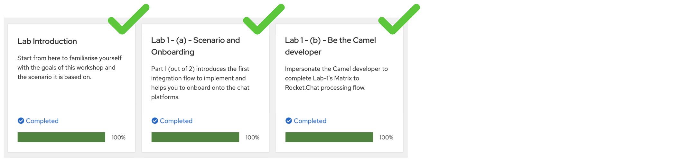
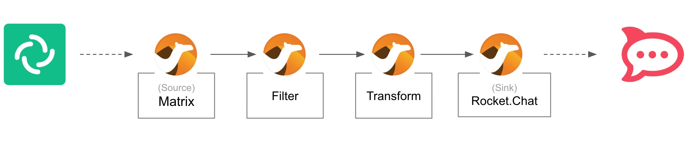

:walkthrough: Matrix to Rocket.Chat bridge ()
:user-password: openshift
:namespace: {user-username}-devspaces

:url-element: https://element-matrix.{openshift-app-host}
:url-rocketchat: https://rocketchat-rocketchat.{openshift-app-host}
:url-codeready: http://devspaces.{openshift-app-host}/
:url-devconsole: {openshift-host}/topology/ns/{namespace}

:experimental:

// WORKS
:style-kbd: kbd { \
  color: black; \
  background-color: lightgrey; \
  border: 1px solid black; \
  box-shadow: 0px 1px black; \
  font-size: .85em; \
  line-height: .85em; \
  display: inline-block; \
  font-weight: 600; \
  letter-spacing: .05em; \
  padding: 3px 5px; \
  white-space: nowrap; \
  border-radius:5px; \
} \

:style-summary: summary {cursor: pointer; list-style: none;}
:style-triangle: .triangle {margin-right: .5em;} summary:hover .sumtext {text-decoration: underline;}
:style-details:  .triangle::before {content: "▶";} details[open] .triangle::before {content: "▼";}
:style-open-close: {style-summary}{style-triangle}{style-details} 

:style-preview: pre {background-color: #272822; color: white; padding: 5px 15px; font-size: 15px}
:style-indent: .indent2 {padding-left: 2rem;}
:style-all: pass:a[]

:url-docserver: https://docserver-webapp.{openshift-app-host}
//:url-docserver: http://0.0.0.0:8080

:docserver-status: pass:a[ response.text()) \
        .then(data => this.parentElement.innerHTML = 'Status: 

') \
        .catch(error => this.parentElement.innerHTML = 'Status: 

') \
      ">]

:freplace: pass:[function replaceTokens(templateString, values) { \
    const valueArray = values.split(',').map(val => val.trim()); \
    let result = templateString; \
    let replaceIndex = 0; \
    while (result.includes('REPLACE') && replaceIndex < valueArray.length) { \
        result = result.replace('REPLACE', valueArray[replaceIndex]); \
        replaceIndex++; \
    } \
    return result; \
}]

//:fdocserver: pass:a[function docserver(target,template,params) { \
//    {freplace} \
//    fetch('{url-docserver}/roomid/params) \
//        .then(response => response.text()) \
//        .then(data => {target.firstChild.data=replaceTokens(text, data);}) \
//        .catch(error => room = 'Error fetching data: ' + error.message); \
//}]

:fdocserver: pass:a[function docserver(target,template,params) { \
    {freplace} \
    fetch('{url-docserver}'+params.trim()) \
        .then(response => response.text()) \
        .then(data => {target.firstChild.data=replaceTokens(text, data);}) \
        .catch(error => room = 'Error fetching data: ' + error.message); \
}]

:fcopy: pass:a[function copy(el) { \
  el.previousElementSibling.select(); \
  text = el.previousElementSibling.textContent; \
  console.log(text); \
  navigator.clipboard.writeText(text + '\n') \
        .then(response => console.log('Text with carriage return copied to clipboard!')) \
        .catch(err => console.error('Failed to copy: ', err)); \
}]

:copypaste: pass:a[ \

 \
  <textarea readonly style="field-sizing: content;border: none; background-color: #f0f0f0; width: 100%; resize: none; font-size:14px; font-family: monospace;padding: 5px 15px" rows="4">function example() { \
  console.log("Hello {replace-with-previous}!"); \
  return true; \
}</textarea> \
  <button class="mytooltip" onclick="{fcopy} copy(this);" style="border: none; background-color: white; padding: 5px 15px; border-bottom: 1px solid transparent; transition: border-bottom-color 0.2s;"> \
    <svg fill="currentColor" height="1em" width="1em" viewBox="0 0 448 512" aria-hidden="true" role="img" style="vertical-align: -0.125em;"> \
      <path d="M320 448v40c0 13.255-10.745 24-24 24H24c-13.255 0-24-10.745-24-24V120c0-13.255 10.745-24 24-24h72v296c0 30.879 25.121 56 56 56h168zm0-344V0H152c-13.255 0-24 10.745-24 24v368c0 13.255 10.745 24 24 24h272c13.255 0 24-10.745 24-24V128H344c-13.2 0-24-10.8-24-24zm120.971-31.029L375.029 7.029A24 24 0 0 0 358.059 0H352v96h96v-6.059a24 24 0 0 0-7.029-16.97z"></path> \
    </svg> \
    Copy to clipboard \
  </button> \
   \

 \
 \
]

:snippet: pass:a[ \

 \

 \
 \
]

ifdef::env-github[]
endif::[]

[id='lab2-matrix-rocketchat-two-ways']
// = Lab 2 - Matrix ⇔ Rocket.Chat (two ways)
= Lab 2 - Enable two way interactions

// = [[kubernetes-user]] The Kubernetes user deployment flow

Enable two-way communication between Matrix and Rocket.Chat chat platforms.

Prerequisites: +
--
* Ensure you have previously completed the following tiles:
+

{empty} +
--

*Overview*

Lab 1 enabled a _Matrix_ to _Rocket.Chat_ data flow. On this second lab we want the flow to work in both directions so that users from both chat platforms can exchange messages and have a conversation.

{empty} + 

Target persona: +
--
* *Kubernetes User* +
{empty} +
--
Difficulty level: +
--
* *EASY* +
{empty} +
--
Estimated time: +
--
* *10 mn* +
{empty} +
--

{empty} +

Technical goals and milestones:

* Enable two-way communications.
* Include event filters.

{empty} +

[NOTE]
--
In the first lab you impersonated the _Camel_ developer to create and deploy _Kamelet Bindings_. Later, you will create more advanced integrations using regular Camel DSL (_Domain Specific Language_).
--

In this second lab, you will work as a _Kubernetes_ user. Instead of running locally your code, you will directly push your definitions to OpenShift. 

[NOTE]
--
As you progress with the lab, notice that working as a Kubernetes user, with Camel K, allows you to create and deploy data flows without any internal knowledge of Camel, as per the diagram below:

image::images/workflow-kube-user.png[align="center", width=100%]

You only need to define and configure sources, steps and sinks in Kamelet Binding definitions.
--

{empty} +

The picture below illustrates two data flows interconnecting both chat systems, one for each direction of communication:

// image::images/processing-flow.png[title="Data flow",align="center",title-align=center, width=80%]
image::images/data-flow.png[align="center", width=80%]

Luckily, you've already done all the necessary onboarding setup with both chat systems, so this lab should be a lot faster to complete than the first one.

{empty} +

[time=5]
[id="m2r"]
== Matrix to Rocket.Chat
{style-all}

[type=taskResource]
.Credentials
****
* *username:* `{user-username}`
//* *password:* `{user-password}`
****
[type=taskResource]
.Red Hat OpenShift Dev Spaces
****
* link:{url-codeready}[Console, window="_blank"]
****
[type=taskResource]
.Red Hat OpenShift Developer Console
****
* link:{url-devconsole}[Topology View, window="_blank"]
****
[type=taskResource]
.Matrix
****
* link:{url-element}[Matrix Web Client, window="_blank"]
****
[type=taskResource]
.Rocket.Chat
****
* link:{url-rocketchat}[Rocket.Chat Web Client, window="_blank"]
****

This process is identical to the one you've already created in Lab 1, except there is a hazardous scenario you need to prevent. +
Ask yourself the following question:

* If the App (e.g. Camel) in a chat room fires an event for each new message in a conversation, what would happen when interconnecting both ends (apps)?

{empty} +

Obviously, the interaction between both platforms would enter in a ping-pong effect between the App in Matrix and the App in Rocket.Chat.

image::images/death-loop.png[align="center", width=60%]

A filtering mechanism needs to be put in place to prevent the interaction from entering in a death loop.

{empty} +

=== Process overview

The diagram below illustrates the processing flow you're about to create:

There are 4 processing steps in use:

====
* *1 source _Kamelet_* +
Consumes events from _Matrix_.

* *2 mid-flow steps* +
One filters messages to prevent death loops. +
One transforms _Matrix_ events to _Rocket.Chat_ events (in JSON format).

* *1 sink _Kamelet_* +
Produces events to _Rocket.Chat_.
====

{empty} +

=== Process definition

. Setup
.. Close tabs
+
image::images/crw-close-tabs.png[align="left", width=100%]
+
{blank}
+
Before you start this second lab, make sure you close in your editor all the tabs (source files) from the previous exercise.
+
1) Click on the file explorer's `...` button +
2) Ensure your `Open Editors` is ticked [√] +
3) Click the `Close all Editors` button.
+
{empty} +

.. Find your new folder in the project tree
+
image::images/crw-folder.png[align="left", width=30%]
+
{blank}
+
NEEDS UPDATING IMAGES and CONTENT
+
{empty} +

. Include the filter
+
_Matrix_ does not provide a field to flag bot-generated messages, so we need to develop a custom pattern-matching approach to distinguish user messages from bot messages.
+
--
The data mapper transforms messages to the following format:

* `username@system:`  message
+
For example:
+
** *{user-username}@matrix:* ping
** *{user-username}@rocketchat:* pong
+
{blank}
+
--
+
This pattern is reliable for identifying and blocking incoming events because it is uniquely defined by the data mapper in Kaoto and not used by other systems.
+
With the above in mind, let's include a filtering step, that identifies and blocks bot (Camel generated) messages.
+
Follow the steps below:
+
.. Add a *Filter* processor after the Matrix kamelet
.. Add a step inside the filter, choose a *Stop* processor
.. Click the group `All` at the top of the configuration panel.
.. Select the *JQ* expression language.
... Configure the following elements with copy and paste:
.... *Expression*:
+
--
{copypaste}
----
.text | test("<b>.*@.*</b>")
----
--
+
NOTE: In the expression above you'll notice `.text` is the JSON field selected and tested with a regular expression that takes in account the _HTML_ `<b>` tags that _Matrix_ parses to render rich content.
+
{blank}
+
.... *Source*:
+
--
{copypaste}
----
matrix
----
--
+
NOTE: When *Source* is configured it indicates the variable from where to obtain the input data, otherwise Camel uses the body.
+
{empty} +

+
In summary, the *Filter* definition will result in the following behaviour: +
** The JQ evaluation picks `.text` and tests for a pattern match:
+
--
.. When it matches, the event is ignored (*stop* halts the process execution)
.. When not matched, the execution resumes with normality.
--
+ 
{empty} + 

. Run the flow with Camel JBang
+ 
Use the following command to run locally your _Camel_ route:
+
--
{copypaste}
----
labrun m2r \
--properties matrix.properties,rocketchat.properties
----
--
+
{empty} +

. Test the filter (part 1)
+
Now, from _Matrix_'s chat room, send a message.
+
* For example:
+
--
{copypaste}
----
go through
----
--
+
If all goes well your message should show up in _Rocket.Chat_'s chat room.
+
{empty} +

. Test the filter (part 2)
+
Now, let's fake a message pretending it is generated by _Camel_.
+
* Copy the following message, then paste and send from _Matrix_:
+
--
{copypaste}
----
<b>fakebot@rocketchat</b>: fake app message
----
--
+
The expected behaviour from the system is to observe how the filter blocks the message and ensure it doesn't show up in Rocket.Chat.
+
{empty} +

[type=verification]
In test 1, did you see the message going from _Matrix_ to _Rocket.Chat_?

[type=verificationSuccess]
Very good !

[type=verificationFail]
Inspect in the pod logs to troubleshoot.

[type=verification]
In test 2, did you see the message not reach _Rocket.Chat_?

[type=verificationSuccess]
Very good !

[type=verificationFail]
Inspect in the pod logs to troubleshoot.

[time=5]
[id="r2m"]
== Rocket.Chat to Matrix
{style-all}

[type=taskResource]
.Credentials
****
* *username:* `{user-username}`
//* *password:* `{user-password}`
****
[type=taskResource]
.Red Hat OpenShift Dev Spaces
****
* link:{url-codeready}[Console, window="_blank"]
****
[type=taskResource]
.Red Hat OpenShift Developer Console
****
* link:{url-devconsole}[Topology View, window="_blank"]
****
[type=taskResource]
.Matrix
****
* link:{url-element}[Matrix Web Client, window="_blank"]
****
[type=taskResource]
.Rocket.Chat
****
* link:{url-rocketchat}[Rocket.Chat Web Client, window="_blank"]
****

This process is equivalent to the previous one, but designed to enable the opposite data flow.

It also requires a filtering mechanism to block events from _Rocket.Chat_, originally emitted from _Matrix_-to-_Rocket.Chat_ _Camel_ transactions.

{empty} +

=== Process overview

The diagram below illustrates the processing flow:

image::images/new/processing-flow-r2m.jpg[align="center", width=80%]
//image::images/processing-flow-s2g.png[align="center", width=80%]

There are 4 processing steps in use:

====
* *1 source _Kamelet_* +
Consumes events from _Rocket.Chat_.

* *2 mid-flow steps* +
One filters messages to prevent death loops. +
One transforms _Rocket.Chat_ events to _Matrix_ events (in JSON format).

* *1 sink _Kamelet_* +
Produces events to _Matrix_.
====

{empty} +

=== Process definition

. Define the base camel route.
+
Because the flow is so similar to the one previously constructed, we provide below a base skeleton to get you started:
+
.. Setup your exercise with the command below:
+
--
{copypaste}
----
step 3
----
--
+
.. Find and open your `r2m` flow in your `lab` directory:
+
--
* `lab/r2m/r2m.camel.yaml`
--
+
[NOTE]
--
The source step is now a **_Platform Http_**.

* It defines `variableReceive: rocketchat` where the incoming payload is kept.
* _Rocket.Chat_ has been pre-configured to push events to this particular _Webhook_, via its _Kubernetes_ service.
--
+
[NOTE]
--
In the **_Filter_**, notice the JQ expression picks the `.text` JSON field and evaluates it against the regular expression that takes in account the `*` symbol that _Matrix_ uses to render rich content.
--
+
{empty} +

. Include data transformation
+
Now we need to extend the _Camel_ route definition to include data transformation to match the JSON structure the target system (_Matrix_) expects.
+
.. Include in your Camel route a Kaoto data transformation step
+
--
From Kaoto: 

. Click the `+` button in the transition
. Find and select the _Kaoto DataMapper_
. Click to open the configuration panel
. Click the `🔧Configure` button
--
+
{blank}
+
.. Attach schemas
+
--
From the DataMapper editor: 

. Define the source:
.. On `Parameters` click the `+` to add new parameter
.. Enter `rocketchat` and click the checkmark button kbd:[√]
.. Click first the Attach schema button, then the blue button, and pick `rocketchat-in.json`.
+
{blank}
+
. Define the target
.. Find the target Body and click on "Attach schema", then the blue button, and pick `matrix-out.json`

{blank}
--
+
{blank}
+
.. Define the data mappings
+
Copy and Paste the values below to define the given field entries:
+
... `string[@key = text]`: 
+
--
{copypaste}
----
concat("<b>",$rocketchat-x/xf:map/xf:string[@key='user_name'],"@rocketchat</b>: ",$rocketchat-x/xf:map/xf:string[@key='text'])
----
--
+
Your mapping rules should look similar to the image below.
+
image::images/jslt-room-config.png[align="left", width=80%]
+
{blank}
+
NOTE: The field `text` includes JsonPath rules extracting values from the input _Rocket.Chat_ event.
+
{empty} +

. Run Camel JBang again to test the process:
+
--
{copypaste}
----
labrun r2m --dev
----
--
+
NOTE: The flag `--dev` indicates to hot-reload the souce code when changes are applied live.
+
{empty} +

. Test the integration from _Rocket.Chat_.
+
Go to you Rocket.Chat's chat room and send a message, for example:
+
--
{copypaste}
----
Hello from Rocket.Chat
----
--
+
If all goes well your message should show in your logs something similar to:
+
----
{"text":"<b>user2@rocketchat<\/b>: Hello from Rocket.Chat"}
----
+
{empty} +

. Test the filter.
+
Fake a message pretending it is generated by _Camel_.
+
NOTE: We simulate a reaction from Rocket.Chat when receiving an event, published by _Matrix_ and channeled via Camel.
+
Copy the following message, then paste and send from _Rocket.Chat_:
+
--
{copypaste}
----
*fakebot@matrix:* fake app message
----
--
+
The expected outcome is to observe Camel ignores (filters) the message from _Rocket.Chat_.
+
{empty} +

. Include the Matrix Kamelet.
+
Copy from below the step definition, and paste it at the end of your Camel route.
+
--
{copypaste}
----
{
  "type":"Route",
  "name":"to",
  "definition":{
    "description":"Matrix",
    "uri":"kamelet",
    "parameters":{
      "templateId":"matrix-sink",
      "token":"{{matrix.token}}",
      "room":"{{matrix.room}}"
    }
  },
  "__kaoto_marker":"kaoto-node"
}
----
--
+
{empty} +

. Test the end-to-end integration from Rocket.Chat to Matrix.
+
Go to you Rocket.Chat's chat room and send a message, for example:
+
--
{copypaste}
----
Hello from Rocket.Chat
----
--
+
If all goes well your message should show up in Matrix.
+
image::images/stage2-msg-slack-gitter.png[align="left", width=80%]

{empty} +

If all went well, you should end up with both flows completed:

--
* Matrix to Rocket.Chat
* Rocket.Chat to Matrix
--

{empty} +

[type=verification]
Did you see your message from _Rocket.Chat_ successfully reach _Matrix_ (and not come back)?

[type=verificationSuccess]
Very good! Next, deploy the flows.

[type=verificationFail]
Inspect in the pod logs to troubleshoot.

[time=5]
[id="openshift"]
== Deployment on OpenShift
{style-all}

[type=taskResource]
.Credentials
****
* *username:* `{user-username}`
//* *password:* `{user-password}`
****
[type=taskResource]
.Red Hat OpenShift Dev Spaces
****
* link:{url-codeready}[Console, window="_blank"]
****
[type=taskResource]
.Red Hat OpenShift Developer Console
****
* link:{url-devconsole}[Topology View, window="_blank"]
****
[type=taskResource]
.Matrix
****
* link:{url-element}[Matrix Web Client, window="_blank"]
****
[type=taskResource]
.Rocket.Chat
****
* link:{url-rocketchat}[Rocket.Chat Web Client, window="_blank"]
****

Now that you have validated your code locally, you can proceed to deploy and run in _OpenShift_.

{empty} +

=== Matrix to Rocket.Chat

{blank}

. To start with, make sure you have stopped you local Camel instance. +
If it is still running, press kbd:[Ctrl+C] to stop it.
+
{empty} +

. Deploy your _Matrix_ to _RocketChat_ integration
+
Use the command below to deploy on _OpenShift_:
+
--
{copypaste}
----
labdeploy m2r \
matrix.properties rocketchat.properties
----
--
+
[pass]

  

    
    Click for more information
  

We provide the script <code>labdeploy</code> to help you read the commands more clearly. 
Under the hood the script calls <i>Camel JBang</i> as per the snippet below:
<pre>
camel kubernetes run m2r/* \
matrix.properties rocketchat.properties \
--name m2r \
--property quarkus.config.locations=matrix.properties,rocketchat.properties \
--local-kamelet-dir ../support/deploy/kamelets \
--cluster-type openshift
</pre>

+
{blank}
+
NOTE: Be patient, this action may take some time to complete (could take up to 10mn the first time).
+
{empty} +

. Inspect the deployment status
+
You can monitor the state of the resource with the following command:
+
--
{copypaste}
----
oc get deployment/m2r
----
--
+
When the deployment is ready, the command outputs something similar to:
+
----
NAME   READY   UP-TO-DATE   AVAILABLE   AGE
m2r    1/1     1            1           10m 
----
+
{empty} +

{empty} +

=== Rocket.Chat to Matrix

{blank}

. Deploy your _RocketChat_ to _Matrix_ integration
+
Use the command below to deploy your application:
+
--
{copypaste}
----
labdeploy r2m \
rocketchat.properties matrix.properties
----
--
+
[pass]

  

    
    Click for more information
  

We provide the script <code>labdeploy</code> to help you read the commands more clearly. 
Under the hood the script calls <i>Camel JBang</i> as per the snippet below:
<pre>
camel kubernetes run r2m/* \
rocketchat.properties matrix.properties \
--name r2m \
--property quarkus.config.locations=rocketchat.properties,matrix.properties \
--local-kamelet-dir ../support/deploy/kamelets \
--cluster-type openshift
</pre>

+
{blank}
+
NOTE: Be patient, this action may take some time to complete (could take up to 10mn the first time).
+
{empty} +

. Inspect the deployment status
+
Monitor the state of the deployment with the command below:
+
--
{copypaste}
----
oc get deployment/r2m
----
--
+
When the deployment is ready, the command outputs something similar to:
+
----
NAME   READY   UP-TO-DATE   AVAILABLE   AGE
r2m    1/1     1            1           10m 
----
+
{empty} +

{empty} +

=== Developer topology view

Visually check the deployments and logs to ensure all is in healthy state.

. Open your Developer Topology view in the OpenShift console
+
image::images/ocp-dev-pod-healthy-s2g.png[align="left", width=80%]
+
{empty} +

{empty} +

=== Test the flows

{blank}

Ensure messages flow in both directions to validate your deployments.

WARNING: As you injected filters to prevent lookbacks, make sure you don't see messages circling back when you execute the tests below.

{empty} +

. Test your _Matrix to Rocket.Chat_ integration
+
One more time, send a message from _Matrix_ (ensure you don't see loopbacks). +
For example:
+
--
{copypaste}
----
Hello from Matrix
----
--
+
image::images/stage1-msg-gitter-slack.png[align="left", width=80%]
+
{empty} +

. Test your _Rocket.Chat to Matrix_ integration.
+
Go to you Rocket.Chat's chat room and send a message. +
+
* For example:
+
--
{copypaste}
----
Hello from Rocket.Chat
----
--
+
If all goes well your message should show up in _Matrix_.
+
image::images/stage2-msg-slack-gitter.png[align="left", width=80%]
+
{empty} +

**Well done!** you shoud now have both flows in place:

--
* Matrix to Rocket.Chat
* Rocket.Chat to Matrix
--

{empty} +

[type=verification]
Did you see your message from _Rocket.Chat_ successfully reach _Matrix_ (and not come back)?

[type=verificationSuccess]
Finish this lab by completing the next section.

[type=verificationFail]
Inspect in the pod logs to troubleshoot.

[type=verification]
Did you see the message going from _Matrix_ to _Rocket.Chat_?

[type=verificationSuccess]
Finish this lab by completing the next section.

[type=verificationFail]
Inspect in the pod logs to investigate possible failure causes.

[time=2]
[id="clean"]
== Undeploy from OpenShift
{style-all}

[type=taskResource]
.Credentials
****
* *username:* `{user-username}`
//* *password:* `{user-password}`
****
[type=taskResource]
.Red Hat OpenShift Dev Spaces
****
* link:{url-codeready}[Console, window="_blank"]
****
[type=taskResource]
.Red Hat OpenShift Developer Console
****
* link:{url-devconsole}[Topology View, window="_blank"]
****
[type=taskResource]
.Matrix
****
* link:{url-element}[Matrix Web Client, window="_blank"]
****
[type=taskResource]
.Rocket.Chat
****
* link:{url-rocketchat}[Rocket.Chat Web Client, window="_blank"]
****

You're almost done on this lab episode.
In preparation for your next lab exercise, this last section helps you clean your _OpenShift_ project and, more importantly, shows you how to use _Camel JBang_ when it comes to undeploy integrations.

{empty} +

. Undeploy your _"Matrix to RocketChat"_ integration
+
The _Kubernetes_ plugin in _Camel JBang_ makes it super simple to undeploy _Camel_. +
Issue the command below to undeploy `m2r`:
+
--
{copypaste}
----
camel kubernetes delete --name m2r
----
--
+
You'll see the following command output in your terminal:
+
[subs=attributes]
----
Deleting resources in namespace '{user-username}-devspaces' with name: m2r
Deleted: apps/Deployment 'm2r'
Deleted: v1/Service 'm2r'
Deleted: build.openshift.io/BuildConfig 'm2r-s2i'
Deleted: image.openshift.io/ImageStream 'm2r'
Deleted: route.openshift.io/Route 'm2r'
----
+
NOTE: The process is thorough when cleaning the deployment by removing all the artifacts originally created.
+
{empty} +

. Undeploy your _"RocketChat to Matrix"_ integration
+
Issue the equivalent command below to undeploy `r2m`:
+
--
{copypaste}
----
camel kubernetes delete --name r2m
----
--
+
You'll see the following command output in your terminal:
+
[subs=attributes]
----
Deleting resources in namespace '{user-username}-devspaces' with name: r2m
Deleted: apps/Deployment 'r2m'
Deleted: v1/Service 'r2m'
Deleted: build.openshift.io/BuildConfig 'r2m-s2i'
Deleted: image.openshift.io/ImageStream 'r2m'
Deleted: route.openshift.io/Route 'r2m'
----
+
{empty} +

{empty} +

[type=verification]
Do you see your _Camel_ applications absent in your _OpenShift_ project?

[type=verificationSuccess]
You have now completed Stage 2 !!

[type=verificationFail]
Inspect in the pod logs to troubleshoot.
