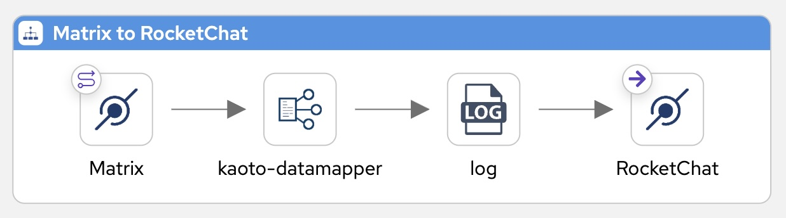
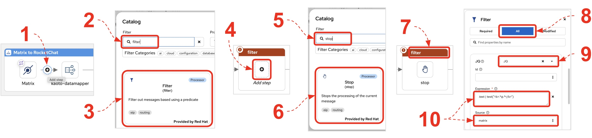
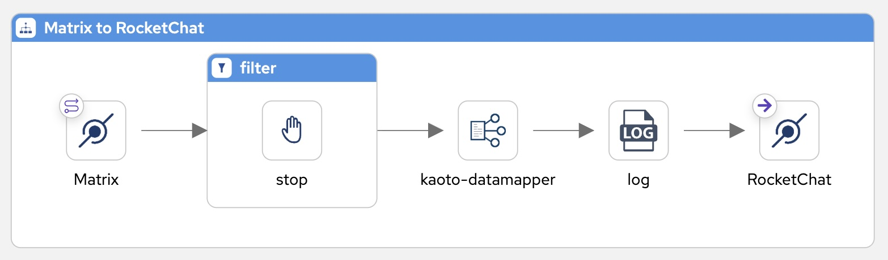
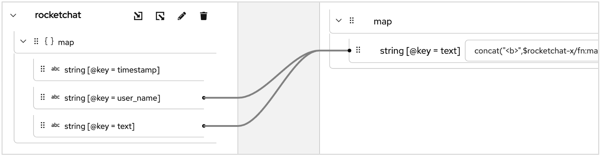
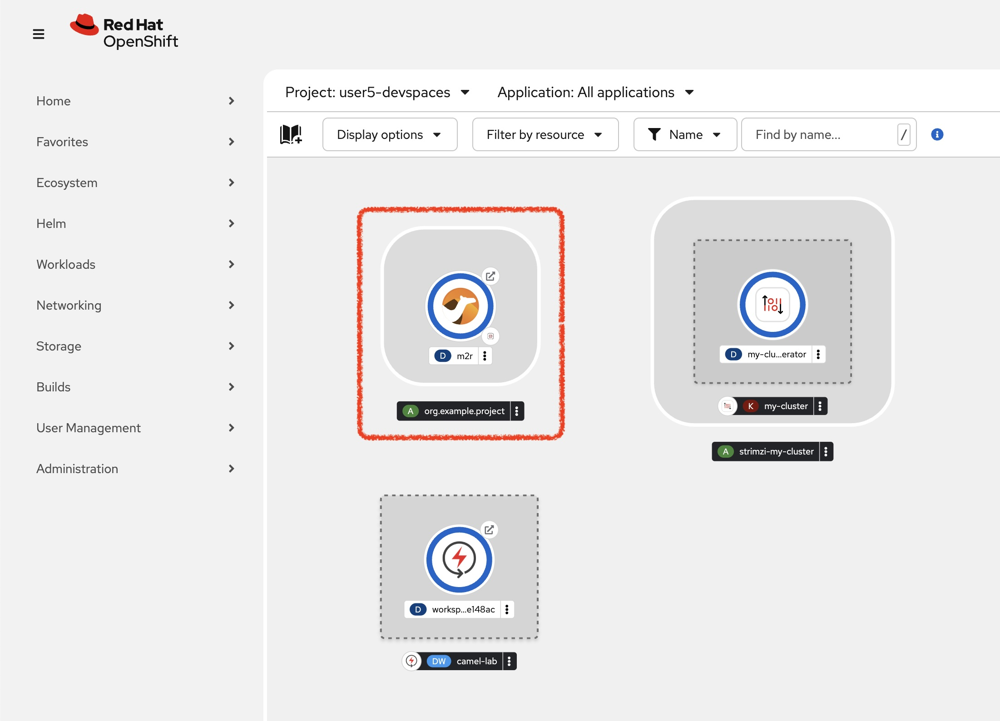
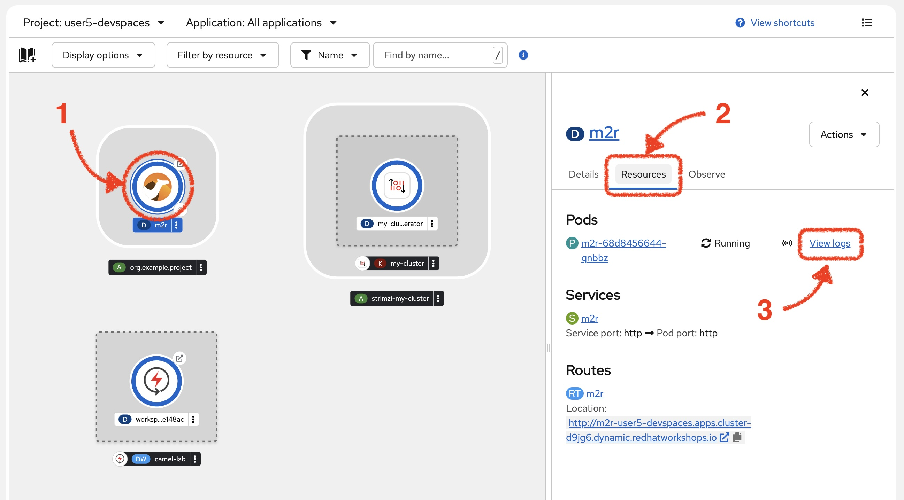
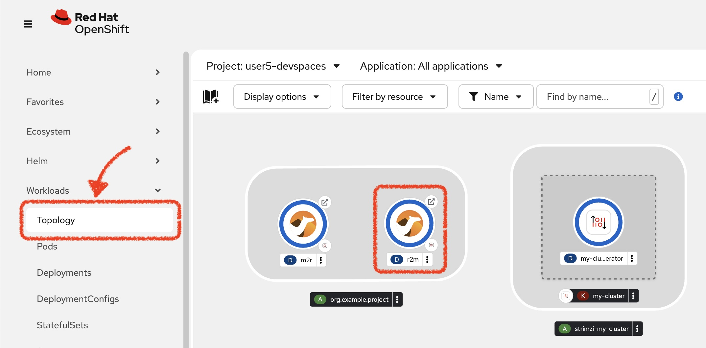
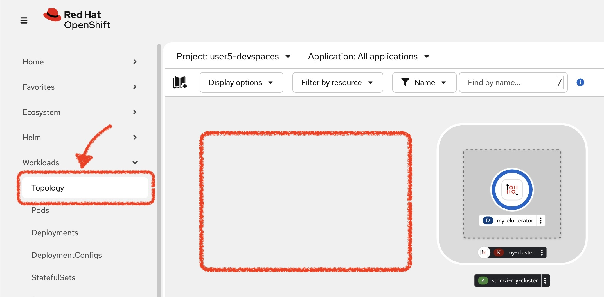

:walkthrough: Matrix to Rocket.Chat bridge ()
:user-password: openshift
:namespace: {user-username}-devspaces

:url-element: https://element-matrix.{openshift-app-host}
:url-rocketchat: https://rocketchat-rocketchat.{openshift-app-host}
:url-codeready: http://devspaces.{openshift-app-host}/
:url-devconsole: {openshift-host}/topology/ns/{namespace}

:experimental:

:cp-btn: pass:[<svg fill="currentColor" height="1em" width="1em" viewBox="0 0 448 512" aria-hidden="true" role="img" style="vertical-align: -0.125em;"> <path d="M320 448v40c0 13.255-10.745 24-24 24H24c-13.255 0-24-10.745-24-24V120c0-13.255 10.745-24 24-24h72v296c0 30.879 25.121 56 56 56h168zm0-344V0H152c-13.255 0-24 10.745-24 24v368c0 13.255 10.745 24 24 24h272c13.255 0 24-10.745 24-24V128H344c-13.2 0-24-10.8-24-24zm120.971-31.029L375.029 7.029A24 24 0 0 0 358.059 0H352v96h96v-6.059a24 24 0 0 0-7.029-16.97z"></path></svg>]

:btn-paste: pass:[<svg fill="#000000" width="1em" height="1em" viewBox="-32 0 512 512" xmlns="http://www.w3.org/2000/svg"><g id="SVGRepo_bgCarrier" stroke-width="0"></g><g id="SVGRepo_tracerCarrier" stroke-linecap="round" stroke-linejoin="round"></g><g id="SVGRepo_iconCarrier"><path d="M128 184c0-30.879 25.122-56 56-56h136V56c0-13.255-10.745-24-24-24h-80.61C204.306 12.89 183.637 0 160 0s-44.306 12.89-55.39 32H24C10.745 32 0 42.745 0 56v336c0 13.255 10.745 24 24 24h104V184zm32-144c13.255 0 24 10.745 24 24s-10.745 24-24 24-24-10.745-24-24 10.745-24 24-24zm184 248h104v200c0 13.255-10.745 24-24 24H184c-13.255 0-24-10.745-24-24V184c0-13.255 10.745-24 24-24h136v104c0 13.2 10.8 24 24 24zm104-38.059V256h-96v-96h6.059a24 24 0 0 1 16.97 7.029l65.941 65.941a24.002 24.002 0 0 1 7.03 16.971z"></path></g></svg>]

:btn-replace: pass:[<svg fill="#000000" width="1.5em" height="1.5em"  viewBox="0 0 912.193 912.193" xml:space="preserve"> \
  <g stroke-width="0"></g><g stroke-linecap="round" stroke-linejoin="round"></g><g> <g> <path d="M807.193,170.092v83.973c-6.033-10.458-12.529-20.674-19.512-30.606c-24.436-34.762-54.037-65.357-87.984-90.937 c-34.352-25.885-72.34-46.014-112.908-59.827c-41.957-14.286-85.891-21.529-130.577-21.529c-46.663,0-92.432,7.883-136.03,23.431 c-42.135,15.025-81.295,36.846-116.393,64.858c-34.751,27.735-64.539,60.747-88.534,98.119 c-24.444,38.072-42.191,79.621-52.748,123.492c-6.783,28.19,10.57,56.542,38.761,63.325c4.128,0.993,8.259,1.469,12.325,1.469 c23.705,0,45.21-16.167,51-40.229c15.47-64.292,52.651-122.573,104.694-164.109c26.001-20.751,54.989-36.909,86.16-48.024 c32.249-11.5,66.151-17.331,100.765-17.331c65.672,0,128.018,20.822,180.297,60.214c35.375,26.656,64.541,61.161,85.139,100.095 h-58.166c-28.994,0-52.5,23.505-52.5,52.5s23.506,52.5,52.5,52.5h196.211c28.996,0,52.5-23.505,52.5-52.5V170.092 c0-28.995-23.504-52.5-52.5-52.5C830.699,117.592,807.193,141.097,807.193,170.092z"></path> <path d="M52.5,794.602c28.995,0,52.5-23.504,52.5-52.5v-84.326c31.275,54.438,74.821,100.955,127.654,135.994 c66.246,43.936,143.417,67.186,223.196,67.254c0.044,0,0.087,0.004,0.13,0.004c0.035,0,0.071-0.002,0.106-0.002 c0.041,0,0.083,0.002,0.124,0.002c0.056,0,0.109-0.004,0.166-0.004c46.524-0.045,92.157-7.924,135.633-23.428 c42.135-15.025,81.295-36.846,116.393-64.857c34.752-27.734,64.539-60.748,88.535-98.119 c24.443-38.072,42.191-79.621,52.748-123.492c6.783-28.189-10.57-56.541-38.762-63.324s-56.541,10.57-63.324,38.76 c-15.471,64.293-52.652,122.574-104.695,164.109c-26,20.75-54.988,36.91-86.16,48.023c-32.217,11.488-66.082,17.318-100.657,17.33 c-59.154-0.023-116.346-17.229-165.398-49.762c-42.3-28.053-76.562-66.006-100.007-110.545h58.028c28.996,0,52.5-23.506,52.5-52.5 c0-28.996-23.505-52.5-52.5-52.5H52.5c-28.995,0-52.5,23.504-52.5,52.5v198.883C0,771.098,23.505,794.602,52.5,794.602z"></path> </g> </g></svg>]

:pen-btn: pass:[<svg height="2em" width="2em" viewBox="0 0 16 16" version="1.1" xmlns="http://www.w3.org/2000/svg" xmlns:xlink="http://www.w3.org/1999/xlink"><path fill="#444" d="M1 11.9l-1 4.1 4.1-1 9.2-9.2-3.1-3.1-9.2 9.2zM1.5 15l-0.4-0.5 0.4-2 2 2-2 0.5zM10.9 4.4l-8.1 8-0.6-0.6 8.1-8 0.6 0.6z"></path><path fill="#444" d="M15.3 0.7c-1.1-1.1-2.6-0.5-2.6-0.5l-1.5 1.5 3.1 3.1 1.5-1.5c0-0.1 0.6-1.5-0.5-2.6zM13.4 1.6l-0.5-0.5c0.6-0.6 1.1-0.1 1.1-0.1l-0.6 0.6z"></path></svg>]

:map-att: pass:[<svg width="1em" height="1em" viewBox="0 0 16 16" xmlns="http://www.w3.org/2000/svg" fill="none" stroke="currentColor" stroke-width="1" stroke-linecap="round" stroke-linejoin="round" class="bi bi-box-arrow-in-down-right"> \
  <path d="M6.364 2.5a.5.5 0 0 1 .5-.5H13.5A1.5 1.5 0 0 1 15 3.5v10a1.5 1.5 0 0 1-1.5 1.5h-10A1.5 1.5 0 0 1 2 13.5V6.864a.5.5 0 1 1 1 0V13.5a.5.5 0 0 0 .5.5h10a.5.5 0 0 0 .5-.5v-10a.5.5 0 0 0-.5-.5H6.864a.5.5 0 0 1-.5-.5z" /> \
  <path d="M11 10.5a.5.5 0 0 1-.5.5h-5a.5.5 0 0 1 0-1h3.793L1.146 1.854a.5.5 0 1 1 .708-.708L10 9.293V5.5a.5.5 0 0 1 1 0v5z" /> \
</svg>]

:map-tick: pass:[<svg width="1em" height="1em" viewBox="0 0 24 24" fill="none" xmlns="http://www.w3.org/2000/svg" stroke-width="1"> \
<path d="M4.89163 13.2687L9.16582 17.5427L18.7085 8" stroke="#000000" stroke-width="3.5" stroke-linecap="round" stroke-linejoin="round"/> \
</svg>]

:map-import: pass:[<svg width="1em" height="1em" viewBox="0 0 512 512" xmlns="http://www.w3.org/2000/svg" fill="#FFFFFF"> \
  <path d="M16 288c-8.8 0-16 7.2-16 16v32c0 8.8 7.2 16 16 16h112v-64zm489-183L407.1 7c-4.5-4.5-10.6-7-17-7H384v128h128v-6.1c0-6.3-2.5-12.4-7-16.9zm-153 31V0H152c-13.3 0-24 10.7-24 24v264h128v-65.2c0-14.3 17.3-21.4 27.4-11.3L379 308c6.6 6.7 6.6 17.4 0 24l-95.7 96.4c-10.1 10.1-27.4 3-27.4-11.3V352H128v136c0 13.3 10.7 24 24 24h336c13.3 0 24-10.7 24-24V160H376c-13.2 0-24-10.8-24-24z"/> \
</svg>]

:map-wrench: pass:[<svg version="1.1" id="Capa_1" xmlns="http://www.w3.org/2000/svg" xmlns:xlink="http://www.w3.org/1999/xlink" x="0px" y="0px" \
   height="1em" fill="white" viewBox="0 0 479.79 479.79" style="enable-background:new 0 0 479.79 479.79;" \
   xml:space="preserve"> \
<g> \
  <path d="M478.409,116.617c-0.368-4.271-3.181-7.94-7.2-9.403c-4.029-1.472-8.539-0.47-11.57,2.556l-62.015,62.011l-68.749-21.768 \
    l-21.768-68.748l62.016-62.016c3.035-3.032,4.025-7.543,2.563-11.565c-1.477-4.03-5.137-6.837-9.417-7.207 \
    c-37.663-3.245-74.566,10.202-101.247,36.887c-36.542,36.545-46.219,89.911-29.083,135.399c-1.873,1.578-3.721,3.25-5.544,5.053 \
    L19.386,373.152c-0.073,0.071-0.145,0.149-0.224,0.219c-24.345,24.346-24.345,63.959,0,88.309 \
    c24.349,24.344,63.672,24.048,88.013-0.298c0.105-0.098,0.201-0.196,0.297-0.305l193.632-208.621 \
    c1.765-1.773,3.404-3.628,4.949-5.532c45.5,17.167,98.9,7.513,135.474-29.056C468.202,191.181,481.658,154.275,478.409,116.617z \
     M75.98,435.38c-8.971,8.969-23.5,8.963-32.47,0c-8.967-8.961-8.967-23.502,0-32.466c8.97-8.963,23.499-8.963,32.47,0 \
    C84.947,411.878,84.947,426.419,75.98,435.38z"/> \
</g></svg>]

:btn-stl-blue: pass:[style="display:inline-block; padding:10px 22px; background:#0366CB; color:white; font:normal 14px Arial,sans-serif; border-radius:40px; cursor:default; user-select:none; text-decoration:none;"]

// WORKS
:style-kbd: kbd { \
  color: black; \
  background-color: white; \
  border: 1px solid black; \
  box-shadow: 0px 1px black; \
  font-size: .85em; \
  line-height: .85em; \
  display: inline-block; \
  font-weight: 600; \
  letter-spacing: .05em; \
  padding: 3px 5px; \
  white-space: nowrap; \
  border-radius:5px; \
} \

:style-summary: summary {cursor: pointer; list-style: none;}
:style-triangle: .triangle {margin-right: .5em;} summary:hover .sumtext {text-decoration: underline;}
:style-details:  .triangle::before {content: "▶";} details[open] .triangle::before {content: "▼";}
:style-open-close: {style-summary}{style-triangle}{style-details} 

:style-preview: pre {background-color: #272822; color: white; padding: 5px 15px; font-size: 15px}
:style-indent: .indent2 {padding-left: 2rem;}
:style-all: pass:a[]

:url-docserver: https://docserver-webapp.{openshift-app-host}

:docserver-status: pass:a[ response.text()) \
        .then(data => this.parentElement.innerHTML = 'Status: 

&nbsp;
;') \
        .catch(error => this.parentElement.innerHTML = 'Status: 

&nbsp;
') \
      ">]

:freplace: pass:[function replaceTokens(templateString, values) { \
    const valueArray = values.split(',').map(val => val.trim()); \
    let result = templateString; \
    let replaceIndex = 0; \
    while (result.includes('REPLACE') && replaceIndex < valueArray.length) { \
        result = result.replace('REPLACE', valueArray[replaceIndex]); \
        replaceIndex++; \
    } \
    return result; \
}]

:fdocserver: pass:a[function docserver(target,template,params) { \
    {freplace} \
    fetch('{url-docserver}'+params.trim()) \
        .then(response => response.text()) \
        .then(data => {target.firstChild.data=replaceTokens(text, data);}) \
        .catch(error => room = 'Error fetching data: ' + error.message); \
}]

:fcopy: pass:a[function copy(el) { \
  el.previousElementSibling.select(); \
  text = el.previousElementSibling.textContent; \
  console.log(text); \
  navigator.clipboard.writeText(text + '\n') \
        .then(response => console.log('Text with carriage return copied to clipboard!')) \
        .catch(err => console.error('Failed to copy: ', err)); \
}]

:copypaste: pass:a[ \

 \
  <textarea readonly style="field-sizing: content;border: none; background-color: #f0f0f0; width: 100%; resize: none; font-size:14px; font-family: monospace;padding: 5px 15px" rows="1">function example() { \
  console.log("Hello {replace-with-previous}!"); \
  return true; \
}</textarea> \
  <button class="mytooltip" onclick="{fcopy} copy(this);" style="border: none; background-color: white; padding: 5px 15px; border-bottom: 1px solid transparent; transition: border-bottom-color 0.2s;"> \
    <svg fill="currentColor" height="1em" width="1em" viewBox="0 0 448 512" aria-hidden="true" role="img" style="vertical-align: -0.125em;"> \
      <path d="M320 448v40c0 13.255-10.745 24-24 24H24c-13.255 0-24-10.745-24-24V120c0-13.255 10.745-24 24-24h72v296c0 30.879 25.121 56 56 56h168zm0-344V0H152c-13.255 0-24 10.745-24 24v368c0 13.255 10.745 24 24 24h272c13.255 0 24-10.745 24-24V128H344c-13.2 0-24-10.8-24-24zm120.971-31.029L375.029 7.029A24 24 0 0 0 358.059 0H352v96h96v-6.059a24 24 0 0 0-7.029-16.97z"></path> \
    </svg> \
    Copy to clipboard \
  </button> \
   \

 \
 \
]

:snippet: pass:a[ \

 \

 \
 \
]

ifdef::env-github[]
endif::[]

[id='lab2-matrix-rocketchat-two-ways']
= Lab 2 - Enable two way interactions

Enable two-way communication between Matrix and Rocket.Chat chat platforms.

[type=walkthroughResource,serviceName=openshift]
.Doc System
****
[subs=attributes]
++++

{docserver-status}

++++
****

Prerequisites: +
--
* Ensure you have previously completed the following tiles:
+
image::images/prereq.png[align="left", width=100%]

{empty} +
--

*Overview*

Lab 1 enabled a _Matrix_ to _Rocket.Chat_ data flow. On this second lab we want the flow to work in both directions so that users from both messaging platforms can interact between each other.

The picture below illustrates two data flows interconnecting both messaging systems, one for each direction of communication:

// image::images/processing-flow.png[title="Data flow",align="center",title-align=center, width=80%]
image::images/data-flow.png[align="center", width=80%]

Technical goals and milestones:

* Enable two-way communications.
* Apply message filters to prevent loops.

{empty} +

[time=5]
[id="m2r"]
== Matrix to Rocket.Chat
{style-all}

[type=taskResource]
.Credentials
****
* *username:* `{user-username}`
//* *password:* `{user-password}`
****
[type=taskResource]
.Red Hat OpenShift Dev Spaces
****
* link:{url-codeready}[Console, window="_blank"]
****
[type=taskResource]
.Red Hat OpenShift Developer Console
****
* link:{url-devconsole}[Topology View, window="_blank"]
****
[type=taskResource]
.Matrix
****
* link:{url-element}[Matrix Web Client, window="_blank"]
****
[type=taskResource]
.Rocket.Chat
****
* link:{url-rocketchat}[Rocket.Chat Web Client, window="_blank"]
****

This process is identical to the one you've already created in Lab 1, except there is a hazardous scenario you need to prevent. +
Ask yourself the following question:

* If the App (e.g. Camel) in a chat room fires an event for each new message in a conversation, what would happen when interconnecting both ends (apps)?

{empty} +

Obviously, the interaction between both platforms would enter in a ping-pong effect between the App in Matrix and the App in Rocket.Chat.

image::images/death-loop.png[align="center", width=60%]

A filtering mechanism needs to be put in place to prevent the interaction from entering a death loop.

{empty} +

=== Process overview

The diagram below illustrates the processing flow you're about to create:

image::images/new/processing-flow-m2r.jpg[align="center", width=80%]

There are 4 processing steps in use:

====
* *1 source _Kamelet_* +
Consumes events from _Matrix_.

* *2 mid-flow steps* +
One filters messages to prevent death loops. +
One transforms _Matrix_ events to _Rocket.Chat_ events (in JSON format).

* *1 sink _Kamelet_* +
Produces events to _Rocket.Chat_.
====

{empty} +

=== Process definition

{blank}

. Work from Kaoto
+
From the work you completed in your previous exercise, your current _Matrix to Rocket.Chat_ flow should be similar to the picture below:
+

+
{empty} +

. Include the filter
+
To address the problem of death loops you will apply the https://camel.apache.org/components/next/eips/filter-eip.html[Filter, window=_blank_] EIP _(Enterprise Integration Patterns)_
+
You'll need to develop a custom pattern-matching approach to distinguish user messages from bot messages.
+
NOTE: It would be easy if _Matrix_ provided a flag to signal if the message was user or bot generated. + Unfortunately it doesn't.
+
--
The data mapper transforms messages to the following convention:

* `username@system:`  message
+
For example:
+
** *{user-username}@matrix:* ping
** *{user-username}@rocketchat:* pong
+
{blank}
+
--
+
The pattern is fixed and can be considered reliable. +
You can use the pattern to identify and block incoming events because it is uniquely defined by the data mapper in Kaoto and not used by other systems.
+
With the above in mind, let's include a filtering step, that identifies and blocks bot (Camel generated) messages.
+
Follow the steps below:
+

+
.. Add a *Filter* processor after the Matrix kamelet (steps 1 to 3).
.. Add a step inside the filter, choose a *Stop* processor (steps 4 to 6).
.. Click the group `All` at the top of the configuration panel (step 8)
.. Select the *JQ* expression language (step 9).
... Configure the following elements with copy and paste (step 10):
.... *Expression*:
+
--
{copypaste}
----
.text | test("<b>.*@.*</b>")
----
--
+
NOTE: In the expression above you'll notice `.text` is the JSON field selected and tested with a regular expression that takes in account the _HTML_ `<b>` tags that _Matrix_ parses to render rich content.
+
{blank}
+
.... *Source*:
+
--
{copypaste}
----
matrix
----
--
+
NOTE: When *Source* is configured it indicates the variable from where to obtain the input data, otherwise Camel uses the body.
+
{empty} +
+
.. The resulting Kaoto definition should look as follows:
+

+
{empty} +

+
In summary, the *Filter* definition will result in the following behaviour: +
** The JQ evaluation picks `.text` and tests for a pattern match:
+
--
.. When it matches, the event is ignored (*stop* halts the process execution)
.. When not matched, the execution resumes with normality.
--
+ 
{empty} + 

. Run the flow with Camel JBang
+ 
Use the following command to run locally your _Camel_ route:
+
--
{copypaste}
----
labrun m2r \
--properties matrix.properties,rocketchat.properties
----
--
+
{empty} +

. Test the filter (part 1)
+
Now, from _Matrix_'s chat room, send a message.
+
* For example:
+
--
{copypaste}
----
go through
----
--
+
If all goes well your message should show up in _Rocket.Chat_'s chat room.
+
{empty} +

. Test the filter (part 2)
+
Now, let's fake a message pretending it is generated by _Camel_.
+
* Copy the following message, then paste and send from _Matrix_:
+
--
{copypaste}
----
<b>fakebot@rocketchat</b>: fake app message
----
--
+
The expected behaviour from the system is to observe how the filter blocks the message and ensure it doesn't show up in Rocket.Chat.
+
{empty} +

[type=verification]
In test 1, did you see the message going from _Matrix_ to _Rocket.Chat_?

[type=verificationSuccess]
Very good !

[type=verificationFail]
Inspect in the pod logs to troubleshoot.

[type=verification]
In test 2, did you see the message not reach _Rocket.Chat_?

[type=verificationSuccess]
Very good !

[type=verificationFail]
Inspect in the pod logs to troubleshoot.

[time=5]
[id="r2m"]
== Rocket.Chat to Matrix
{style-all}

[type=taskResource]
.Credentials
****
* *username:* `{user-username}`
//* *password:* `{user-password}`
****
[type=taskResource]
.Red Hat OpenShift Dev Spaces
****
* link:{url-codeready}[Console, window="_blank"]
****
[type=taskResource]
.Red Hat OpenShift Developer Console
****
* link:{url-devconsole}[Topology View, window="_blank"]
****
[type=taskResource]
.Matrix
****
* link:{url-element}[Matrix Web Client, window="_blank"]
****
[type=taskResource]
.Rocket.Chat
****
* link:{url-rocketchat}[Rocket.Chat Web Client, window="_blank"]
****

This process is equivalent to the previous one, but designed to enable the opposite data flow.

It also requires a filtering mechanism to block events from _Rocket.Chat_, originally emitted from _Matrix_-to-_Rocket.Chat_ _Camel_ transactions.

{empty} +

=== Process overview

The diagram below illustrates the processing flow:

image::images/new/processing-flow-r2m.jpg[align="center", width=80%]
//image::images/processing-flow-s2g.png[align="center", width=80%]

There are 4 processing steps in use:

====
* *1 source _Kamelet_* +
Consumes events from _Rocket.Chat_.

* *2 mid-flow steps* +
One filters messages to prevent death loops. +
One transforms _Rocket.Chat_ events to _Matrix_ events (in JSON format).

* *1 sink _Kamelet_* +
Produces events to _Matrix_.
====

{empty} +

=== Process definition

. Define the base camel route.
+
Because the flow is so similar to the one previously constructed, we provide below a base skeleton to get you started:
+
.. Setup your exercise with the command below:
+
--
{copypaste}
----
step 3
----
--
+
TIP: pass:[Run the command above anytime to reset the exercise. 

  

    
    Click for more information
  

The workshop includes handy helper scripts that let you jump to any step or reset the lab to a known good state:

  <ul>
    <li><strong>step N</strong> – reset the lab to the beginning of step N</li>
    <li><strong>steps</strong> – list all available steps in the lab</li>
    <li><strong>start</strong> or <strong>restart</strong> – go to the very beginning (equivalent to <code>step 1</code>)</li>
    <li><strong>ff</strong> – fast-forward to the <strong>next</strong> step</li>
    <li><strong>rw</strong> – rewind to the <strong>previous</strong> step</li>
  </ul>

]

.. Find and open your `r2m` flow in your `lab` directory:
+
--
pass:[
<code style="background-color: black; color: lightgrey"> ❯ lab ❯ r2m ❯ r2m.camel.yaml </code>
]

--
+
[NOTE]
--
The source step is now a **_Platform Http_**.

* It defines `variableReceive: rocketchat` where the incoming payload is kept.
* _Rocket.Chat_ has been pre-configured to push events to this particular _Webhook_, via its _Kubernetes_ service.
--
+
[NOTE]
--
In the **_Filter_**, notice the JQ expression picks the `.text` JSON field and evaluates it against the regular expression that takes in account the `*` symbol that _Matrix_ uses to render rich content.
--
+
{empty} +

. *Define the data transformation*
+
Now we need to extend the _Camel_ route definition to include data transformation to match the JSON structure the target system (_Matrix_) expects.
+
{empty} +
+
A. Include in your Camel route a Kaoto data transformation step
+
--
From Kaoto: 

. Click the kbd:[+] button inside the pass:[<code style="background-color: #4494E5; color: white;">&nbsp;To do: Mapping&nbsp;</code>] step
. Type `mapper` in the filter to find the _Kaoto DataMapper_
. Click the _Kaoto DataMapper_ tile
. Click the mapper to open the configuration panel
. Click the pass:a[{map-wrench}  Configure] button
--
+
{empty} +

A. Next, define the inputs and outputs
+
--
From the DataMapper editor: 

. Define the source:
.. On **Parameters** click the button kbd:[+] to add new parameter
.. Enter `rocketchat` and click the checkmark button kbd:[{map-tick}]
.. Click kbd:[{map-att}] (Attach schema), next click 
pass:a[{map-import}] and then pick at the top of your screen: `support/schemas/*rocketchat-in.json*`.
.. Click pass:a[Attach] to complete the action.
+
{blank}
+
. Define the target
.. On the right hand side of the DataMapper screen: +
Click kbd:[{map-att}] (Attach schema), next click 
pass:a[{map-import}] and then pick at the top of your screen: `support/schemas/*matrix-out.json*`.
.. Click pass:a[Attach] to complete the action.
+
{empty} +
--

A. Define the data mapping rule
+
Copy and Paste (in the *Target*) the values below to define the given field entries:
+
... `string[@key = text]`:
+
--
{copypaste}
----
concat("<b>",$rocketchat-x/fn:map/fn:string[@key='user_name'],"@rocketchat</b>: ",$rocketchat-x/fn:map/fn:string[@key='text'])
----
--
+
{blank}
+
The mapping rendering should be similar to:
+

+
{empty} +

. Run Camel JBang again to test the process:
+
--
{copypaste}
----
labrun r2m --dev \
--properties matrix.properties
----
--
+
NOTE: The flag `--dev` indicates to hot-reload the souce code when changes are applied live.
+
{empty} +

. Test the integration from _Rocket.Chat_.
+
Go to you Rocket.Chat's chat room and send a message, for example:
+
--
{copypaste}
----
Hello from Rocket.Chat
----
--
+
If all goes well your message should show in your logs something similar to:
+
----
{"text":"<b>user2@rocketchat<\/b>: Hello from Rocket.Chat"}
----
+
{empty} +

. Test the filter.
+
Fake a message pretending it is generated by _Camel_.
+
NOTE: We simulate a reaction from Rocket.Chat when receiving an event, published by _Matrix_ and channeled via Camel.
+
Copy the following message, then paste and send from _Rocket.Chat_:
+
--
{copypaste}
----
*fakebot@matrix:* fake app message
----
--
+
The expected outcome is to observe Camel ignores (filters) the message from _Rocket.Chat_.
+
{empty} +

. Include the Matrix Kamelet.
+
Click the **Design** view to go back to Kaoto's canvas: +
image:images/new/kaoto-views.jpg[align="left", width=40%]
+
As last step in the flow, include the _Matrix Kamelet_ following the instructions. 
+
Click the {cp-btn} button to copy the snippet to the clipboard, and continue below.
+
--
{copypaste}
----
{
  "type":"Route",
  "name":"to",
  "definition":{
    "description":"Matrix",
    "uri":"kamelet",
    "parameters":{
      "templateId":"matrix-sink",
      "token":"{{matrix.token}}",
      "room":"{{matrix.room}}"
    }
  },
  "__kaoto_marker":"kaoto-node"
}
----
--
+
Then perform these actions:
+
--
1. Right-click the *_LOG_* activity (last step of the flow)
1. Click the option: kbd:[{btn-paste} Paste as next step]
+
NOTE: In the next release of Kaoto, copy/paste actions into the canvas will be done in YAML. The current format is still JSON.
--
+
{empty} +

. Test the end-to-end integration from Rocket.Chat to Matrix.
+
Go to you Rocket.Chat's chat room and send a message, for example:
+
--
{copypaste}
----
Hello from Rocket.Chat
----
--
+
If all goes well your message should show up in Matrix.
+
//image::images/stage2-msg-slack-gitter.png[align="left", width=80%]
+
[subs=attributes]
++++

  <!-- Scoped Styles for this component -->
  

  <!-- Main Flex Container -->
  

    <!-- Arrow Column -->
    
  
      

        

          

            <svg width="45" height="45" viewBox="0 0 24 24" fill="white">
              <g transform="translate(-2 -2) scale(.9)">
              <path d="M 7.5488281 5 C 6.2638281 5 5.055 5.3086094 4 5.8496094 C 5.422467 6.9694938 6.4322525 8.5274703 6.8359375 10.300781 C 5.0652471 11.854193 4 13.838545 4 16 C 4 18.1 5.0028438 20.110797 6.8398438 21.716797 C 6.5498438 22.966797 5.9480312 24.134047 5.0820312 25.123047 L 4.0136719 26.345703 L 5.5859375 26.751953 C 6.2259375 26.917953 6.8868281 27 7.5488281 27 C 9.7768281 27 11.841828 26.197516 13.423828 24.728516 C 14.425828 24.908516 15.458 25 16.5 25 C 23.393 25 29 20.962 29 16 C 29 11.038 23.393 7 16.5 7 C 15.440923 7 14.418235 7.1058017 13.435547 7.2851562 C 11.913547 5.8774278 9.8442485 5 7.5488281 5 z M 16.5 9 C 22.29 9 27 12.14 27 16 C 27 19.86 22.29 23 16.5 23 C 15.412 23 14.338594 22.888969 13.308594 22.667969 L 12.757812 22.548828 L 12.371094 22.957031 C 11.147094 24.252031 9.469625 24.976 7.640625 25 C 8.290625 23.917 8.727875 22.724516 8.921875 21.478516 L 9.0136719 20.896484 L 8.5488281 20.535156 C 6.9058281 19.256156 6 17.646 6 16 C 6 12.14 10.71 9 16.5 9 z M 11.5 15 A 1.5 1.5 0 0 0 11.5 18 A 1.5 1.5 0 0 0 11.5 15 z M 16.5 15 A 1.5 1.5 0 0 0 16.5 18 A 1.5 1.5 0 0 0 16.5 15 z M 21.5 15 A 1.5 1.5 0 0 0 21.5 18 A 1.5 1.5 0 0 0 21.5 15 z"/>
            </svg>
          

          rocket.chat
        

        
    
          

            U
          

          

            

              {user-username}
              10:21 PM
            

            

              Hello from Rocket.Chat
            

          

        

      

      

        <svg width="120" height="120" viewBox="0 0 130 180" fill="none" xmlns="http://www.w3.org/2000/svg" style="display: block;">
          <path d="M20 10H45V80C45 113.137 71.8629 140 105 140H120V120L150 150L120 180V160H105C58.0558 160 20 121.944 20 75V10Z" fill="#EDEDED" stroke="#777" stroke-width="2"/>
        </svg>
        <!-- Content Column -->
        

          <!-- Content Column -->
          

            

              <!-- Matrix Icon -->
              

                

                  <svg width="45" height="45" viewBox="0 0 24 24" fill="none" stroke="white" stroke-width="3" stroke-linecap="round" stroke-linejoin="round">
                    <g transform="translate(-11 -11) scale(0.09)">
                      <path stroke-width="30" d="m153.25 277.15c.47-46.35 37.79-81.6 81.6-81.6m0-42.3c46.35.47 81.6 37.79 81.6 81.6m42.3 0c-.47 46.35-37.79 81.6-81.6 81.6m0 42.3c-46.35 0-81.6-37.79-81.6-81.6"/>
                    </g>
                  </svg>
                
  
                Matrix
              

              <!-- Matrix Message Box -->
              

                

                  

                    U
                  

                  

                    {user-username}
                  

                

                

                  

                    22:21
                  

                  

                    

                      <strong>{user-username}@rocketchat: </strong>Hello from Rocket.Chat
                    

                  

                

              

            

          

        

      

    

  

++++

//{empty} +

If all went well, you should end up with both flows completed:

--
* Matrix -> Rocket.Chat
* Rocket.Chat -> Matrix
--

{empty} +

[type=verification]
Did you see your message from _Rocket.Chat_ successfully reach _Matrix_ (and not come back)?

[type=verificationSuccess]
Very good! Next, deploy the flows.

[type=verificationFail]
Inspect in the pod logs to troubleshoot.

[time=5]
[id="deploy-matrix-to-rocketchat"]
== Deploy on OpenShift: Matrix to Rocket.Chat
{style-all}

[type=taskResource]
.Credentials
****
* *username:* `{user-username}`
//* *password:* `{user-password}`
****
[type=taskResource]
.Red Hat OpenShift Dev Spaces
****
* link:{url-codeready}[Console, window="_blank"]
****
[type=taskResource]
.Red Hat OpenShift Developer Console
****
* link:{url-devconsole}[Topology View, window="_blank"]
****
[type=taskResource]
.Matrix
****
* link:{url-element}[Matrix Web Client, window="_blank"]
****
[type=taskResource]
.Rocket.Chat
****
* link:{url-rocketchat}[Rocket.Chat Web Client, window="_blank"]
****

Up until now you've only worked locally (running from terminal), allowing you to prototype fast and producing Camel routes you feel confident with.

As per the diagram below, the _Camel_ developer can work at accelerated speed by editing sources and running locally.

image::images/new/workflow-camel-user.png[align="center", width=80%]

{empty} +

Now that you have validated your code locally, you can proceed to deploy and run in _OpenShift_.

The definitions that you have implemented can be taken as-is into _OpenShift_. +

NOTE: We have configured _Camel JBang_ to include its _Kubernetes_ plugin that allows users to easily deploy into _OpenShift_. +
Below you'll see how it's used.

{empty} +

=== Deploy Matrix to Rocket.Chat

{blank}

. To start with, make sure you have stopped you local Camel instance. +
If it is still running, press kbd:[Ctrl+C] to stop it.
+
{empty} +

. Run the deployment
+
{blank}
+
Use the _Kubernetes_ plugin to deploy your application, as shown below:
+
--
{copypaste}
----
camel kubernetes run m2r/* \
matrix.properties rocketchat.properties \
--name m2r \
--property quarkus.config.locations=rocketchat.properties,matrix.properties \
--local-kamelet-dir ../support/kamelets \
--cluster-type openshift
----
--
+
NOTE: Deployment actions like the one above will be integrated in Kaoto in future releases.
+
NOTE: Be patient, this action may take some time to complete (could take up to 10mn the first time).
+
{empty} +

. Inspect the deployment status
+
You can monitor the state of the resource with the following command:
+
--
{copypaste}
----
oc get deployment/m2r
----
--
+
When the deployment is ready, the command outputs something similar to:
+
----
NAME   READY   UP-TO-DATE   AVAILABLE   AGE
m2r    1/1     1            1           46s 
----
+
{empty} +

. Check the logs of the running pod from your terminal.
+
You can use different commands to inspect the logs of your deployed `m2r` integration:
+
====
* Using the Camel CLI
+
--
{copypaste}
----
camel kubernetes logs m2r
----
--
+
* Or, using OpenShift's CLI
+
--
{copypaste}
----
oc logs deployment/m2r -f
----
--
====
+
{blank}
+
After a while, when the operator deploys the integration, you should see Camel connecting to Matrix and starting the streaming listener:
+
----
... : Apache Camel 4.14.0 (m2r) started in 290ms (build:0ms init:0ms start:290ms boot:2s34ms)
...
... : Opening connection to Matrix...
... : Matrix HTTP Streaming started
----
+
{empty} +

. Check your deployment from the _Developer_ console
+
Inspect in your link:{openshift-host}/topology/ns/{namespace}[OpenShift Developer view, window="_blank"] your pod is in healthy state and running:
+

+
{blank}
+
TIP: You can zoom in/out the canvas by using your mouse scrolling function, and move it around by clicking and dragging the background.
+
NOTE: You will observe your project includes `my-cluster`, a pre-deployed _Kafka_ cluster. +
Later in the workshop, you will use this dedicated _Kafka_ cluster to stream data in and out.
+
NOTE: Also in your namespace you'll find `camel-lab`, the pod running your development environment.
+
{empty} +

. Find the logs.
+
You can open the logs of the _Camel_ instance by:
+
--
. Clicking in the pod's icon
. From the right pane, click `Resources`
. Click `View logs`
--
+
{blank}
+

+
{blank}
+
You should see _Camel_ connecting to _Matrix_ and indicating the stream has started:
+
----
... : Apache Camel 4.14.0 (m2r) started in 290ms (build:0ms init:0ms start:290ms boot:2s34ms)
...
... : Opening connection to Matrix...
... : Matrix HTTP Streaming started
----
+
{empty} +

. Test your deployment
+
One more time, from Matrix send one last message. If all goes well you should see the message listed in your Rocket.Chat chat window. +
For example:
+
--
{copypaste}
----
Hello from Matrix
----
--
+
//image::images/stage1-msg-gitter-slack.png[align="left", width=80%]
+
[subs=attributes]
++++

  <!-- Scoped Styles for this component -->
  

  <!-- Main Flex Container -->
  

    
    <!-- Arrow Column -->
    

        

    <!-- Content Column -->
    

      

        <!-- Matrix Icon -->
        

          

            <svg width="45" height="45" viewBox="0 0 24 24" fill="none" stroke="white" stroke-width="3" stroke-linecap="round" stroke-linejoin="round">
              <g transform="translate(-11 -11) scale(0.09)">
                <path stroke-width="30" d="m153.25 277.15c.47-46.35 37.79-81.6 81.6-81.6m0-42.3c46.35.47 81.6 37.79 81.6 81.6m42.3 0c-.47 46.35-37.79 81.6-81.6 81.6m0 42.3c-46.35 0-81.6-37.79-81.6-81.6"/>
              </g>
            </svg>
          

          Matrix
        

        <!-- Matrix Message Box -->
        

          

            

              U
            

            

              {user-username}
            

          

          

            

              22:21
            

            

              Hello from Matrix
            

          

        

      

    

    
        

      <svg width="120" height="120" viewBox="0 0 130 180" fill="none" xmlns="http://www.w3.org/2000/svg" style="display: block;">
        <path d="M20 10H45V80C45 113.137 71.8629 140 105 140H120V120L150 150L120 180V160H105C58.0558 160 20 121.944 20 75V10Z" fill="#EDEDED" stroke="#777" stroke-width="2"/>
      </svg>

    <!-- Content Column -->
    

      

        

          

            <svg width="45" height="45" viewBox="0 0 24 24" fill="white">
              <g transform="translate(-2 -2) scale(.9)">
              <path d="M 7.5488281 5 C 6.2638281 5 5.055 5.3086094 4 5.8496094 C 5.422467 6.9694938 6.4322525 8.5274703 6.8359375 10.300781 C 5.0652471 11.854193 4 13.838545 4 16 C 4 18.1 5.0028438 20.110797 6.8398438 21.716797 C 6.5498438 22.966797 5.9480312 24.134047 5.0820312 25.123047 L 4.0136719 26.345703 L 5.5859375 26.751953 C 6.2259375 26.917953 6.8868281 27 7.5488281 27 C 9.7768281 27 11.841828 26.197516 13.423828 24.728516 C 14.425828 24.908516 15.458 25 16.5 25 C 23.393 25 29 20.962 29 16 C 29 11.038 23.393 7 16.5 7 C 15.440923 7 14.418235 7.1058017 13.435547 7.2851562 C 11.913547 5.8774278 9.8442485 5 7.5488281 5 z M 16.5 9 C 22.29 9 27 12.14 27 16 C 27 19.86 22.29 23 16.5 23 C 15.412 23 14.338594 22.888969 13.308594 22.667969 L 12.757812 22.548828 L 12.371094 22.957031 C 11.147094 24.252031 9.469625 24.976 7.640625 25 C 8.290625 23.917 8.727875 22.724516 8.921875 21.478516 L 9.0136719 20.896484 L 8.5488281 20.535156 C 6.9058281 19.256156 6 17.646 6 16 C 6 12.14 10.71 9 16.5 9 z M 11.5 15 A 1.5 1.5 0 0 0 11.5 18 A 1.5 1.5 0 0 0 11.5 15 z M 16.5 15 A 1.5 1.5 0 0 0 16.5 18 A 1.5 1.5 0 0 0 16.5 15 z M 21.5 15 A 1.5 1.5 0 0 0 21.5 18 A 1.5 1.5 0 0 0 21.5 15 z"/>
            </svg>
          

          rocket.chat
        

        
    
          

            U
          

          

            

              {user-username}
              10:21 PM
            

            

              <strong>{user-username}@matrix: </strong>Hello from Matrix
            

          

        

      

    

      

    

  

++++
+
{empty} +

[type=verification]
Did you see the message going from _Matrix_ to _Rocket.Chat_?

[type=verificationSuccess]
Jump to the next section to continue.

[type=verificationFail]
Inspect in the pod logs to investigate possible failure causes.

[time=5]
[id="deploy-rocketchat-to-matrix"]
== Deploy on OpenShift: Rocket.Chat to Matrix
{style-all}

[type=taskResource]
.Credentials
****
* *username:* `{user-username}`
****
[type=taskResource]
.Red Hat OpenShift Dev Spaces
****
* link:{url-codeready}[Console, window="_blank"]
****
[type=taskResource]
.Red Hat OpenShift Developer Console
****
* link:{url-devconsole}[Topology View, window="_blank"]
****
[type=taskResource]
.Matrix
****
* link:{url-element}[Matrix Web Client, window="_blank"]
****
[type=taskResource]
.Rocket.Chat
****
* link:{url-rocketchat}[Rocket.Chat Web Client, window="_blank"]
****

The procedure to deploy the _Rocket.Caht to Matrix_ flow is pretty much the same. +
Follow the instructions below.

{empty} +

=== Deploy Rocket.Chat to Matrix

{blank}

. Run the deployment
+
Use the command below to deploy your application:
+
--
{copypaste}
----
labdeploy r2m \
rocketchat.properties matrix.properties
----
--
+
[pass]

  

    
    Click for more information
  

We provide the script <code>labdeploy</code> to help you read the command more clearly. 
Under the hood the script calls <i>Camel JBang</i> as per the snippet below:
<pre>
camel kubernetes run r2m/* \
rocketchat.properties matrix.properties \
--name r2m \
--property quarkus.config.locations=rocketchat.properties,matrix.properties \
--local-kamelet-dir ../support/kamelets \
--cluster-type openshift
</pre>

+
{blank}
+
NOTE: Be patient, this action may take some time to complete (could take up to 10mn the first time).
+
{empty} +

. Inspect the deployment status
+
Monitor the state of the deployment with the command below:
+
--
{copypaste}
----
oc get deployment/r2m
----
--
+
When the deployment is ready, the command outputs something similar to:
+
----
NAME   READY   UP-TO-DATE   AVAILABLE   AGE
r2m    1/1     1            1           32s 
----
+
{empty} +

. Open your Developer Topology view in the OpenShift console
+
Visually check the deployment and logs to ensure all is in healthy state.
+

+
{empty} +

=== Test the flows

{blank}

Ensure messages flow in both directions to validate your deployments.

WARNING: As you injected filters to prevent lookbacks, make sure you don't see messages circling back when you execute the tests below.

{empty} +

. Test your _Matrix to Rocket.Chat_ integration
+
One more time, send a message from _Matrix_ (ensure you don't see loopbacks). +
For example:
+
--
{copypaste}
----
Hello from Matrix
----
--
+
//image::images/stage1-msg-gitter-slack.png[align="left", width=80%]
+
[subs=attributes]
++++

  <!-- Scoped Styles for this component -->
  

  <!-- Main Flex Container -->
  

    <!-- Arrow Column -->
    

      <!-- Content Column -->
      

        

          <!-- Matrix Icon -->
          

            

              <svg width="45" height="45" viewBox="0 0 24 24" fill="none" stroke="white" stroke-width="3" stroke-linecap="round" stroke-linejoin="round">
                <g transform="translate(-11 -11) scale(0.09)">
                  <path stroke-width="30" d="m153.25 277.15c.47-46.35 37.79-81.6 81.6-81.6m0-42.3c46.35.47 81.6 37.79 81.6 81.6m42.3 0c-.47 46.35-37.79 81.6-81.6 81.6m0 42.3c-46.35 0-81.6-37.79-81.6-81.6"/>
                </g>
              </svg>
            

            Matrix
          

          <!-- Matrix Message Box -->
          

            

              

                U
              

              

                {user-username}
              

            

            

              

                22:25
              

              

                Hello from Matrix
              

            

          

        

      

      

        <svg width="120" height="120" viewBox="0 0 130 180" fill="none" xmlns="http://www.w3.org/2000/svg" style="display: block;">
          <path d="M20 10H45V80C45 113.137 71.8629 140 105 140H120V120L150 150L120 180V160H105C58.0558 160 20 121.944 20 75V10Z" fill="#EDEDED" stroke="#777" stroke-width="2"/>
        </svg>
        <!-- Content Column -->
        

          

            

              

                <svg width="45" height="45" viewBox="0 0 24 24" fill="white">
                  <g transform="translate(-2 -2) scale(.9)">
                  <path d="M 7.5488281 5 C 6.2638281 5 5.055 5.3086094 4 5.8496094 C 5.422467 6.9694938 6.4322525 8.5274703 6.8359375 10.300781 C 5.0652471 11.854193 4 13.838545 4 16 C 4 18.1 5.0028438 20.110797 6.8398438 21.716797 C 6.5498438 22.966797 5.9480312 24.134047 5.0820312 25.123047 L 4.0136719 26.345703 L 5.5859375 26.751953 C 6.2259375 26.917953 6.8868281 27 7.5488281 27 C 9.7768281 27 11.841828 26.197516 13.423828 24.728516 C 14.425828 24.908516 15.458 25 16.5 25 C 23.393 25 29 20.962 29 16 C 29 11.038 23.393 7 16.5 7 C 15.440923 7 14.418235 7.1058017 13.435547 7.2851562 C 11.913547 5.8774278 9.8442485 5 7.5488281 5 z M 16.5 9 C 22.29 9 27 12.14 27 16 C 27 19.86 22.29 23 16.5 23 C 15.412 23 14.338594 22.888969 13.308594 22.667969 L 12.757812 22.548828 L 12.371094 22.957031 C 11.147094 24.252031 9.469625 24.976 7.640625 25 C 8.290625 23.917 8.727875 22.724516 8.921875 21.478516 L 9.0136719 20.896484 L 8.5488281 20.535156 C 6.9058281 19.256156 6 17.646 6 16 C 6 12.14 10.71 9 16.5 9 z M 11.5 15 A 1.5 1.5 0 0 0 11.5 18 A 1.5 1.5 0 0 0 11.5 15 z M 16.5 15 A 1.5 1.5 0 0 0 16.5 18 A 1.5 1.5 0 0 0 16.5 15 z M 21.5 15 A 1.5 1.5 0 0 0 21.5 18 A 1.5 1.5 0 0 0 21.5 15 z"/>
                </svg>
              

              rocket.chat
            

            
    
              

                U
              

              

                

                  {user-username}
                  10:25 PM
                

                

                  <strong>{user-username}@matrix: </strong>Hello from Matrix
                

              

            

          

        

      

    

  

++++
+
//{empty} +

. Test your _Rocket.Chat to Matrix_ integration.
+
Go to you Rocket.Chat's chat room and send a message. +
+
* For example:
+
--
{copypaste}
----
Hello from Rocket.Chat
----
--
+
If all goes well your message should show up in _Matrix_.
+
//image::images/stage2-msg-slack-gitter.png[align="left", width=80%]
+
[subs=attributes]
++++

  <!-- Scoped Styles for this component -->
  

  <!-- Main Flex Container -->
  

    <!-- Arrow Column -->
    
  
      

        

          

            <svg width="45" height="45" viewBox="0 0 24 24" fill="white">
              <g transform="translate(-2 -2) scale(.9)">
              <path d="M 7.5488281 5 C 6.2638281 5 5.055 5.3086094 4 5.8496094 C 5.422467 6.9694938 6.4322525 8.5274703 6.8359375 10.300781 C 5.0652471 11.854193 4 13.838545 4 16 C 4 18.1 5.0028438 20.110797 6.8398438 21.716797 C 6.5498438 22.966797 5.9480312 24.134047 5.0820312 25.123047 L 4.0136719 26.345703 L 5.5859375 26.751953 C 6.2259375 26.917953 6.8868281 27 7.5488281 27 C 9.7768281 27 11.841828 26.197516 13.423828 24.728516 C 14.425828 24.908516 15.458 25 16.5 25 C 23.393 25 29 20.962 29 16 C 29 11.038 23.393 7 16.5 7 C 15.440923 7 14.418235 7.1058017 13.435547 7.2851562 C 11.913547 5.8774278 9.8442485 5 7.5488281 5 z M 16.5 9 C 22.29 9 27 12.14 27 16 C 27 19.86 22.29 23 16.5 23 C 15.412 23 14.338594 22.888969 13.308594 22.667969 L 12.757812 22.548828 L 12.371094 22.957031 C 11.147094 24.252031 9.469625 24.976 7.640625 25 C 8.290625 23.917 8.727875 22.724516 8.921875 21.478516 L 9.0136719 20.896484 L 8.5488281 20.535156 C 6.9058281 19.256156 6 17.646 6 16 C 6 12.14 10.71 9 16.5 9 z M 11.5 15 A 1.5 1.5 0 0 0 11.5 18 A 1.5 1.5 0 0 0 11.5 15 z M 16.5 15 A 1.5 1.5 0 0 0 16.5 18 A 1.5 1.5 0 0 0 16.5 15 z M 21.5 15 A 1.5 1.5 0 0 0 21.5 18 A 1.5 1.5 0 0 0 21.5 15 z"/>
            </svg>
          

          rocket.chat
        

        
    
          

            U
          

          

            

              {user-username}
              10:26 PM
            

            

              Hello from Rocket.Chat
            

          

        

      

      

        <svg width="120" height="120" viewBox="0 0 130 180" fill="none" xmlns="http://www.w3.org/2000/svg" style="display: block;">
          <path d="M20 10H45V80C45 113.137 71.8629 140 105 140H120V120L150 150L120 180V160H105C58.0558 160 20 121.944 20 75V10Z" fill="#EDEDED" stroke="#777" stroke-width="2"/>
        </svg>
        <!-- Content Column -->
        

          <!-- Content Column -->
          

            

              <!-- Matrix Icon -->
              

                

                  <svg width="45" height="45" viewBox="0 0 24 24" fill="none" stroke="white" stroke-width="3" stroke-linecap="round" stroke-linejoin="round">
                    <g transform="translate(-11 -11) scale(0.09)">
                      <path stroke-width="30" d="m153.25 277.15c.47-46.35 37.79-81.6 81.6-81.6m0-42.3c46.35.47 81.6 37.79 81.6 81.6m42.3 0c-.47 46.35-37.79 81.6-81.6 81.6m0 42.3c-46.35 0-81.6-37.79-81.6-81.6"/>
                    </g>
                  </svg>
                
  
                Matrix
              

              <!-- Matrix Message Box -->
              

                

                  

                    U
                  

                  

                    {user-username}
                  

                

                

                  

                    22:26
                  

                  

                    

                      <strong>{user-username}@rocketchat: </strong>Hello from Rocket.Chat
                    

                  

                

              

            

          

        

      

    

  

++++
+
{empty} +

**Well done!** you shoud now have both flows in place:

--
* Matrix to Rocket.Chat
* Rocket.Chat to Matrix
--

{empty} +

[type=verification]
Did you see the message going from _Matrix_ to _Rocket.Chat_ (and **not** come back)?

[type=verificationSuccess]
Finish this lab by completing the next section.

[type=verificationFail]
Inspect in the pod logs to investigate possible failure causes.

[type=verification]
Did you see your message from _Rocket.Chat_ successfully reach _Matrix_ (and **not** come back)?

[type=verificationSuccess]
Finish this lab by completing the next section.

[type=verificationFail]
Inspect in the pod logs to troubleshoot.

[time=2]
[id="clean"]
== Undeploy from OpenShift
{style-all}

[type=taskResource]
.Credentials
****
* *username:* `{user-username}`
//* *password:* `{user-password}`
****
[type=taskResource]
.Red Hat OpenShift Dev Spaces
****
* link:{url-codeready}[Console, window="_blank"]
****
[type=taskResource]
.Red Hat OpenShift Developer Console
****
* link:{url-devconsole}[Topology View, window="_blank"]
****
[type=taskResource]
.Matrix
****
* link:{url-element}[Matrix Web Client, window="_blank"]
****
[type=taskResource]
.Rocket.Chat
****
* link:{url-rocketchat}[Rocket.Chat Web Client, window="_blank"]
****

You're almost done on this lab episode.
In preparation for your next lab exercise, this last section helps you clean your _OpenShift_ project and, more importantly, shows you how to use _Camel JBang_ when it comes to undeploy integrations.

{empty} +

. Undeploy your _"Matrix to RocketChat"_ integration
+
The _Kubernetes_ plugin in _Camel JBang_ makes it super simple to undeploy _Camel_. +
Issue the command below to undeploy `m2r`:
+
--
{copypaste}
----
camel kubernetes delete --name m2r
----
--
+
You'll see the following command output in your terminal:
+
[subs=attributes]
----
Deleting resources in namespace '{user-username}-devspaces' with name: m2r
Deleted: apps/Deployment 'm2r'
Deleted: v1/Service 'm2r'
Deleted: build.openshift.io/BuildConfig 'm2r-s2i'
Deleted: image.openshift.io/ImageStream 'm2r'
Deleted: route.openshift.io/Route 'm2r'
----
+
NOTE: The process is thorough when cleaning the deployment by removing all the artifacts originally created.
+
{empty} +

. Undeploy your _"RocketChat to Matrix"_ integration
+
Issue the equivalent command below to undeploy `r2m`:
+
--
{copypaste}
----
camel kubernetes delete --name r2m
----
--
+
You'll see the following command output in your terminal:
+
[subs=attributes]
----
Deleting resources in namespace '{user-username}-devspaces' with name: r2m
Deleted: apps/Deployment 'r2m'
Deleted: v1/Service 'r2m'
Deleted: build.openshift.io/BuildConfig 'r2m-s2i'
Deleted: image.openshift.io/ImageStream 'r2m'
Deleted: route.openshift.io/Route 'r2m'
----
+
{empty} +

. Visually check the deployments no longer exist.
+

+
{empty} +

{empty} +

[type=verification]
Do you see your _Camel_ applications absent in your _OpenShift_ project?

[type=verificationSuccess]
You have now completed Stage 2 !!

[type=verificationFail]
Inspect in the pod logs to troubleshoot.
