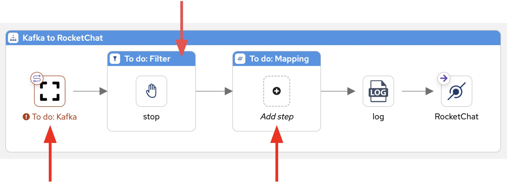

:walkthrough: Matrix to Rocket.Chat bridge ()
:user-password: openshift
:namespace: {user-username}-devspaces

:url-element: https://element-matrix.{openshift-app-host}
:url-rocketchat: https://rocketchat-rocketchat.{openshift-app-host}
:url-codeready: http://devspaces.{openshift-app-host}/
:url-devconsole: {openshift-host}/topology/ns/{namespace}

:experimental:

:btn-replace: pass:[<svg fill="#000000" width="1.5em" height="1.5em"  viewBox="0 0 912.193 912.193" xml:space="preserve"> \
  <g stroke-width="0"></g><g stroke-linecap="round" stroke-linejoin="round"></g><g> <g> <path d="M807.193,170.092v83.973c-6.033-10.458-12.529-20.674-19.512-30.606c-24.436-34.762-54.037-65.357-87.984-90.937 c-34.352-25.885-72.34-46.014-112.908-59.827c-41.957-14.286-85.891-21.529-130.577-21.529c-46.663,0-92.432,7.883-136.03,23.431 c-42.135,15.025-81.295,36.846-116.393,64.858c-34.751,27.735-64.539,60.747-88.534,98.119 c-24.444,38.072-42.191,79.621-52.748,123.492c-6.783,28.19,10.57,56.542,38.761,63.325c4.128,0.993,8.259,1.469,12.325,1.469 c23.705,0,45.21-16.167,51-40.229c15.47-64.292,52.651-122.573,104.694-164.109c26.001-20.751,54.989-36.909,86.16-48.024 c32.249-11.5,66.151-17.331,100.765-17.331c65.672,0,128.018,20.822,180.297,60.214c35.375,26.656,64.541,61.161,85.139,100.095 h-58.166c-28.994,0-52.5,23.505-52.5,52.5s23.506,52.5,52.5,52.5h196.211c28.996,0,52.5-23.505,52.5-52.5V170.092 c0-28.995-23.504-52.5-52.5-52.5C830.699,117.592,807.193,141.097,807.193,170.092z"></path> <path d="M52.5,794.602c28.995,0,52.5-23.504,52.5-52.5v-84.326c31.275,54.438,74.821,100.955,127.654,135.994 c66.246,43.936,143.417,67.186,223.196,67.254c0.044,0,0.087,0.004,0.13,0.004c0.035,0,0.071-0.002,0.106-0.002 c0.041,0,0.083,0.002,0.124,0.002c0.056,0,0.109-0.004,0.166-0.004c46.524-0.045,92.157-7.924,135.633-23.428 c42.135-15.025,81.295-36.846,116.393-64.857c34.752-27.734,64.539-60.748,88.535-98.119 c24.443-38.072,42.191-79.621,52.748-123.492c6.783-28.189-10.57-56.541-38.762-63.324s-56.541,10.57-63.324,38.76 c-15.471,64.293-52.652,122.574-104.695,164.109c-26,20.75-54.988,36.91-86.16,48.023c-32.217,11.488-66.082,17.318-100.657,17.33 c-59.154-0.023-116.346-17.229-165.398-49.762c-42.3-28.053-76.562-66.006-100.007-110.545h58.028c28.996,0,52.5-23.506,52.5-52.5 c0-28.996-23.505-52.5-52.5-52.5H52.5c-28.995,0-52.5,23.504-52.5,52.5v198.883C0,771.098,23.505,794.602,52.5,794.602z"></path> </g> </g></svg>]

:pen-btn: pass:[<svg height="2em" width="2em" viewBox="0 0 16 16" version="1.1" xmlns="http://www.w3.org/2000/svg" xmlns:xlink="http://www.w3.org/1999/xlink"><path fill="#444" d="M1 11.9l-1 4.1 4.1-1 9.2-9.2-3.1-3.1-9.2 9.2zM1.5 15l-0.4-0.5 0.4-2 2 2-2 0.5zM10.9 4.4l-8.1 8-0.6-0.6 8.1-8 0.6 0.6z"></path><path fill="#444" d="M15.3 0.7c-1.1-1.1-2.6-0.5-2.6-0.5l-1.5 1.5 3.1 3.1 1.5-1.5c0-0.1 0.6-1.5-0.5-2.6zM13.4 1.6l-0.5-0.5c0.6-0.6 1.1-0.1 1.1-0.1l-0.6 0.6z"></path></svg>]

:map-att: pass:[<svg width="1em" height="1em" viewBox="0 0 16 16" xmlns="http://www.w3.org/2000/svg" fill="none" stroke="currentColor" stroke-width="1" stroke-linecap="round" stroke-linejoin="round" class="bi bi-box-arrow-in-down-right"> \
  <path d="M6.364 2.5a.5.5 0 0 1 .5-.5H13.5A1.5 1.5 0 0 1 15 3.5v10a1.5 1.5 0 0 1-1.5 1.5h-10A1.5 1.5 0 0 1 2 13.5V6.864a.5.5 0 1 1 1 0V13.5a.5.5 0 0 0 .5.5h10a.5.5 0 0 0 .5-.5v-10a.5.5 0 0 0-.5-.5H6.864a.5.5 0 0 1-.5-.5z" /> \
  <path d="M11 10.5a.5.5 0 0 1-.5.5h-5a.5.5 0 0 1 0-1h3.793L1.146 1.854a.5.5 0 1 1 .708-.708L10 9.293V5.5a.5.5 0 0 1 1 0v5z" /> \
</svg>]

:map-tick: pass:[<svg width="1em" height="1em" viewBox="0 0 24 24" fill="none" xmlns="http://www.w3.org/2000/svg" stroke-width="1"> \
<path d="M4.89163 13.2687L9.16582 17.5427L18.7085 8" stroke="#000000" stroke-width="3.5" stroke-linecap="round" stroke-linejoin="round"/> \
</svg>]

:map-import: pass:[<svg width="1em" height="1em" viewBox="0 0 512 512" xmlns="http://www.w3.org/2000/svg" fill="#FFFFFF"> \
  <path d="M16 288c-8.8 0-16 7.2-16 16v32c0 8.8 7.2 16 16 16h112v-64zm489-183L407.1 7c-4.5-4.5-10.6-7-17-7H384v128h128v-6.1c0-6.3-2.5-12.4-7-16.9zm-153 31V0H152c-13.3 0-24 10.7-24 24v264h128v-65.2c0-14.3 17.3-21.4 27.4-11.3L379 308c6.6 6.7 6.6 17.4 0 24l-95.7 96.4c-10.1 10.1-27.4 3-27.4-11.3V352H128v136c0 13.3 10.7 24 24 24h336c13.3 0 24-10.7 24-24V160H376c-13.2 0-24-10.8-24-24z"/> \
</svg>]

:map-wrench: pass:[<svg version="1.1" id="Capa_1" xmlns="http://www.w3.org/2000/svg" xmlns:xlink="http://www.w3.org/1999/xlink" x="0px" y="0px" \
   height="1em" fill="white" viewBox="0 0 479.79 479.79" style="enable-background:new 0 0 479.79 479.79;" \
   xml:space="preserve"> \
<g> \
  <path d="M478.409,116.617c-0.368-4.271-3.181-7.94-7.2-9.403c-4.029-1.472-8.539-0.47-11.57,2.556l-62.015,62.011l-68.749-21.768 \
    l-21.768-68.748l62.016-62.016c3.035-3.032,4.025-7.543,2.563-11.565c-1.477-4.03-5.137-6.837-9.417-7.207 \
    c-37.663-3.245-74.566,10.202-101.247,36.887c-36.542,36.545-46.219,89.911-29.083,135.399c-1.873,1.578-3.721,3.25-5.544,5.053 \
    L19.386,373.152c-0.073,0.071-0.145,0.149-0.224,0.219c-24.345,24.346-24.345,63.959,0,88.309 \
    c24.349,24.344,63.672,24.048,88.013-0.298c0.105-0.098,0.201-0.196,0.297-0.305l193.632-208.621 \
    c1.765-1.773,3.404-3.628,4.949-5.532c45.5,17.167,98.9,7.513,135.474-29.056C468.202,191.181,481.658,154.275,478.409,116.617z \
     M75.98,435.38c-8.971,8.969-23.5,8.963-32.47,0c-8.967-8.961-8.967-23.502,0-32.466c8.97-8.963,23.499-8.963,32.47,0 \
    C84.947,411.878,84.947,426.419,75.98,435.38z"/> \
</g></svg>]

:btn-stl-blue: pass:[style="display:inline-block; padding:10px 22px; background:#0366CB; color:white; font:normal 14px Arial,sans-serif; border-radius:40px; cursor:default; user-select:none; text-decoration:none;"]

// WORKS
:style-kbd: kbd { \
  color: black; \
  background-color: white; \
  border: 1px solid black; \
  box-shadow: 0px 1px black; \
  font-size: .85em; \
  line-height: .85em; \
  display: inline-block; \
  font-weight: 600; \
  letter-spacing: .05em; \
  padding: 3px 5px; \
  white-space: nowrap; \
  border-radius:5px; \
} \

:style-summary: summary {cursor: pointer; list-style: none;}
:style-triangle: .triangle {margin-right: .5em;} summary:hover .sumtext {text-decoration: underline;}
:style-details:  .triangle::before {content: "▶";} details[open] .triangle::before {content: "▼";}
:style-open-close: {style-summary}{style-triangle}{style-details} 

:style-preview: pre {background-color: #272822; color: white; padding: 5px 15px; font-size: 15px}
:style-indent: .indent2 {padding-left: 2rem;}
:style-all: pass:a[]

:url-docserver: https://docserver-webapp.{openshift-app-host}
//:url-docserver: http://0.0.0.0:8080

:docserver-status: pass:a[ response.text()) \
        .then(data => this.parentElement.innerHTML = 'Status: 

&nbsp;
') \
        .catch(error => this.parentElement.innerHTML = 'Status: 

&nbsp;
') \
      ">]

:freplace: pass:[function replaceTokens(templateString, values) { \
    const valueArray = values.split(',').map(val => val.trim()); \
    let result = templateString; \
    let replaceIndex = 0; \
    while (result.includes('REPLACE') && replaceIndex < valueArray.length) { \
        result = result.replace('REPLACE', valueArray[replaceIndex]); \
        replaceIndex++; \
    } \
    return result; \
}]

//:fdocserver: pass:a[function docserver(target,template,params) { \
//    {freplace} \
//    fetch('{url-docserver}/roomid?user='+params) \
//        .then(response => response.text()) \
//        .then(data => {target.firstChild.data=replaceTokens(text, data);}) \
//        .catch(error => room = 'Error fetching data: ' + error.message); \
//}]

:fdocserver: pass:a[function docserver(target,template,params) { \
    {freplace} \
    fetch('{url-docserver}'+params.trim()) \
        .then(response => response.text()) \
        .then(data => {target.firstChild.data=replaceTokens(text, data);}) \
        .catch(error => room = 'Error fetching data: ' + error.message); \
}]

:fcopy: pass:a[function copy(el) { \
  el.previousElementSibling.select(); \
  text = el.previousElementSibling.textContent; \
  console.log(text); \
  navigator.clipboard.writeText(text + '\n') \
        .then(response => console.log('Text with carriage return copied to clipboard!')) \
        .catch(err => console.error('Failed to copy: ', err)); \
}]

:copypaste: pass:a[ \

 \
  <textarea readonly style="field-sizing: content;border: none; background-color: #f0f0f0; width: 100%; resize: none; font-size:14px; font-family: monospace;padding: 5px 15px" rows="4">function example() { \
  console.log("Hello {replace-with-previous}!"); \
  return true; \
}</textarea> \
  <button class="mytooltip" onclick="{fcopy} copy(this);" style="border: none; background-color: white; padding: 5px 15px; border-bottom: 1px solid transparent; transition: border-bottom-color 0.2s;"> \
    <svg fill="currentColor" height="1em" width="1em" viewBox="0 0 448 512" aria-hidden="true" role="img" style="vertical-align: -0.125em;"> \
      <path d="M320 448v40c0 13.255-10.745 24-24 24H24c-13.255 0-24-10.745-24-24V120c0-13.255 10.745-24 24-24h72v296c0 30.879 25.121 56 56 56h168zm0-344V0H152c-13.255 0-24 10.745-24 24v368c0 13.255 10.745 24 24 24h272c13.255 0 24-10.745 24-24V128H344c-13.2 0-24-10.8-24-24zm120.971-31.029L375.029 7.029A24 24 0 0 0 358.059 0H352v96h96v-6.059a24 24 0 0 0-7.029-16.97z"></path> \
    </svg> \
    Copy to clipboard \
  </button> \
   \

 \
 \
]

:snippet: pass:a[ \

 \

 \
 \
]

ifdef::env-github[]
endif::[]

[id='lab3-matrix-kafka-rocketchat']
// = Lab 3 - Matrix ⇔ Kafka ⇔ Rocket.Chat (via streams)
= Lab 3 - Decoupled Re-Architecture

// = [[kubernetes-user]] The Kubernetes user deployment flow

Open the architecture by decoupling the messaging systems using streaming capabilities with Streams for Apache Kafka.

Prerequisites: +
--
* Ensure you have previously completed the following tiles:
+
image::images/prereq.png[align="left", width=100%]

{empty} +
--

*Overview*

Lab 1 and 2 enabled _Matrix_/_Rocket.Chat_ conversations. However their connectivity was tightly coupled with dedicated data translations between both platforms. On this third lab we want to break them away to open up the architecture in order to welcome additional systems and services.

The picture below illustrates an asynchronous decoupled architecture, via a streaming platform (_Kafka_). This approach increases the number of data flows from two to four.

TIP: At first it seems unnecessary to double the number of data flows, but the benefits outweighs complexity, we gain an easily extensible architecture. In later labs you'll see new additions to the architecture.

// image::images/processing-flow.png[title="Data flow",align="center",title-align=center, width=80%]
image::images/data-flow.png[align="center", width=90%]

{empty} +

In terms of implementation effort for this lab, your main task is to split each of your current data flows (from Lab-2) in two different parts:

- The _Matrix_ to _Rocket.Chat_ process into:
. _Matrix_ to _Kafka_
. _Kafka_ to _Rocket.Chat_
+
{empty} +
- The _Rocket.Chat_ to _Matrix_ process into:
. _Rocket.Chat_ to _Kafka_
. _Kafka_ to _Matrix_

{empty} +

One fundamental architecture consideration is that if we want an easy to plugin platform where other communication systems or services need to plugin with ease, we should adopt a standard data model. It would establish a common interface for systems planning to integrate with the platform.

This implies that instead of applying platform specific data transformations (eg. _Matrix_ data model to _Rocket.Chat_ data model), we apply the following data transformations:

- System specific to standard data model (e.g. _Matrix_/_Rocket.Chat_ to _Kafka_)
- Standard data model to system specific (e.g. _Kafka_ to _Matrix_/_Rocket.Chat_)

{empty} +

The illustration below describes data exchanges via _Kafka_:

image::images/standard-data-model.png[align="center", width=90%]

{empty} +

Technical goals and milestones:

* Evolve the solution into an event-driven architecture.
* Adopt a standard interface
* Switch bindings to plug platform resources.

{empty} +

[time=2]
[id="setup"]
== Setup the Lab working folder

[type=taskResource]
.Credentials
****
* *username:* `{user-username}`
//* *password:* `{user-password}`
****
[type=taskResource]
.Red Hat OpenShift Dev Spaces
****
* link:{url-codeready}[Console, window="_blank"]
****

{empty} +

The following set of instructions prepare the set of files you will be working with: 

. Close tabs
+
Before you start this second lab, make sure you close in your editor all the tabs (source files) from the previous exercise.
+
image::images/crw-close-tabs.png[align="left", width=100%]
+
{blank}
+
1. Click on the file explorer's `...` button +
1. Ensure your `Open Editors` is ticked [√] +
1. Click the `Close all Editors` button.
+
{empty} +

. Setup your Lab 3 folder
+
--
{copypaste}
[subs=attributes]
----
step 5
----
--
{empty} +

. Check your lab folder
+
After executing the commands above, have a look in your editor's tree view to confirm it looks healthy. It should be similar to:
+
--
[.indent2]
📁 workshop +
&nbsp;&nbsp;📁 lab +
&nbsp;&nbsp;&nbsp;&nbsp;📁 k2m +
pass:[<mark style="padding-left: 2rem; background-color: white; color: purple"><b><i>&nbsp;!&nbsp;&nbsp;</i></b></mark>] *k2m.camel.yaml* +
&nbsp;&nbsp;&nbsp;&nbsp;📁 k2r +
pass:[<mark style="padding-left: 2rem; background-color: white; color: purple"><b><i>&nbsp;!&nbsp;&nbsp;</i></b></mark>] *k2r.camel.yaml* +
&nbsp;&nbsp;&nbsp;&nbsp;📁 m2k +
pass:[<mark style="padding-left: 2rem; background-color: white; color: purple"><b><i>&nbsp;!&nbsp;&nbsp;</i></b></mark>] *m2k.camel.yaml* +
&nbsp;&nbsp;&nbsp;&nbsp;📁 r2k +
pass:[<mark style="padding-left: 2rem; background-color: white; color: purple"><b><i>&nbsp;!&nbsp;&nbsp;</i></b></mark>] *r2k.camel.yaml* +
pass:[<mark style="padding-left: 1rem; background-color: white; color: grey"><b>⚙</b></mark>] matrix.properties +
pass:[<mark style="padding-left: 1rem; background-color: white; color: grey"><b>⚙</b></mark>] rocketchat.properties +

NOTE: Make sure the files are visible in your file explorer in the left panel of _VSCode_.
--
+
{empty} +

[type=verification]
Do you see the same folder structure and files?

[type=verificationSuccess]
You're ready to continue.

[type=verificationFail]
Make sure the syntax of the commands are compatible with with your environment and try again.

{empty} +

[time=5]
[id="matrix-rocketchat-to-kafka"]
== Matrix/Rocket.Chat to Kafka
{style-all}

[type=taskResource]
.Credentials
****
* *username:* `{user-username}`
//* *password:* `{user-password}`
****
[type=taskResource]
.Red Hat OpenShift Dev Spaces
****
* link:{url-codeready}[Console, window="_blank"]
****
[type=taskResource]
.Red Hat OpenShift Developer Console
****
* link:{url-devconsole}[Topology View, window="_blank"]
****
[type=taskResource]
.Matrix
****
* link:{url-element}[Matrix Web Client, window="_blank"]
****
[type=taskResource]
.Rocket.Chat
****
* link:{url-rocketchat}[Rocket.Chat Web Client, window="_blank"]
****

The two data flows we have created in previous labs are almost identical in terms of processing steps, those are:

. Receive events
. Filter events
. Transform events
. Push events

{empty} +

For the processes from _Matrix_/_Rocket.Chat_ to _Kafka_, the steps remain the same, we just need to switch to the standard data model (step 3) and target _Kafka_ instead (step 4).

{empty} +

=== Process overview

The diagram below applies to the data flows (2 of them) from _Matrix_/_Rocket.Chat_ respectively to _Kafka_:

image::images/new/processing-flow-chat2kafka.jpg[align="center", width=90%]
//image::images/processing-flow-chat2kafka.png[align="center", width=90%]

{empty} +

There are 4 processing steps in use:

====
* *1 source _Kamelet_* +
Consumes events from _Matrix/Rocket.Chat_.

* *2 mid-flow steps* +
One filters messages to prevent death loops. +
One transforms _Matrix/Rocket.Chat_ events to the standard data model.

* *1 producer* +
Produces events to _Kafka_.
====

{empty} +

=== Matrix to Kafka

The picture below shows the original _Matrix to Rocket.Chat_ flow you defined earlier:

image::images/new/flow-m2r.jpg[align="left", width=60%]

{blank}

The changes you need to apply on the flow above are minimal:

1. Redefine the data mapping using the common interface
1. Send the event to Kafka (instead of _Rocket.Chat_)

{blank}

To simplify the work you need to do, we've prepared the flow so that you just need to fill the blanks. The picture below illustrates the two focus areas where you need to work on:

image::images/new/flow-m2k-todo.jpg[align="left", width=70%]

{blank}

To open the Camel route definition (picture above), find in your directory tree the following resource:

* `m2k.camel.yaml`
+
Click to open it in _Kaoto_. 
+
{empty} +

Then, follow the instructions below to complete its definition:

{empty} +

. *Define the data transformation*
+
In the new data transformation, the source system remains the same (_Matrix_). However, because the event to push to _Kafka_ will target various systems, we need to use a common schema shared with all other _Camel_ flows.
+
{empty} +
+
A. Include in your Camel route a Kaoto data transformation step
+
--
From Kaoto: 

. Click the kbd:[+] button inside the pass:[<code style="background-color: #4494E5; color: white;">&nbsp;To do: Mapping&nbsp;</code>] step
. Type `mapper` in the filter to find the _Kaoto DataMapper_
. Click the _Kaoto DataMapper_ tile
. Click the mapper to open the configuration panel
. Click the pass:a[{map-wrench}  Configure] button
--
+
{empty} +

A. Next, define the inputs and outputs
+
--
From the DataMapper editor: 

. Define the source:
.. On **Parameters** click the button kbd:[+] to add new parameter
.. Enter `matrix` and click the checkmark button kbd:[{map-tick}]
.. Click kbd:[{map-att}] (Attach schema), next click 
pass:a[{map-import}] and then pick at the top of your screen: `support/schemas/*matrix-in.json*`.
.. Click pass:a[Attach] to complete the action.
+
{blank}
+
. Define the target
.. On the right hand side of the DataMapper screen: +
Click kbd:[{map-att}] (Attach schema), next click 
pass:a[{map-import}] and then pick at the top of your screen: `support/schemas/*common.json*`.
.. Click pass:a[Attach] to complete the action.
+
{empty} +
--

A. Define the data mappings rules
+
Copy and Paste the values below to define the given field entries:
+
... `string[@key = timestamp]`: 
+
--
{copypaste}
----
$matrix-x/fn:map/fn:string[@key='sent']
----
--
+
{blank}
+
... `string[@key = source]`: 
+
--
{copypaste}
----
"matrix"
----
--
+
{blank}
+
... `string[@key = user]`: 
+
--
{copypaste}
----
$matrix-x/fn:map/fn:map[@key='fromUser']/fn:string[@key='displayName']
----
--
+
{blank}
+
... `string[@key = text]`:
+
--
{copypaste}
----
$matrix-x/fn:map/fn:string[@key='text']
----
--
+
{empty} +

. *Define Kafka as the target system*
+
The last step of the flow is where you need to define Kafka as the target system where events will be pushed.
+
NOTE: Your _OpenShift_ namespace already contains an _Streams for Apache Kafka_ cluster (_Kafka_) ready for you to use. 
+

1. Click the `+` button inside the pass:[<code style="background-color: #4494E5; color: white;">&nbsp;To do: Kafka&nbsp;</code>] step
1. Find and select the _Kafka_ component.
1. Select the `All` configuration tab
1. Configure the following 2 properties:
+
`Topic`:
+
--
{copypaste}
----
myroom
----
--
+
`Brokers`:
+
--
{copypaste}
----
my-cluster-kafka-bootstrap:9092
----
--
+
{empty} +

And that's all it takes for this first data flow between _Matrix_ and _Kafka_.

{empty} +

=== Rocket.Chat to Kafka

Very similar changes apply for the _Rocket.Chat_ -> _Kafka_ flow.

Find in your directory tree the following resource:

* `r2k.camel.yaml`
+
Click to open it in _Kaoto_. 
+
{empty} +

Then, follow the instructions below to complete its definition:

{empty} +

. *Define the data transformation*
+
The source system remains the same (_Rocket.Chat_). In similar fashion we also need to use a common schema shared with all other _Camel_ flows.
+
{empty} +
+
A. Include in your Camel route a Kaoto data transformation step
+
--
From Kaoto: 

. Click the kbd:[+] button inside the pass:[<code style="background-color: #4494E5; color: white;">&nbsp;To do: Mapping&nbsp;</code>] step
. Type `mapper` in the filter to find the _Kaoto DataMapper_
. Click the _Kaoto DataMapper_ tile
. Click the mapper to open the configuration panel
. Click the pass:a[{map-wrench}  Configure] button
--
+
{empty} +

A. Next, define the inputs and outputs
+
--
From the DataMapper editor: 

. Define the source:
.. On **Parameters** click the button kbd:[+] to add new parameter
.. Enter `rocketchat` and click the checkmark button kbd:[{map-tick}]
.. Click kbd:[{map-att}] (Attach schema), next click 
pass:a[{map-import}] and then pick at the top of your screen: `support/schemas/*rocketchat-in.json*`.
.. Click pass:a[Attach] to complete the action.
+
{blank}
+
. Define the target
.. On the right hand side of the DataMapper screen: +
Click kbd:[{map-att}] (Attach schema), next click 
pass:a[{map-import}] and then pick at the top of your screen: `support/schemas/*common.json*`.
.. Click pass:a[Attach] to complete the action.
+
{empty} +
--

A. Define the data mappings rules
+
Copy and Paste the values below to define the given field entries:
+
... `string[@key = timestamp]`: 
+
--
{copypaste}
----
$rocketchat-x/fn:map/fn:string[@key='timestamp']
----
--
+
{blank}
+
... `string[@key = source]`: 
+
--
{copypaste}
----
"rocketchat"
----
--
+
{blank}
+
... `string[@key = user]`: 
+
--
{copypaste}
----
$rocketchat-x/fn:map/fn:string[@key='user_name']
----
--
+
{blank}
+
... `string[@key = text]`:
+
--
{copypaste}
----
$rocketchat-x/fn:map/fn:string[@key='text']
----
--
+
{empty} +

. *Define Kafka as the target system*
+
The last step of the flow is where you need to define Kafka as the target system where events will be pushed.
+
NOTE: Your _OpenShift_ namespace already contains an _Streams for Apache Kafka_ cluster (_Kafka_) ready for you to use. 
+

1. Click the `+` button inside the pass:[<code style="background-color: #4494E5; color: white;">&nbsp;To do: Kafka&nbsp;</code>] step
1. Find and select the _Kafka_ component.
1. Select the `All` configuration tab
1. Configure the following 2 properties:
+
`Topic`:
+
--
{copypaste}
----
myroom
----
--
+
`Brokers`:
+
--
{copypaste}
----
my-cluster-kafka-bootstrap:9092
----
--
+
{empty} +

Very straightforward, nothing else to be done here. 

{empty} +

[time=5]
[id="kafka-to-matrix-rocketchat"]
== Kafka to Rocket.Chat/Matrix
{style-all}

[type=taskResource]
.Credentials
****
* *username:* `{user-username}`
//* *password:* `{user-password}`
****
[type=taskResource]
.Red Hat OpenShift Dev Spaces
****
* link:{url-codeready}[Console, window="_blank"]
****
[type=taskResource]
.Red Hat OpenShift Developer Console
****
* link:{url-devconsole}[Topology View, window="_blank"]
****
[type=taskResource]
.Matrix
****
* link:{url-element}[Matrix Web Client, window="_blank"]
****
[type=taskResource]
.Rocket.Chat
****
* link:{url-rocketchat}[Rocket.Chat Web Client, window="_blank"]
****

The processing steps still remain essentially the same:

. Receive events
. Filter events
. Transform events
. Push events

{empty} +

The main differences are that we are consuming events from _Kafka_ (step 1) and that we have to translate events (step 3) from the standard data model to the target specific model (e.g. _Matrix_, _Rocket.Chat_, other)

{empty} +

=== Process overview

The diagram below applies to the data flows (2 of them) from _Kafka_ to Matrix/Rocket.Chat respectively:

image::images/new/processing-flow-kafka2chat.jpg[align="center", width=90%]
//image::images/processing-flow-kafka2chat.png[align="center", width=90%]

{empty} +

There are 4 processing steps in use:

====
* *1 consumer* +
Consumes events from _Kafka_.

* *2 mid-flow steps* +
One filters messages to prevent death loops. +
One transforms events from the standard data model to _Matrix/Rocket.Chat_.

* *1 sink _Kamelet_* +
Produces events to _Matrix/Rocket.Chat_.
====

{empty} +

=== Kafka to Rocket.Chat

Like we did earlier, it's handy to use one of the previous flows as a base to construct the new _Kafka to Rocket.Chat_ proces as some of the steps are identical. The picture below shows the original _Matrix to Rocket.Chat_ flow you originally constructed:

image::images/new/flow-m2r.jpg[align="left", width=60%]

{blank}

Again, the changes you need to apply on the flow above are minimal:

1. Replace _Matrix_ as the source by a _Kafka_ consumer.
1. Redefine the filter to prevent *Rocket.Chat to Rocket.Chat* loopback events.
1. Redefine the data mapping to use the common interface as the source schema.

{blank}

To simplify the work you need to do, we've prepared the flow so that you just need to fill the blanks. The picture below illustrates the focus areas where you need to work on:

{blank}

NOTE: You might find this exercice repetitive. You can fast-foward to accelerate your work.

[TIP]
====
⏩ *Fast-Forward*

[.underline]#*Only*# if you want to skip (fast-forward) this section, execute in your terminal the commands below:

--
{copypaste}
----
ff
----
--
====

For a manual creation process, continue with the instructions below. +
Find in your directory tree the following resource:

* `k2r.camel.yaml`
+
Click to open it in _Kaoto_. 
+
{empty} +

Then, follow the instructions below to complete its definition:

{empty} +

. *Define Kafka as the source system*
+
The first step of the flow is where you need to define Kafka as the source system from where events will arrive.
+
NOTE: Your _OpenShift_ namespace already contains an _Streams for Apache Kafka_ cluster (_Kafka_) ready for you to use. 
+

1. Hover the `To do: Kafka` step and click the floating {btn-replace} button.
1. Find and select the _Kafka_ component.
1. Select the `All` configuration tab
1. Configure the following 2 properties:
+
`Topic`:
+
--
{copypaste}
----
myroom
----
--
+
`Brokers`:
+
--
{copypaste}
----
my-cluster-kafka-bootstrap:9092
----
--
+
{empty} +

. *Define the filter*
+
Filters you've previously defined are intended to block loopback events, in other words, if we push an event to _Matrix_ or _Rocket.Chat_, we don't want the same message to come back.
+
However, by decoupling the architecture using _Kafka_, we introduce another event duplication threat you need to keep under control. The problem that arises is that we're about to define flows using _Kafka_ consumers that will route any incoming event, no matter where they really originate from, and push it to a defined target. In other words, we're potentially creating flows where the source and target system is the same, for example:
+
  * _Matrix -> Matrix_
  * _Rocket.Chat -> Rochet.Chat_
  * _X -> X_
+
{blank}
+
The filter you need to define will prevent that.
+
1. Click the bar pass:[<code style="background-color: #B0380C; color: white;">&nbsp;To do: Filter&nbsp;</code>]
+
You should the `JQ` expression language is selected by default.
+
1. copy and paste the following expression:
+
--
{copypaste}
----
.source | test("rocketchat")
----
--
+
NOTE: The expression above picks the `source` JSON field from the Kafka event and checks if it originates in the Rocket.Chat system.
+
NOTE: Flows pushing events to _Kafka_ populate the field `source` to indicate where the event originates. 
+
{empty} +

. *Define the data transformation*
+
In the new data transformation, the source data complies with the common schema (from _Kafka_) while the target system needs to map data going to _Rocket.Chat_.
+
.. Include in your Camel route a Kaoto data transformation step
+
--
From Kaoto: 

. Click the kbd:[+] button inside the pass:[<code style="background-color: #4494E5; color: white;">&nbsp;To do: Mapping&nbsp;</code>] step
. Type `mapper` in the filter to find the _Kaoto DataMapper_
. Click the _Kaoto DataMapper_ tile
. Click the mapper to open the configuration panel
. Click the pass:a[{map-wrench}  Configure] button
--
+
{empty} +

.. Next, define the inputs and outputs
+
--
From the DataMapper editor: 

. Define the source:
.. On **Parameters** click the button kbd:[+] to add new parameter
.. Enter `common` and click the checkmark button kbd:[{map-tick}]
.. Click kbd:[{map-att}] (Attach schema), next click 
pass:a[{map-import}] and then pick at the top of your screen: `support/schemas/*common.json*`.
.. Click pass:a[Attach] to complete the action.
+
{blank}
+
. Define the target
.. On the right hand side of the DataMapper screen: +
Click kbd:[{map-att}] (Attach schema), next click 
pass:a[{map-import}] and then pick at the top of your screen: `support/schemas/*rocketchat-out.json*`.
.. Click pass:a[Attach] to complete the action.
+
{empty} +
--

.. Define the data mappings rules
+
Copy and Paste the values below to define the given field entries:
+
... `string[@key = channel]`: 
+
--
{copypaste}/roomid/{user-username}
----
"REPLACE"
----
--
+
{blank}
+
... `string[@key = text]`:
+
--
{copypaste}
----
concat("*",$common-x/fn:map/fn:string[@key='user'], "@", $common-x/fn:map/fn:string[@key='source'],":* ", $common-x/fn:map/fn:string[@key='text'])
----
--
+
{empty} +

And you’re done with the Kafka → Rocket.Chat changes.

{empty} +

=== Kafka to Matrix

//Like we did earlier, it's handy to use one of the previous flows as a base to construct the new _Kafka to Matrix_ proces as many of the steps are the same. The picture below shows the original _Rocket.Chat to Matrix_ flow you defined earlier:

//image::images/new/flow-m2r.jpg[align="left", width=60%]

//{blank}

Similarly, the changes you need to apply on this flow are minimal:

1. Define a _Kafka_ consumer (instead of _Rocket.Chat_)
1. Redefine the filter to prevent *Rocket.Chat to Rocket.Chat* loopback events.
1. Redefine the data mapping to use the common interface as the source schema.

{blank}

image::images/new/flow-k2m-todo.jpg[align="left", width=70%]

{blank}

NOTE: You might find the remaining task repetitive. You can skip it to accelerate your work.

[TIP]
====
⏩ *Skip step*

[.underline]#*Only*# if you want to skip this section, execute in your terminal the commands below:

--
{copypaste}
----
step 6
----
--
====

For a manual creation process, continue with the instructions below. +
Find in your directory tree the following resource:

* `k2m.camel.yaml`
+
Click to open it in _Kaoto_. 
+
{empty} +

Then, follow the instructions below to complete its definition:

{empty} +

. *Define Kafka as the source system*
+
The first step of the flow is where you need to define _Kafka_ as the source system from where events will arrive.
+
NOTE: Your _OpenShift_ namespace already contains an _Streams for Apache Kafka_ cluster (_Kafka_) ready for you to use. 
+

1. Hover the `To do: Kafka` step and click the floating {btn-replace} button.
1. Find and select the _Kafka_ component.
1. Select the `All` configuration tab
1. Configure the following 2 properties:
+
`Topic`:
+
--
{copypaste}
----
myroom
----
--
+
`Brokers`:
+
--
{copypaste}
----
my-cluster-kafka-bootstrap:9092
----
--
+
{empty} +

. *Define the filter*
+
As previously explained, you need the define a filter to prevent events flowing from _Matrix to Matrix_.
+
1. Click the bar pass:[<code style="background-color: #B0380C; color: white;">&nbsp;To do: Filter&nbsp;</code>]
+
You should see the `JQ` expression language selected by default.
+
1. copy and paste the following expression:
+
--
{copypaste}
----
.source | test("matrix")
----
--
+
NOTE: The expression above picks the `source` JSON field from the _Kafka_ event and checks if it originates in the _Matrix_ system.
+
NOTE: Flows pushing events to _Kafka_ populate the field `source` to indicate where the event originates. 
+
{empty} +

. *Define the data transformation*
+
In the new data transformation, the source data complies with the common schema (from _Kafka_) while the target system needs to map data going to _Matrix_.
+
.. Include in your Camel route a Kaoto data transformation step
+
--
From Kaoto: 

. Click the kbd:[+] button inside the pass:[<code style="background-color: #4494E5; color: white;">&nbsp;To do: Mapping&nbsp;</code>] step
. Type `mapper` in the filter to find the _Kaoto DataMapper_
. Click the _Kaoto DataMapper_ tile
. Click the mapper to open the configuration panel
. Click the pass:a[{map-wrench}  Configure] button
--
+
{empty} +

.. Next, define the inputs and outputs
+
--
From the DataMapper editor: 

. Define the source:
.. On **Parameters** click the button kbd:[+] to add new parameter
.. Enter `common` and click the checkmark button kbd:[{map-tick}]
.. Click kbd:[{map-att}] (Attach schema), next click 
pass:a[{map-import}] and then pick at the top of your screen: `support/schemas/*common.json*`.
.. Click pass:a[Attach] to complete the action.
+
{blank}
+
. Define the target
.. On the right hand side of the DataMapper screen: +
Click kbd:[{map-att}] (Attach schema), next click 
pass:a[{map-import}] and then pick at the top of your screen: `support/schemas/*matrix-out.json*`.
.. Click pass:a[Attach] to complete the action.
+
{empty} +
--

.. Define the data mappings rules
+
Copy and Paste the values below to define the given field entries:
+
... `string[@key = text]`:
+
--
{copypaste}
----
concat("<b>",$common-x/fn:map/fn:string[@key='user'], "@", $common-x/fn:map/fn:string[@key='source'],":</b> ", $common-x/fn:map/fn:string[@key='text'])
----
--
+
{empty} +

Again, very simple updates, nothing else required for the _Kafka → Matrix_ process.

{empty} +

[time=8]
[id="deploy-test"]
== Deploy and test
{style-all}

[type=taskResource]
.Credentials
****
* *username:* `{user-username}`
//* *password:* `{user-password}`
****
[type=taskResource]
.Red Hat OpenShift Dev Spaces
****
* link:{url-codeready}[Console, window="_blank"]
****
[type=taskResource]
.Red Hat OpenShift Developer Console
****
* link:{url-devconsole}[Topology View, window="_blank"]
****
[type=taskResource]
.Matrix
****
* link:{url-element}[Matrix Web Client, window="_blank"]
****
[type=taskResource]
.Rocket.Chat
****
* link:{url-rocketchat}[Rocket.Chat Web Client, window="_blank"]
****

You've covered a lot of ground. Now it is time to deploy the new data flows.

[NOTE]
====
It's possible you made mistakes in decoupling the data flows.

* If you feel confident with your flows, ignore this note, and carry on with the deployment process.
* If you prefer to take the safe route, run the following command to reset your flows to a ready-to-deploy state:
+
--
{copypaste}
[subs=attributes]
----
step 6
----
--
====

=== Deploy Matrix to Kafka

{blank}

. To start with, make sure you have stopped you local Camel instance. +
If it is still running, press kbd:[Ctrl+C] to stop it.
+
{empty} +

. Run the deployment
+
Use the command below to deploy on _OpenShift_:
+
--
{copypaste}
----
labdeploy m2k \
matrix.properties
----
--
+
[pass]

  

    
    Click for more information
  

We provide the script <code>labdeploy</code> to help you read the commands more clearly. 
Under the hood the script calls <i>Camel JBang</i> as per the snippet below:
<pre>
camel kubernetes run m2k/* \
matrix.properties \
--name m2k \
--property quarkus.config.locations=matrix.properties \
--local-kamelet-dir ../support/kamelets \
--cluster-type openshift
</pre>

+
{blank}
+
NOTE: Be patient, this action may take some time to complete (could take up to 10mn the first time).
+
{empty} +

. Inspect the deployment status
+
You can monitor the state of the resource with the following command:
+
--
{copypaste}
----
oc get deployment/m2k
----
--
+
When the deployment is ready, the command outputs something similar to:
+
----
NAME   READY   UP-TO-DATE   AVAILABLE   AGE
m2k    1/1     1            1           23s 
----
+
{empty} +

{empty} +

=== Deploy Kafka to Matrix

{blank}

. Run the deployment
+
Use the command below to deploy on _OpenShift_:
+
--
{copypaste}
----
labdeploy k2m \
matrix.properties
----
--
+
[pass]

  

    
    Click for more information
  

We provide the script <code>labdeploy</code> to help you read the commands more clearly. 
Under the hood the script calls <i>Camel JBang</i> as per the snippet below:
<pre>
camel kubernetes run k2m/* \
matrix.properties \
--name k2m \
--property quarkus.config.locations=matrix.properties \
--local-kamelet-dir ../support/kamelets \
--cluster-type openshift
</pre>

+
{blank}
+
NOTE: Be patient, this action may take some time to complete (could take up to 10mn the first time).
+
{empty} +

. Inspect the deployment status
+
You can monitor the state of the resource with the following command:
+
--
{copypaste}
----
oc get deployment/k2m
----
--
+
When the deployment is ready, the command outputs something similar to:
+
----
NAME   READY   UP-TO-DATE   AVAILABLE   AGE
k2m    1/1     1            1           25s 
----
+
{empty} +
{empty} +
{empty} +

=== Deploy Rocket.Chat to Kafka

{blank}

. Run the deployment
+
Use the command below to deploy on _OpenShift_:
+
--
{copypaste}
----
labdeploy r2k \
rocketchat.properties
----
--
+
[pass]

  

    
    Click for more information
  

We provide the script <code>labdeploy</code> to help you read the commands more clearly. 
Under the hood the script calls <i>Camel JBang</i> as per the snippet below:
<pre>
camel kubernetes run r2k/* \
rocketchat.properties \
--name r2k \
--property quarkus.config.locations=rocketchat.properties \
--local-kamelet-dir ../support/kamelets \
--cluster-type openshift
</pre>

+
{blank}
+
NOTE: Be patient, this action may take some time to complete (could take up to 10mn the first time).
+
{empty} +

. Inspect the deployment status
+
You can monitor the state of the resource with the following command:
+
--
{copypaste}
----
oc get deployment/r2k
----
--
+
When the deployment is ready, the command outputs something similar to:
+
----
NAME   READY   UP-TO-DATE   AVAILABLE   AGE
r2k    1/1     1            1           20s 
----
+
{empty} +
{empty} +
{empty} +

=== Deploy Kafka to Rocket.Chat

{blank}

. Run the deployment
+
Use the command below to deploy on _OpenShift_:
+
--
{copypaste}
----
labdeploy k2r \
rocketchat.properties
----
--
+
[pass]

  

    
    Click for more information
  

We provide the script <code>labdeploy</code> to help you read the commands more clearly. 
Under the hood the script calls <i>Camel JBang</i> as per the snippet below:
<pre>
camel kubernetes run k2r/* \
rocketchat.properties \
--name k2r \
--property quarkus.config.locations=rocketchat.properties \
--local-kamelet-dir ../support/kamelets \
--cluster-type openshift
</pre>

+
{blank}
+
NOTE: Be patient, this action may take some time to complete (could take up to 10mn the first time).
+
{empty} +

. Inspect the deployment status
+
You can monitor the state of the resource with the following command:
+
--
{copypaste}
----
oc get deployment/k2r
----
--
+
When the deployment is ready, the command outputs something similar to:
+
----
NAME   READY   UP-TO-DATE   AVAILABLE   AGE
k2r    1/1     1            1           31s 
----
+
{empty} +
{empty} +
{empty} +

=== View and test your deployment

{blank}

. Check your deployment from the _Developer_ console
+
Looking from your console's topology view, you should see something similar to:
+
image::images/new/topology-view.jpg[align="left", width=80%]
+
{empty} +

. Send messages to test the system.
+
.. Go to you _Matrix_'s room and send a message, for example `Hello from Matrix`.

.. Then go to you _Rocket.Chat_'s room and send a message, for example `Hello from Rocket.Chat`.
+
If all goes well you should see something similar to the picture below:
+
image::images/stage3-msg-chat-test.png[align="left", width=90%]
+
{empty} +

+
{empty} +

[type=verification]
Did you see the message going from _Matrix_ to _Rocket.Chat_?

[type=verificationSuccess]
Very good !

[type=verificationFail]
Inspect in the pod logs to troubleshoot.

[type=verification]
Did you see the message going from _Rocket.Chat_ to _Matrix_?

[type=verificationSuccess]
Very good !

[type=verificationFail]
Inspect in the pod logs to troubleshoot.

// Bravo! You've completed Stage 3 !!
