:walkthrough: Discord Integration
:checkedbox: pass:normal[{startsb}&#10004;{endsb}]
:user-password: openshift
:namespace: {user-username}-devspaces
:invite-url: http://invite-webapp.{openshift-app-host}

:url-element: https://element-matrix.{openshift-app-host}
:url-rocketchat: https://rocketchat-rocketchat.{openshift-app-host}
:url-codeready: http://devspaces.{openshift-app-host}/
:url-devconsole: {openshift-host}/topology/ns/{namespace}

:url-docserver: https://docserver-webapp.{openshift-app-host}
//:url-docserver: https://docserver-webapp.apps.cluster-mqpjp.dynamic.redhatworkshops.io

:experimental:

:btn-trash: pass:[<svg width="2em" height="2em" xmlns="http://www.w3.org/2000/svg" preserveAspectRatio="xMidYMid meet"> \
<rect x="0" y="0" width="2em" height="2em"  fill="#B0380C" rx="8" ry="8" /> \
<g transform="translate(4,4)"> \
  <path d="M8 1.5V2.5H3C2.44772 2.5 2 2.94772 2 3.5V4.5C2 5.05228 2.44772 5.5 3 5.5H21C21.5523 5.5 22 5.05228 22 4.5V3.5C22 2.94772 21.5523 2.5 21 2.5H16V1.5C16 0.947715 15.5523 0.5 15 0.5H9C8.44772 0.5 8 0.947715 8 1.5Z" fill="#FFFFFF"/> \
    <path d="M3.9231 7.5H20.0767L19.1344 20.2216C19.0183 21.7882 17.7135 23 16.1426 23H7.85724C6.28636 23 4.98148 21.7882 4.86544 20.2216L3.9231 7.5Z" fill="#FFFFFF"/> \
</g></svg>]

:btn-duplicate: pass:[<svg fill="#000000" width="2em" height="2em" viewBox="0 0 32 32" data-name="Layer 1" id="Layer_1" xmlns="http://www.w3.org/2000/svg"><title/><path d="M27.2,8.22H23.78V5.42A3.42,3.42,0,0,0,20.36,2H5.42A3.42,3.42,0,0,0,2,5.42V20.36a3.43,3.43,0,0,0,3.42,3.42h2.8V27.2A2.81,2.81,0,0,0,11,30H27.2A2.81,2.81,0,0,0,30,27.2V11A2.81,2.81,0,0,0,27.2,8.22ZM5.42,21.91a1.55,1.55,0,0,1-1.55-1.55V5.42A1.54,1.54,0,0,1,5.42,3.87H20.36a1.55,1.55,0,0,1,1.55,1.55v2.8H11A2.81,2.81,0,0,0,8.22,11V21.91ZM28.13,27.2a.93.93,0,0,1-.93.93H11a.93.93,0,0,1-.93-.93V11a.93.93,0,0,1,.93-.93H27.2a.93.93,0,0,1,.93.93Z"/></svg>]

:btn-paste: pass:[<svg fill="#000000" width="1em" height="1em" viewBox="-32 0 512 512" xmlns="http://www.w3.org/2000/svg"><g id="SVGRepo_bgCarrier" stroke-width="0"></g><g id="SVGRepo_tracerCarrier" stroke-linecap="round" stroke-linejoin="round"></g><g id="SVGRepo_iconCarrier"><path d="M128 184c0-30.879 25.122-56 56-56h136V56c0-13.255-10.745-24-24-24h-80.61C204.306 12.89 183.637 0 160 0s-44.306 12.89-55.39 32H24C10.745 32 0 42.745 0 56v336c0 13.255 10.745 24 24 24h104V184zm32-144c13.255 0 24 10.745 24 24s-10.745 24-24 24-24-10.745-24-24 10.745-24 24-24zm184 248h104v200c0 13.255-10.745 24-24 24H184c-13.255 0-24-10.745-24-24V184c0-13.255 10.745-24 24-24h136v104c0 13.2 10.8 24 24 24zm104-38.059V256h-96v-96h6.059a24 24 0 0 1 16.97 7.029l65.941 65.941a24.002 24.002 0 0 1 7.03 16.971z"></path></g></svg>]

:map-att: pass:[<svg width="1em" height="1em" viewBox="0 0 16 16" xmlns="http://www.w3.org/2000/svg" fill="none" stroke="currentColor" stroke-width="1" stroke-linecap="round" stroke-linejoin="round" class="bi bi-box-arrow-in-down-right"> \
  <path d="M6.364 2.5a.5.5 0 0 1 .5-.5H13.5A1.5 1.5 0 0 1 15 3.5v10a1.5 1.5 0 0 1-1.5 1.5h-10A1.5 1.5 0 0 1 2 13.5V6.864a.5.5 0 1 1 1 0V13.5a.5.5 0 0 0 .5.5h10a.5.5 0 0 0 .5-.5v-10a.5.5 0 0 0-.5-.5H6.864a.5.5 0 0 1-.5-.5z" /> \
  <path d="M11 10.5a.5.5 0 0 1-.5.5h-5a.5.5 0 0 1 0-1h3.793L1.146 1.854a.5.5 0 1 1 .708-.708L10 9.293V5.5a.5.5 0 0 1 1 0v5z" /> \
</svg>]

:map-tick: pass:[<svg width="1em" height="1em" viewBox="0 0 24 24" fill="none" xmlns="http://www.w3.org/2000/svg" stroke-width="1"> \
<path d="M4.89163 13.2687L9.16582 17.5427L18.7085 8" stroke="#000000" stroke-width="3.5" stroke-linecap="round" stroke-linejoin="round"/> \
</svg>]

:map-import: pass:[<svg width="1em" height="1em" viewBox="0 0 512 512" xmlns="http://www.w3.org/2000/svg" fill="#FFFFFF"> \
  <path d="M16 288c-8.8 0-16 7.2-16 16v32c0 8.8 7.2 16 16 16h112v-64zm489-183L407.1 7c-4.5-4.5-10.6-7-17-7H384v128h128v-6.1c0-6.3-2.5-12.4-7-16.9zm-153 31V0H152c-13.3 0-24 10.7-24 24v264h128v-65.2c0-14.3 17.3-21.4 27.4-11.3L379 308c6.6 6.7 6.6 17.4 0 24l-95.7 96.4c-10.1 10.1-27.4 3-27.4-11.3V352H128v136c0 13.3 10.7 24 24 24h336c13.3 0 24-10.7 24-24V160H376c-13.2 0-24-10.8-24-24z"/> \
</svg>]

:map-wrench: pass:[<svg version="1.1" id="Capa_1" xmlns="http://www.w3.org/2000/svg" xmlns:xlink="http://www.w3.org/1999/xlink" x="0px" y="0px" \
   height="1em" fill="white" viewBox="0 0 479.79 479.79" style="enable-background:new 0 0 479.79 479.79;" \
   xml:space="preserve"> \
<g> \
  <path d="M478.409,116.617c-0.368-4.271-3.181-7.94-7.2-9.403c-4.029-1.472-8.539-0.47-11.57,2.556l-62.015,62.011l-68.749-21.768 \
    l-21.768-68.748l62.016-62.016c3.035-3.032,4.025-7.543,2.563-11.565c-1.477-4.03-5.137-6.837-9.417-7.207 \
    c-37.663-3.245-74.566,10.202-101.247,36.887c-36.542,36.545-46.219,89.911-29.083,135.399c-1.873,1.578-3.721,3.25-5.544,5.053 \
    L19.386,373.152c-0.073,0.071-0.145,0.149-0.224,0.219c-24.345,24.346-24.345,63.959,0,88.309 \
    c24.349,24.344,63.672,24.048,88.013-0.298c0.105-0.098,0.201-0.196,0.297-0.305l193.632-208.621 \
    c1.765-1.773,3.404-3.628,4.949-5.532c45.5,17.167,98.9,7.513,135.474-29.056C468.202,191.181,481.658,154.275,478.409,116.617z \
     M75.98,435.38c-8.971,8.969-23.5,8.963-32.47,0c-8.967-8.961-8.967-23.502,0-32.466c8.97-8.963,23.499-8.963,32.47,0 \
    C84.947,411.878,84.947,426.419,75.98,435.38z"/> \
</g></svg>]

:btn-stl-blue: pass:[style="display:inline-block; padding:10px 22px; background:#0366CB; color:white; font:normal 14px Arial,sans-serif; border-radius:40px; cursor:default; user-select:none; text-decoration:none;"]

// WORKS
:style-kbd: kbd { \
  color: black; \
  background-color: white; \
  border: 1px solid black; \
  box-shadow: 0px 1px black; \
  font-size: .85em; \
  line-height: .85em; \
  display: inline-block; \
  font-weight: 600; \
  letter-spacing: .05em; \
  padding: 3px 5px; \
  white-space: nowrap; \
  border-radius:5px; \
} \

:cp-btn: pass:[<svg fill="currentColor" height="1em" width="1em" viewBox="0 0 448 512" aria-hidden="true" role="img" style="vertical-align: -0.125em;"> <path d="M320 448v40c0 13.255-10.745 24-24 24H24c-13.255 0-24-10.745-24-24V120c0-13.255 10.745-24 24-24h72v296c0 30.879 25.121 56 56 56h168zm0-344V0H152c-13.255 0-24 10.745-24 24v368c0 13.255 10.745 24 24 24h272c13.255 0 24-10.745 24-24V128H344c-13.2 0-24-10.8-24-24zm120.971-31.029L375.029 7.029A24 24 0 0 0 358.059 0H352v96h96v-6.059a24 24 0 0 0-7.029-16.97z"></path></svg>]

:style-summary: summary {cursor: pointer; list-style: none;}
:style-triangle: .triangle {margin-right: .5em;} summary:hover .sumtext {text-decoration: underline;}
:style-details:  .triangle::before {content: "▶";} details[open] .triangle::before {content: "▼";}
:style-open-close: {style-summary}{style-triangle}{style-details} 

:style-preview: pre {background-color: #272822; color: white; padding: 5px 15px; font-size: 15px}
:style-indent: .indent2 {padding-left: 2rem;}
:style-all: pass:a[]

:docserver-status: pass:a[ response.text()) \
        .then(data => this.parentElement.innerHTML = 'Status: 

&nbsp;
') \
        .catch(error => this.parentElement.innerHTML = 'Status: 

&nbsp;
') \
      ">]

:freplace: pass:[function replaceTokens(templateString, values) { \
    const valueArray = values.split(',').map(val => val.trim()); \
    let result = templateString; \
    let replaceIndex = 0; \
    while (result.includes('REPLACE') && replaceIndex < valueArray.length) { \
        result = result.replace('REPLACE', valueArray[replaceIndex]); \
        replaceIndex++; \
    } \
    return result; \
}]

//:fdocserver: pass:a[function docserver(target,template,params) { \
//    {freplace} \
//    fetch('{url-docserver}/roomid?user='+params) \
//        .then(response => response.text()) \
//        .then(data => {target.firstChild.data=replaceTokens(text, data);}) \
//        .catch(error => room = 'Error fetching data: ' + error.message); \
//}]

:fdocserver: pass:a[function docserver(target,template,params) { \
    {freplace} \
    fetch('{url-docserver}'+params.trim()) \
        .then(response => response.text()) \
        .then(data => {target.firstChild.data=replaceTokens(text, data);}) \
        .catch(error => room = 'Error fetching data: ' + error.message); \
}]

:fcopy: pass:a[function copy(el) { \
  el.previousElementSibling.select(); \
  text = el.previousElementSibling.textContent; \
  console.log(text); \
  navigator.clipboard.writeText(text + '\n') \
        .then(response => console.log('Text with carriage return copied to clipboard!')) \
        .catch(err => console.error('Failed to copy: ', err)); \
}]

:copypaste: pass:a[ \

 \
  <textarea readonly style="field-sizing: content;border: none; background-color: #f0f0f0; width: 100%; resize: none; font-size:14px; font-family: monospace;padding: 5px 15px" rows="4">function example() { \
  console.log("Hello {replace-with-previous}!"); \
  return true; \
}</textarea> \
  <button class="mytooltip" onclick="{fcopy} copy(this);" style="border: none; background-color: white; padding: 5px 15px; border-bottom: 1px solid transparent; transition: border-bottom-color 0.2s;"> \
    <svg fill="currentColor" height="1em" width="1em" viewBox="0 0 448 512" aria-hidden="true" role="img" style="vertical-align: -0.125em;"> \
      <path d="M320 448v40c0 13.255-10.745 24-24 24H24c-13.255 0-24-10.745-24-24V120c0-13.255 10.745-24 24-24h72v296c0 30.879 25.121 56 56 56h168zm0-344V0H152c-13.255 0-24 10.745-24 24v368c0 13.255 10.745 24 24 24h272c13.255 0 24-10.745 24-24V128H344c-13.2 0-24-10.8-24-24zm120.971-31.029L375.029 7.029A24 24 0 0 0 358.059 0H352v96h96v-6.059a24 24 0 0 0-7.029-16.97z"></path> \
    </svg> \
    Copy to clipboard \
  </button> \
   \

 \
 \
]

:snippet: pass:a[ \

 \

 \
 \
]

:room: pass:a[ \
 \
]

ifdef::env-github[]
endif::[]

[id='lab4-discord-integration']
= Lab 4 - Extend the platform with new systems

Extend the solution by integrating Discord using the common interface

[type=walkthroughResource,serviceName=openshift]
.Doc System
****
[subs=attributes]
++++

{docserver-status}

++++
****

Prerequisites: +
--
* Ensure you have previously completed the following tiles:
+
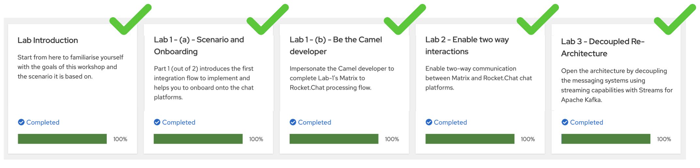

{empty} +
--

// == Overview
You have evolved the architecture and connected _Matrix_ and _Rocket.Chat_, crucially, with the addition of Red Hat streams for Apache Kafka, opening the platform for other systems to easily integrate. In this new Lab you're going to add a new messaging option: _Discord_.

_Discord_ is a well known messaging platform, very popular among gamers, but increasingly embraced by enterprises to connect internal teams but also for external interactions with customers as a way to maintain close contact.

The challenge in this new stage is that you need to create your own connectors to _Discord_ as there are none out-of-the-box available in Camel.

{blank}

Difficulty level: +
--
* *MEDIUM* +
{empty} +
--

Technical goals and milestones:

* Prototype custom _Kamelets_ to extend catalogue.
* Integrate new platforms with new _Kamelets_.
* Use of _Camel DSL_ for more advanced use cases.

{empty} +

The picture below illustrates all chat systems communicating via _Kafka_, including the to-be-integrated _Discord_ system, and optionally (for those willing to go the extra mile) _Telegram_.

image::images/stage-overview-discord.png[align="center", width=80%]

{empty} +

In terms of implementation effort for this lab, the main tasks to complete are the following:

- Create a _Discord_ sink _Kamelet_
- Craete a _Kafka_ -> _Discord_ flow using the new _Kamelet_
- Create a _Discord_ -> _Kafka_ flow using Camel

{empty} +

and optionally:

- Create a _Telegram_ -> _Kafka_ flow
- Create a _Kafka_ -> _Teletram_ flow

{empty} +

// == Access Discord\'s chat platform

[time=5]
[id="discord-chat"]
== Discord platform onboarding
{style-all}

TIP: If you're unfamiliar with _Discord_, it is a well known chat platform, very popular among gamers, but increasingly embraced by enterprises to connect internal teams but also for external interactions with customers as a way to maintain close contact.

{empty} +

=== Join the Discord lab server.

To accelerate the onboarding process in _Discord_, we've created a shared server for students to freely join and use to complete this enablement workshop. 

TIP: You don't need an account in _Discord_ to join the server. Just follow the instructions below to join with what _Discord_ calls an _"Unclaimed Account"_, a sort of temporary account you can claim as yours afterwards if you want.

TIP: If you prefer using an existing _Discord_ account of yours, please feel free to sign in with it instead of using an _"Unclaimed Account"_.

{empty} +

To join the lab's Discord server using a temporary account (Unclaimed account), follow the instructions below:

:docserver-invite: pass:a[ response.text()) \
        .then(data => this.parentElement.innerHTML = '<a href=&quot;'+data+'&quot; target=&quot;_blank&quot;>Click this Discord invite link</a>') \
        .catch(error => this.parentElement.innerHTML = '

 Discord link unavailable (talk to your admin)') \
      ">]

:docserver-token: pass:a[ response.text()) \
        .then(data => this.parentElement.innerHTML = 'Status: '+ data) \
        .catch(error => this.parentElement.innerHTML = 'Status: 

') \
      ">]

{empty} +

. Click on the link below to join your _Discord_ server (opens a new tab).
+
--
- {docserver-invite}
--
+
{empty} +

. In the new tab, follow the sequence of steps described below:
+
IMPORTANT: Discord performs an age verification, ensure you enter a birth date for 18+ or older.

.. In the invitation screen, you will be prompted to enter a `Display Name`:
+
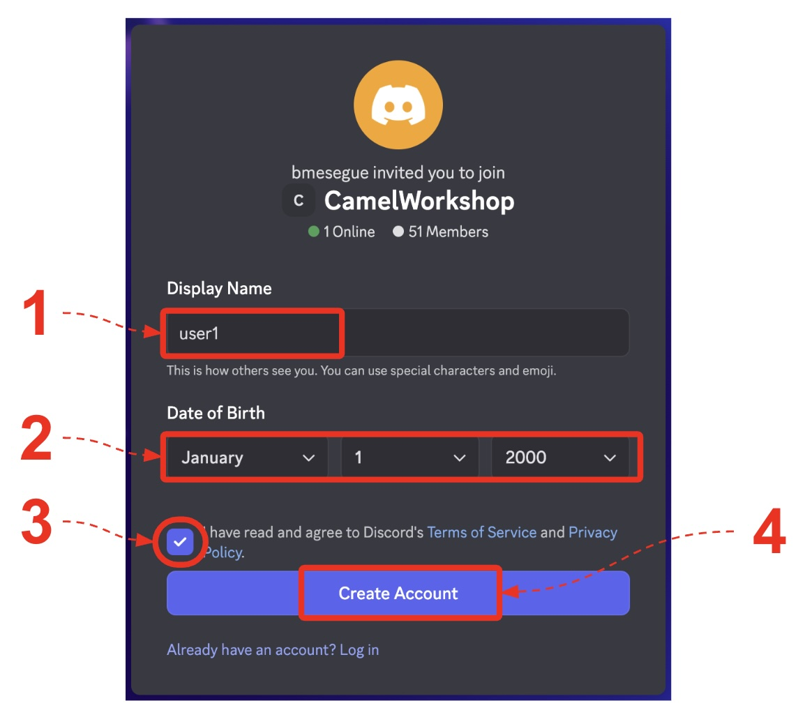
+
====
. Enter your user name:
+
--
{copypaste}
[subs=attributes]
----
{user-username}
----
--
+
. An age verification is also requested. There's no need to enter a real one, just ensure the birthday matches an individual of 18+ years old.
+
Enter for example: `January`, `1`, `2000`
+
. Tick the agreement box.
. Click the button *_Create Account_*.
====
+
{empty} +

.. A _'Capcha'_ verification process will pop up to validate you are human:
+
image::images/discord-join-step2.png[align="left", width=80%]
+
--
. Tick the box _"I'm a human"_.
. Solve the puzzles presented to you.
. Click the _Verify_ button.
--
+
{empty} +

.. A final popup window will prompt you to claim the account. Simply ignore it by closing the popup
+
//image::images/discord-join-step4.png[align="left", width=80%]
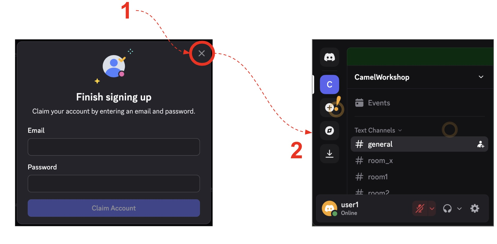
+
--
. Click the cross in the upper right corner.
. You should then see on screen the _CamelWorkshop_ server.
--

{empty} +

CAUTION: The server is open to the public, please be mindful of your actions, don't abuse the space.

{empty} +

=== Join your Discord room (channel).

. Use your dedicated _Discord_ room
+ 
A number of rooms have been made available for this workshop. 
+
To work on a room number that nobody uses and avoid noisy conversations, please make sure you operate from your given room. +
Your assigned room number is:
+
--
* You are `{user-username}` -> use `{user-username}` {room}
--
+
{empty} +

=== How Camel connects to Discord

To connect from _Camel_ to the chat platform, an App needs to be registered in _Discord_. Apps in _Discord_ are automatically member of all channels in the server.

* An App has been made available for all students to share.
+
NOTE: To configure _Camel_ you will need the _Discord_ App credentials. +
Later, you will find the credentials following the lab instructions.

{empty} +

[type=verification]
Were you able to join the _Discord_ room successfully?

{empty} +

[time=10]
[id="kamelet-create"]
== Part 1 - Create the Sink Kamelet
{style-all}

[type=taskResource]
.Credentials
****
* *username:* `{user-username}`
//* *password:* `{user-password}`
****
[type=taskResource]
.Red Hat OpenShift Dev Spaces
****
* link:{url-codeready}[Console, window="_blank"]
****
[type=taskResource]
.Red Hat OpenShift Developer Console
****
* link:{url-devconsole}[Topology View, window="_blank"]
****

TIP: _Kamelets_ are [underline big]_**Camel**_ route snipp[underline big]**ets**. +
A Kamelet encapsulates a normal _Camel_ route.

The _Kamelet_ to create involves defining a Camel route that targets _Discord_ as the endpoint system.

To integrate with _Discord_ we need to understand well its API, but don't worry, we got you covered, just follow our instructions.

[NOTE]
====
For reference, here's _Discord_'s documentation on how to post messages:

* link:https://discord.com/developers/docs/resources/channel#create-message[window="_blank"]
====

{empty} +

=== Process overview

The diagram below illustrates the processing flow (Camel route) you're about to create:

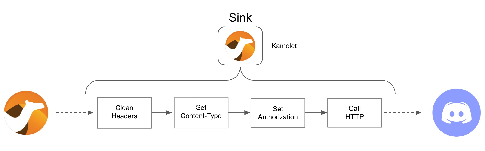

There are 4 key processing steps necessary:

====
* *Clean Headers* +
  The incoming _Camel_ exchange might have headers that can potentially enter in conflict with the HTTP call to _Discord_.

* *Set Content-Type* +
	Include an HTTP header to specify the type of payload we send (JSON)

* *Set Authorization* +
	Include an HTTP header with the security token

* *HTTP call to Discord* +
  Trigger the HTTP call using the _Camel_ HTTP component
====

{empty} +

=== Process definition

The best approach to make rapid progress developing this _Kamelet_, is to use _Camel JBang_ in your local environment.

image::images/camel-jbang.png[align="left", width=40%]

{empty} +

==== Clean up your environment

Before you start this second lab, make sure you close in your editor all the tabs (source files) from the previous exercise.

. Close tabs
+
1) Click on the file explorer's `...` button +
2) Ensure your `Open Editors` is ticked [√] +
3) Click the `Close all Editors` button.
+
{blank}
+
image::images/crw-close-tabs.png[align="left", width=100%]
+
{empty} +

==== Setup your Lab folder

* Next, prepare your lab by issuing the following command:
+
--
{copypaste}
[subs=attributes]
----
step 7
----
--
+
TIP: pass:[Run the command above anytime to reset the exercise. 

  

    
    Click for more information
  

The workshop includes handy helper scripts that let you jump to any step or reset the lab to a known good state:

  <ul>
    <li>
<strong>step N</strong>  – reset the lab to the beginning of step N
</li>
    <li><strong>steps</strong> – list all available steps in the lab</li>
    <li><strong>start</strong> or <strong>restart</strong> – go to the very beginning (equivalent to <code>step 1</code>)</li>
    <li><strong>ff</strong> – fast-forward to the <strong>next</strong> step</li>
    <li><strong>rw</strong> – rewind to the <strong>previous</strong> step</li>
  </ul>

]

{empty} +

==== Create your base Sink skeleton

Follow the steps below to create your base _Discord_ sink _Kamelet_

[TIP]
====
⏩ *Fast-Forward*

[.underline]#*Only*# if you want to skip (fast-forward) this section, execute in your terminal the commands below:

--
{copypaste}
----
ff
----
--
====

For a manual creation process:

. Create a generic sink
+
Use _Camel JBang_ to create your skeleton executing the command below:
+
--
{copypaste}
[subs=attributes]
----
camel init k2d/discord-sink.kamelet.yaml
----
--
+
NOTE: the suffix `-sink` tells _Camel JBang_ you're creating a _Kamelet_ sink.
+
{empty} +

. Open the base Discord Kamelet in Kaoto
+
Find the newly created YAML file in your directory:
+
  * `discord-sink.kamelet.yaml`
+
{blank}
+
Click to open it in _Kaoto_. 
+
{empty} +

. Configure input parameters
+
TIP: Sink _Kamelets_ can be configured to enforce input parameters.
+
When pushing events, _Discord_ requires some fields to be provided, follow the steps below to configure them:
+
.. Click the container's blue bar pass:[<code style="background-color: #4494E5; color: white;">&nbsp;A sink that logs...&nbsp;&nbsp;&nbsp;</code>]
+
The panel configuration opens on the side.
+
... Click on the pass:[<code style="background-color: #0366CB; color: white;">&nbsp;Required&nbsp;</code>] configuration group
+
Scroll down the panel and you'll find an area where to configure properties.
+
NOTE: The sink creation auto-generates two example properties.
+
... Reconfigure the first property as follows:
+
====
* Property Name:
+
--
{copypaste}
----
token
----
--

* Property Type
+
`string`
====
+
... Reconfigure the second property as follows:
+
====
* Property Name:
+
--
{copypaste}
----
channel
----
--

* Property Type
+
`string`
====
+
{empty} +

. Delete the Log step
+
.. Hover your mouse pointer over the log step.
.. Click {btn-trash} to delete the _Log_ step that was auto-generated by _Camel JBang_.

{empty} +

==== Implement the flow steps for the Sink _Kamelet_

At this stage your _Kamelet_ in _Kaoto_ should look like the picture below:

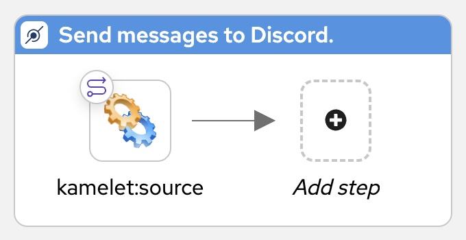

NOTE: you can configure its description to give it more meaning.

The base skeleton is ready but the actions inside the _Kamelet_ are yet to defined.

[TIP]
====
⏩ *Fast-Forward*

[.underline]#*Only*# if you want to skip (fast-forward) this section, execute in your terminal the commands below:

--
{copypaste}
----
ff
----
--
====

For a manual creation process:

. Add a step to clean all headers
+
.. Click the kbd:[+] sign to add a step
.. In the catalogue, find and select the `removeHeaders` processor
+
NOTE: this step removes all headers (`*`) by default.
+
NOTE: This step prevents sending residual headers to _Discord_.
+
{empty} +

. Define required headers _Discord_ expects
+
[TIP]
====
To add headers, follow the steps:

. Hover the mouse pointer over the last step and click the `->` sign
. Browse the catalogue to find and select the `setHeader` processor
====
+
.. Add the first header and configure the following fields:
+
====
* Name:
+
--
{copypaste}
----
Content-Type
----
--
+
* Expression:
+
--
{copypaste}
----
application/json
----
--
====
+
{empty} +
+
.. Add the second header to be authorized by _Discord_:
+
TIP: You can `⧉ Duplicate` the previous header to go faster. +
Hover your mouse over the last step and click on the floating {btn-duplicate} button
+
Configure with:
+
====
* Name:
+
--
{copypaste}
----
Authorization
----
--
+
* Expression:
+
--
{copypaste}
----
Bot {{token}}
----
--
+
NOTE: The property `token` in the expression refers to the input parameter defined in the _Kamelet_.
====
+
{empty} +

. Add a call to communicate with _Discord_
+
.. Click the kbd:[->] sign to add a step
.. In the catalogue, find and select the `HTTPS(Secure)` component, and configure with:
+
====
* `Http Uri`:
+
--
{copypaste}
----
https://discordapp.com/api/channels/{{channel}}/messages
----
--
+
NOTE: The property `channel` in the URI refers to the input parameter defined in the _Kamelet_.
====
+
{empty} +

==== Configure access to _Discord_

[NOTE]
====
Quick reminder on the purpose of the 2 input parameters defined in your _Kamelet_:

* `token`: carries the authorization token required to invoke _Discord's_ API.
* `channel`: carries the identifier that represents your room in _Discord_.
====

{blank}

Input parameters for a _Kamelet_ is one thing. You still need to pass the values when you call the _Kamelet_. +
For that, as you did with _Matrix_ and _Rocket.Chat_, define the properties where you'll configure the values to map to your _Kamelet_ inputs.

. Create the configuration file
+
--
{copypaste}
----
touch discord.properties
----
--

. Open the file and add the following properties:
+
--
{copypaste}/configuration/discord/{user-username}
----
# Discord credentials
discord.token=REPLACE
discord.room=REPLACE
----
--
+
NOTE: both values have been pre-configured for your use in this lab.
+
WARNING: If the credentials above do not look healthy, speak to your instructor/administrator, and set their values as indicated below:
+
[WARNING]
====
- `token`: Ask your instructor/administrator for the token to use to connect to _Discord_. +
The workshop slides should contain the token values valid for today's session:
+
image::images/apps-tokens.png[align="left", width=50%]
+
{empty} +

- `channel`: You can find the channel id in the address bar of your _Discord_ window. The pattern is:
+
** \http://discord.com/channels/SERVER_ID/**CHANNEL_ID**
+
image::images/discord-room-id.png[align="left", width=80%]
+
IMPORTANT: Ensure you only pick the last token (after last `/`) from the address bar.
====

{empty} + 

==== Test the _Discord Kamelet_

Ok, you have the configuration ready and the _Kamelet_ fully implemented, but you don't know yet if your _Kamelet_ works. +

This section will show you how to easily test it, _Camel JBang_ has very handy functionality to help you validate your code.

{empty} +

. Start your Kamelet
+
Camel JBang allows you to run your application in the background. +
Issue the following command:
+
--
{copypaste}
----
camel run k2d/* \
--background \
--properties discord.properties
----
--
+
NOTE: the command above loads your code under the directory `k2d` (kafka-to-discord) and picks your local `discord.properties`
+
{empty} +

. Verify the _Kamelet_ is loaded
+
Check your _Camel_ code is running by issuing the command below:
+
--
{copypaste}
----
camel ps
----
--
+
You should see a terminal output similar to:
+
----
 PID   NAME          READY  STATUS   AGE  TOTAL  FAIL  INFLIGHT   
 6496  discord-sink   1/1   Running  21s      0     0         0
----
+
NOTE: the output above tells you the name of the application is `discord-sink`
+
{empty} +

. Test the _Kamelet_
+
The moment of truth. +
_Camel JBang_ has a handy command to send/inject messages to running applications.
+
Use the command below to send a message to the _Kamelet_:
+
--
{copypaste}
----
camel cmd send discord-sink \
--uri "kamelet:discord-sink?token={{discord.token}}&channel={{discord.room}}" \
--body '{"content":"Hello from Camel"}'
----
--
+
NOTE: the `--uri` flag points to the _Discord Kamelet_.
+
NOTE: the _Kamelet_ parameters `token`/`channel` are set with the values configured in `discord.properties`.
+
If everything goes according to plan you should see an output similar to:
+
++++
<pre>
2025-10-20 20:21:33.640   6496 --- kamelet://discord-sink?channel=103309798 : Sent (success) (367ms)
</pre>
++++
+
{empty} +

. Check Discord's room
+
_Discord_ should have received the message and displayed it in the room, as shown below:
+
[IMPORTANT]
====
Make sure you have selected in Discord the channel: +
`# {user-username}` {room}
====
+
image::images/discord-room-hello.png[align="left", width=30%]
+
{empty} +

. Stop your Kamelet running in the background
+
--
{copypaste}
----
camel stop
----
--
+
TIP: You can verify no background processes are running with `camel ps` as seen earlier.

{empty} +

=== Your Kamelet is now ready

Assuming all went well, you have now created your own _Discord Kamelet_, and used it in a _Camel_ route to push messages to _Discord_.

{empty} +

[type=verification]
Did you see the message showing in _Discord_?

[type=verificationSuccess]
The second goal has been accomplished. image:images/emoji-clap.png[width=3%]

[type=verificationFail]
Review the instructions above and try again.

[time=5]
[id="kamelet-binding-create"]
== Part 2 - Kafka ⇒ Discord
{style-all}

[type=taskResource]
.Credentials
****
* *username:* `{user-username}`
//* *password:* `{user-password}`
****
[type=taskResource]
.Red Hat OpenShift Dev Spaces
****
* link:{url-codeready}[Console, window="_blank"]
****
[type=taskResource]
.Red Hat OpenShift Developer Console
****
* link:{url-devconsole}[Topology View, window="_blank"]
****
[type=taskResource]
.Matrix
****
* link:{url-element}[Matrix Web Client, window="_blank"]
****
[type=taskResource]
.Rocket.Chat
****
* link:{url-rocketchat}[Rocket.Chat Web Client, window="_blank"]
****

Now that you have the key building block to push events to _Discord_, you can design the process that enables routing _Kafka_ events to _Discord_.

=== Process overview

You should by now be very familiar with the necessary processing steps. The diagram below illustrates the _Kafka_ to _Discord_ data flow:

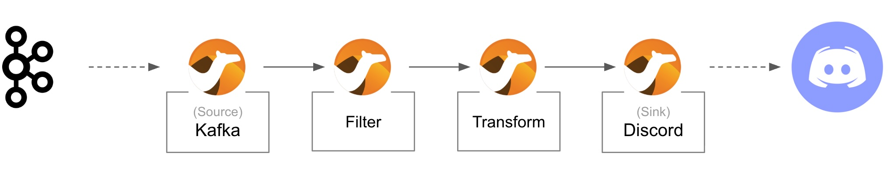
//image::images/processing-flow-kafka2discord.png[align="center", width=90%]

There are 4 processing steps in use:

====
* *1 source consumer* +
Consumes events from _Kafka_.

* *2 mid-flow steps* +
One filters messages to prevent death loops. +
One transforms events from the standard data model to _Discord_.

* *1 sink _Kamelet_* +
Produces events to _Discord_.
====

{empty} +

Let's get started.

{empty} +

=== Clean up your environment

Before you start this lab, make sure you close in your editor all the tabs (source files) from the previous exercise.

. Close tabs
+
1) Click on the file explorer's `...` button +
2) Ensure your `Open Editors` is ticked [√] +
3) Click the `Close all Editors` button.
+
{blank}
+
image::images/crw-close-tabs.png[align="left", width=100%]
+
{empty} +

=== Setup your Lab folder

* Next, prepare your lab by issuing the following command:
+
--
{copypaste}
[subs=attributes]
----
step 10
----
--
+
TIP: pass:[Run the command above anytime to reset the exercise. 

  

    
    Click for more information
  

The workshop includes handy helper scripts that let you jump to any step or reset the lab to a known good state:

  <ul>
    <li>
<strong>step N</strong>  – reset the lab to the beginning of step N
</li>
    <li><strong>steps</strong> – list all available steps in the lab</li>
    <li><strong>start</strong> or <strong>restart</strong> – go to the very beginning (equivalent to <code>step 1</code>)</li>
    <li><strong>ff</strong> – fast-forward to the <strong>next</strong> step</li>
    <li><strong>rw</strong> – rewind to the <strong>previous</strong> step</li>
  </ul>

]

{empty} +

=== Define the Camel process

It helps using one of the existing flows as a base to construct the new _Kafka to Discord_ proces, given some of the steps are identical.

The picture below shows the _Kafka to Rocket.Chat_ process you previously constructed:

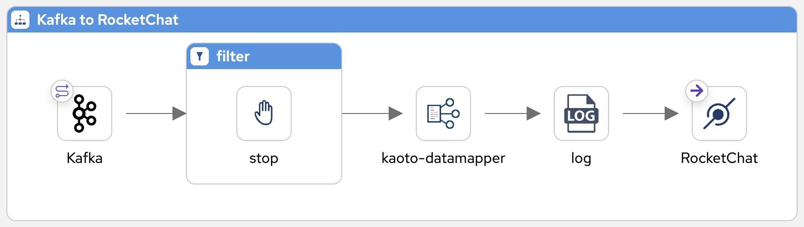

{blank}

Using the above process as a base, the changes you need to apply for the new flow are minimal:

1. Redefine the filter to prevent *Discord to Discord* loopback events.
1. Redefine the data mapping to use _Discord's_ interface as the target schema.
1. Replace the call to _Rocket.Chat_ with a _Discord_ call.

{blank}

To simplify the work you need to do, we've prepared the flow so that you just need to fill the blanks. The picture below illustrates the focus areas where you need to work on:

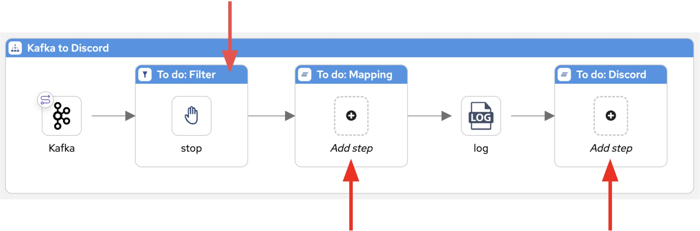

{blank}

==== Implement the process definition

Follow the steps below to complete the base _Kafka to Discord_ process.

[TIP]
====
⏩ *Fast-Forward*

[.underline]#*Only*# if you want to skip (fast-forward) this section, execute in your terminal the commands below:

--
{copypaste}
----
ff
----
--
====

For a manual creation process, find in your directory tree the following resource:

* `k2d.camel.yaml`
+
Click to open it in _Kaoto_. 

Then, follow the instructions below to complete its definition:

{empty} +

. *Define the filter*
+
As previously explained _Kafka_ introduces the danger of events circling back. You need to prevent data flowing from one system, back to itself:
+
  * _Discord -> Discord_
  * _Matrix -> Matrix_
  * _Rocket.Chat -> Rochet.Chat_
+
{blank}
+
The flows above can occur because we have processes taking originating messages from _Discord/Matrix/Rocket.Chat_ and pushing them to _Kafka_, while at the same time we have processes consuming _Kafka_ events and pushing them to _Discord/Matrix/Rocket.Chat_.
+
The filter you need to define will prevent that for _Discord -> Discord_ cases.
+
1. Click the bar pass:[<code style="background-color: #B0380C; color: white;">&nbsp;To do: Filter&nbsp;</code>]
+
You should see the `JQ` expression language selected by default.
+
1. copy and paste the following expression:
+
--
{copypaste}
----
.source | test("discord")
----
--
+
NOTE: The expression above picks the `source` JSON field from the _Kafka_ event and checks if it originates in the _Discord_ system.
+
NOTE: Flows pushing events to _Kafka_ populate the field `source` to indicate where the event originates. 
+
{empty} +

. *Define the data transformation*
+
In the new data transformation, the source data complies with the common schema (from _Kafka_) while the target system needs to map data going to _Discord_.
+
.. Include in your Camel route a Kaoto data transformation step
+
--
From Kaoto: 

. Click the kbd:[+] button inside the pass:[<code style="background-color: #4494E5; color: white;">&nbsp;To do: Mapping&nbsp;</code>] step
. Type `mapper` in the filter to find the _Kaoto DataMapper_
. Click the _Kaoto DataMapper_ tile
. Click the mapper to open the configuration panel
. Click the pass:a[{map-wrench}  Configure] button
--
+
{empty} +

.. Next, define the inputs and outputs
+
--
From the DataMapper editor: 

. Define the source:
.. On **Parameters** click the button kbd:[+] to add new parameter
.. Enter `common` and click the checkmark button kbd:[{map-tick}]
.. Click kbd:[{map-att}] (Attach schema), next click 
pass:a[{map-import}] and then pick at the top of your screen: `support/schemas/*common.json*`.
.. Click pass:a[Attach] to complete the action.
+
{blank}
+
. Define the target
.. On the right hand side of the DataMapper screen: +
Click kbd:[{map-att}] (Attach schema), next click 
pass:a[{map-import}] and then pick at the top of your screen: `support/schemas/*discord-out.json*`.
.. Click pass:a[Attach] to complete the action.
+
{empty} +
--

.. Define the data mappings rules
+
====
Copy and Paste (in the *Target*) the values below to define the given field entries:

... `string[@key = content]`:
+
--
{copypaste}
----
concat("**",$common-x/fn:map/fn:string[@key='user'], "@", $common-x/fn:map/fn:string[@key='source'],"**: ", $common-x/fn:map/fn:string[@key='text'])
----
--
+
{blank}
+
The mapping rendering should be similar to:
+
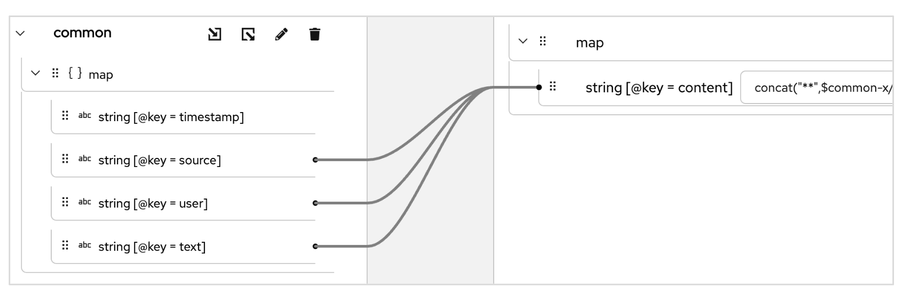
====
+
{empty} +

. [[step-discord-sink]]*Include the _Discord Kamelet_ call*
+
Copy from below the step definition, and paste it at the end of your Camel route.
+
--
{copypaste}
----
{
  "type": "Route",
  "name": "to",
  "definition": {
    "uri": "kamelet",
    "description": "Discord",
    "parameters": {
      "templateId": "discord-sink",
      "channel": "{{discord.room}}",
      "token": "{{discord.token}}"
    }
  },
  "__kaoto_marker": "kaoto-node"
}
----
--
+
Then perform the actions below:
+
1. Right-click the blue bar where it reads: pass:[<code style="background-color: #4494E5; color: white;">&nbsp;To do: Discord&nbsp;</code>]
1. Click the option: kbd:[{btn-paste} Paste as child]
+
{empty} +

==== Test the _Discord_ process

You've completed the definition of all the parts needed:

* the _Discord Kamelet_
* the _"Kafka -> Discord"_ _Camel_ route
* the properties file containing _Discord_ credentials

{blank}

Like you did before, use _Camel JBang_ to validate your implementation.

{empty} +

. Run _Camel_
+
_Camel JBang_ allows you to run your application in the background. +
Issue the following command:
+
--
{copypaste}
----
labrun k2d \
--background \
--properties discord.properties
----
--
+
NOTE: `labrun` executes `camel run` under the hood loading your code under the directory `k2d` (kafka-to-discord). +
Additional flags are added to run in the background and pick your local `discord.properties`
+
{empty} +

. Verify the process is running
+
Check your _Camel_ code is running by issuing the command below:
+
--
{copypaste}
----
camel ps
----
--
+
You should see a terminal output similar to:
+
----
 PID   NAME  READY  STATUS   AGE  TOTAL  FAIL  INFLIGHT   
 2492  k2d    1/1   Running  22s      0     0         0
----
+
NOTE: the output above tells you the name of the application is `k2d` _(Kafka to Discord)_.
+
{empty} +

. Test the flow
+
Again, use _Camel JBang_ to generate a message, except this time you want it sent to Kafka.
+
Use the command below to send a message to _Kafka_:
+
--
{copypaste}
[subs=attributes]
----
camel cmd send k2d \
--body '
  { 
    "timestamp":"sometime",
    "user":"{user-username}",
    "source":"test",
    "text":"Hello from Camel"
  }'
----
--
+
NOTE: the command injects the message in the _Camel_ `k2d` process. +
_Camel JBang_ finds the _Kafka_ endpoint and pushes the message to the _Kafka_ cluster.
+
NOTE: the JSON payload in the body conforms to the common interface defined to communicate via Kafka.
+
If everything goes according to plan you should see an output similar to:
+
++++
<pre>
2025-10-20 20:21:33.640   2492 --- kafka://myroom?brokers=my-cluster-kafka- : Sent (success) (4ms)
</pre>
++++
+
{empty} +

. Check Discord's room
+
_Discord_ should have received the message and displayed it in the room, as shown below:
+
[IMPORTANT]
====
Make sure you have selected in Discord the channel: +
`# {user-username}` {room}
====
+

+
{empty} +

. Stop the process
+
Ensure you don't forget to stop the process running in the background.
Execute the command below:
+
--
{copypaste}
----
camel stop
----
--
+
You should see a message like:
+
----
Shutting down Camel integration (PID: 2492)
----
+
{empty} +

{empty} +

=== Deploy on OpenShift

{blank}

When happy with your previous local run, proceed to deploy the flow on OpenShift.

{empty} +

. Use the command below to deploy the process:
+
--
{copypaste}
----
labdeploy k2d \
discord.properties
----
--
+
[pass]

  

    
    Click for more information
  

We provide the script <code>labdeploy</code> to help you read the commands more clearly. 
Under the hood the script calls <i>Camel JBang</i> as per the snippet below:
<pre>
camel kubernetes run k2d/* \
discord.properties \
--name k2d \
--property quarkus.config.locations=discord.properties \
--local-kamelet-dir ../support/kamelets \
--cluster-type openshift
</pre>

+
{blank}
+
NOTE: Be patient, this action may take some time to complete.
+
{empty} +

. Inspect the deployment status
+
You can monitor the state of the resource with the following command:
+
--
{copypaste}
----
oc get deployment/k2d
----
--
+
When the deployment is ready, the command outputs something similar to:
+
----
NAME   READY   UP-TO-DATE   AVAILABLE   AGE
k2d    1/1     1            1           41s 
----
+
{empty} +

. Test the deployment
+
Push a message to _Kafka_ using the _Camel JBang_ command below:
+
--
{copypaste}
[subs=attributes]
----
camel cmd send \
--uri "kafka:myroom?brokers=my-cluster-kafka-bootstrap:9092" \
--body '
  { 
    "timestamp":"sometime",
    "user":"{user-username}",
    "source":"test",
    "text":"Hello from Camel"
  }'
----
--
+
NOTE: `camel cmd send` does not refer to any local process.
+
NOTE: the `--uri` flag points directly to the _Kafka_ platform.
+
NOTE: the JSON payload in the body conforms to the common interface defined to communicate via Kafka.
+
If everything goes according to plan you should see an output similar to:
+
++++
<pre>
2025-10-20 20:21:33.640   7697 --- kafka://myroom?brokers=my-cluster-kafka- : Sent (success) (4ms)
</pre>
++++
+
{empty} +

. Check Discord's room
+
_Discord_ should have received the message and displayed it in the room, as shown below:
+
[IMPORTANT]
====
Make sure you have selected in Discord the channel: +
`# {user-username}` {room}
====
+

+
{empty} +

{empty} +

=== Send messages End-to-End

You're almost there. +
Run a last test to see messages flowing _End-to-End_, from _Matrix/Rocket.Chat to Discord_.

. Send messages to test the flow.
+
====
.. Go to your _Matrix_'s room and send a message, for example:
+
--
{copypaste}
----
Hello from Matrix
----
--

.. Then go to your _Rocket.Chat_'s room and send a message, for example:
+
--
{copypaste}
----
Hello from Rocket.Chat
----
--
====
+
{empty} +
+
If all goes well you should see something similar to the picture below:
+
image::images/stage4-msg-k2d-test.png[align="left", width=90%]
+
{empty} +

[type=verification]
Did you see the message going from _Matrix_ to _Discord_?

[type=verificationSuccess]
Very good !

[type=verificationFail]
Inspect in the pod logs to troubleshoot.

[type=verification]
Did you see the message going from _Rocket.Chat_ to _Discord_?

[type=verificationSuccess]
Very good !

[type=verificationFail]
Inspect in the pod logs to troubleshoot.

[time=5]
[id="discord-source-consumer"]
== Part 3 - Create the Source consumer
{style-all}

[type=taskResource]
.Credentials
****
* *username:* `{user-username}`
//* *password:* `{user-password}`
****
[type=taskResource]
.Red Hat OpenShift Dev Spaces
****
* link:{url-codeready}[Console, window="_blank"]
****
[type=taskResource]
.Red Hat OpenShift Developer Console
****
* link:{url-devconsole}[Topology View, window="_blank"]
****
[type=taskResource]
.Matrix
****
* link:{url-element}[Matrix Web Client, window="_blank"]
****
[type=taskResource]
.Rocket.Chat
****
* link:{url-rocketchat}[Rocket.Chat Web Client, window="_blank"]
****

In previous exercises, our _Camel_ definitions mainly used source/sink _Kamelets_ to consume/produce events. In this new task however, to communicate with _Discord_, more developer control is required.

_Discord_ implements the use of websockets to push notifications from the chat platform to the application. A websocket is a 2-way communication protocol on top of HTTP. _Camel's_ DSL provides the necessary level of control to implement a _Discord_ listener.

{empty} +

[NOTE]
====
As a reminder, _Camel_ provides the following route constructs:

* *Kamelets* +
These are like capsules containing _Camel_ routes. They don't run on their own, they are used in _Pipes_ or traditional _Camel_ routes.

* *Pipes* +
These are no-code definitions where _Kamelets_ are sequenced together. _Camel_ deploys them as running integration units.

* *Camel routes* +
These are defined using the _Camel's_ DSL _(Domain Specific Languate)_. _Camel_ provides EIPs (_Enterprise Integration Patterns_), components (connectors) and _DataFormats_ (translators), as constructs the developer can use to define integrations with a very high level of control.
====

{empty} +

=== Process overview

Although the actions of consuming/producing events will be implemented with _Camel's_ DSL instead of _Kamelets_, the core processing steps are still essentially the same. +
The diagram below illustrates the _Discord -> Kafka_ data flow:

image::images/processing-flow-discord2kafka.png[align="center", width=90%]

There are 4 processing steps involved:

====
* *1 websocket listener* +
Consumes events from _Discord_.

* *2 mid-flow steps* +
One filters messages to prevent death loops. +
One transforms events from _Discord_ to the standard data model.

* *1 Kafka producer* +
Produces events to _Kafka_.
====

{empty} +

Due to the nature of _Discord's_ communication channel, the developer is also responsible to manage the lifecycle of the websocket connection following _Discord's_ specification.

NOTE: For reference, here's _Discord's Gateway API_ specification covering the details on how websocket exchanges need to happen: link:https://discord.com/developers/docs/topics/gateway[window="_blank"]

{empty} +

The following diagram illustrates the required exchanges that need to happen to maintain the connection alive.

image::images/discord-websocket-management.png[align="center", width=40%]

{empty} +

The _Camel_ developer needs to open a websocket connection and ensure the following tasks are covered:

. Identify the application.
. Send regular heartbeats.
. Listen for incoming events. 

{empty} +

=== Implementation approach

Let's first understand how the new implementation approach (no Kamelets) differs from previous exercises (with Kamelets).

NOTE: This section covers the cases where _Camel_ consumes events from _Matrix/Rocket.Chat/Discord_

* Previous chapters:
** Flows start with a **Kamelet** component, followed by other route steps.
** Source Kamelets encapsulates actions.
+
{empty} +

* This chapter:
** The flow starts with a **Direct** component (consumer), followed by other route steps.
** A source _Camel_ route encapsulates logic to obtain events from Discord, and calls **direct** to hand over control.
+
NOTE: the **direct** component is used to allow routes to call other routes. 

{empty} +

=== Flow construction 

Time to get started.

{empty} +

==== Clean up your environment

Before you start this lab, make sure you close in your editor all the tabs (source files) from the previous exercise.

. Close tabs
+
1) Click on the file explorer's `...` button +
2) Ensure your `Open Editors` is ticked [√] +
3) Click the `Close all Editors` button.
+
{blank}
+
image::images/crw-close-tabs.png[align="left", width=100%]
+
{blank}

{empty} +

==== Setup your Lab folder

* Next, prepare your lab by issuing the following command:
+
--
{copypaste}
[subs=attributes]
----
step 12
----
--
+
TIP: pass:[Run the command above anytime to reset the exercise. 

  

    
    Click for more information
  

The workshop includes handy helper scripts that let you jump to any step or reset the lab to a known good state:

  <ul>
    <li>
<strong>step N</strong>  – reset the lab to the beginning of step N
</li>
    <li><strong>steps</strong> – list all available steps in the lab</li>
    <li><strong>start</strong> or <strong>restart</strong> – go to the very beginning (equivalent to <code>step 1</code>)</li>
    <li><strong>ff</strong> – fast-forward to the <strong>next</strong> step</li>
    <li><strong>rw</strong> – rewind to the <strong>previous</strong> step</li>
  </ul>

]

{empty} +

==== Create your Discord consumer

Follow the steps below to create your base _Discord_ sink _Kamelet_

[TIP]
====
⏩ *Fast-Forward*

[.underline]#*Only*# if you want to skip (fast-forward) this section, execute in your terminal the commands below:

--
{copypaste}
----
ff
----
--
====

For a manual creation process:

. Find in your directory tree the following resource:
+
--
* `discord-source.camel.yaml`
+
Click to open it in _Kaoto_. +
It will present a banner informing you *no routes are defined*.
--
+
{empty} +

[start=2]
. Create the Camel routes
+
Because creating the Discord listener is not trivial, the lab provides the routes pre-defined for you, just copy and paste the given snippets to complete the work.
+
[NOTE]
====
The following list summarizes the Camel routes you're about to include:

. One route to let _Discord_ **identify** _Camel_ as a registered bot.
. One route to send **heartbeats** to _Discord_ to signal _Camel_ is alive.
. One route to handle all **events** coming from _Discord_, including user messages.
====
+
[NOTE]
====
image::images/discord-websocket-management.png[align="left", width=30%]
====
+
Kaoto has the ability to provide bi-directional mode of code edition: visual and text based. +
You will use the text based edition to append the snippets (routes) given below.
+
NOTE: Kaoto will automatically synchronize your canvas in the visual mode.
+
Open the file in source code view (text mode). +
In your editor (upper-right corner), find and click the button pass:[<code style="background-color: black; color: white; padding: 10px; border-radius: 5px; font-family: console;"><b>&lt; / &gt;</b></code>]
+
The action above should open the empty source code file in text mode.
+
{empty} +
+
[start=1]
1. Include a (_Discord_) identification process
+
The _Camel_ route below provides the actions to identify our _Camel_ system with _Discord_.
+
NOTE: We need it because _Discord_ sends an identification request when you open a new _Websocket_ session. 
+
Append in your `discord-source.camel.yaml` the identification _Camel_ route.
+
Click the {cp-btn} button (Copy to clipboard), and paste the code in the text editor.
+
--
{copypaste}
----
- route:
    description: Identification
    from:
      uri: direct
      parameters:
        name: identify
      steps:
        - setBody:
            expression:
              simple:
                expression: |
                  {
                    "op": 2,
                    "d": {
                      "token": "{{discord.token}}",
                      "intents": 513,
                      "properties": {
                        "os": "linux",
                        "browser": "my_library",
                        "device": "my_library"
                      }
                    }
                  }
        - to:
            uri: vertx-websocket
            parameters:
              consumeAsClient: true
              encoding: json
              host: wss:gateway.discord.gg
              port: 443
              originHeaderUrl: https://gateway.discord.gg
              v: 9
----
--
+
[NOTE] 
--
* The (from) `uri` element defines the `direct` _Camel_ component permitting other _Camel_ routes to trigger identification events.

* The JSON body follows _Discord's_ API specification for identification payloads.

* The parameter `{{discord.token}}` identifies our _Camel_ bot registerd in _Discord_.

* The producer (`to` element) pushes the JSON body to _Discord's_ websocket.
--
+
{empty} +

1. Include the pulsating heartbeat process
+
Include in your `discord-source.camel.yaml` the additional _Camel_ route below.
+
Click the {cp-btn} button (Copy to clipboard), and paste the code in the text editor.
+
--
{copypaste}
----
- route:
    description: Heartbeats
    from:
      uri: timer
      parameters:
        delay: 10000
        period: "{{time:30000}}"
        timerName: heartbeat
      steps:
        - setBody:
            expression:
              simple:
                expression: |
                  {
                    "op": 1,
                    "d": 251
                  }
        - to:
            uri: vertx-websocket
            parameters:
              consumeAsClient: true
              encoding: json
              host: wss:gateway.discord.gg
              originHeaderUrl: https://gateway.discord.gg
              port: 443
              v: 9
----
--
+
[NOTE] 
--
* The `from` element defines the `timer` _Camel_ component to trigger an event every 30 seconds.

* The JSON body follows _Discord's_ API specification for heartbeat payloads.

* The producer (`to` element) pushes the JSON body to _Discord's_ websocket.

--
+
{empty} +

1. Include the event listener
+
Include in your `discord-source.camel.yaml` yet another _Camel_ route.
+
Click the {cp-btn} button (Copy to clipboard), and paste the code in the text editor.
+
--
{copypaste}
----
- route:
    description: Event Listener
    from:
      uri: vertx-websocket
      parameters:
        consumeAsClient: true
        encoding: json
        host: wss:gateway.discord.gg
        originHeaderUrl: https://gateway.discord.gg
        port: 443
        v: 9
      steps:
        - choice:
            when:
              - description: Hello
                expression:
                  jq:
                    expression: .op == 10
                steps:
                  - to:
                      uri: direct
                      parameters:
                        name: identify
              - description: Ready
                expression:
                  jq:
                    expression: .op == 0 and .t == "READY"
                steps:
                  - log:
                      message: Discord connection open and session ready.
                  - stop: {}
              - description: Heartbeat ACK
                expression:
                  jq:
                    expression: .op == 11
                steps:
                  - stop: {}
              - description: Message
                expression:
                  jq:
                    expression: .t == "MESSAGE_CREATE"
                steps:
                  - filter:
                      jq:
                        expression: .d.channel_id != "{{discord.room}}"
                      steps:
                        - stop: {}
                  - to:
                      uri: direct
                      parameters:
                        name: main-process
              - description: Reconnect
                expression:
                  jq:
                    expression: .op == 7
                steps:
                  - stop: {}
----
--
+
[NOTE] 
--
* The `from` consumer connects to _Discord's_ websocket to attend incoming events. 

* A `choice` EIP matches types of incoming events according to their `op` (operation identifier).

* Events with `.op == 10` require responding to _Discord_ with an identification event (triggers internal call to `direct:identify`).

* Events of type `MESSAGE_CREATE` identify _Discord_ messages and are directed to the main processor.

--
+
{blank}
+
NOTE: The `main-process` route is yet to be implemented and, later in the lab exercise, where the main steps to push messages to Kafka will be defined.
+
{empty} +

By the end of this process you should find all the route definitions in your canvas (vertical layout):

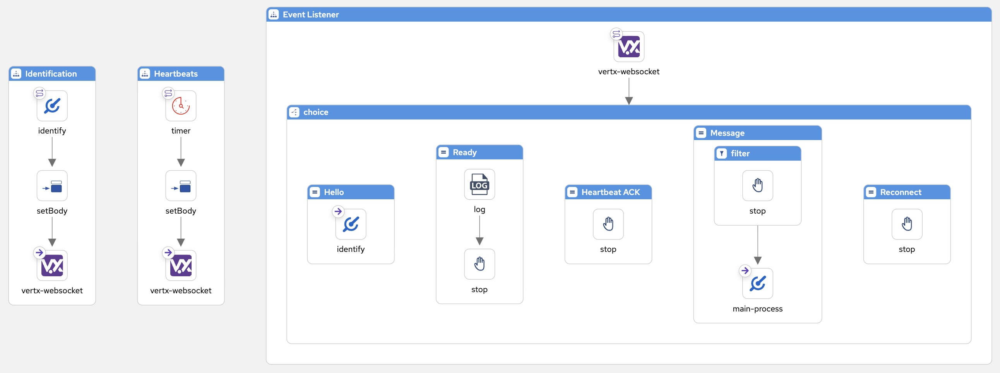

{empty} +

==== Test your Discord consumer

It's time to check it all works. +
We've included in your folder the file `d2k.camel.yaml` _(Discord to Kafka)_. It contains the endpoint `direct:main-process` where the _Discord_ source above forwards messages to. The base route provided only logs messages coming from _Discord_, as per the image below:

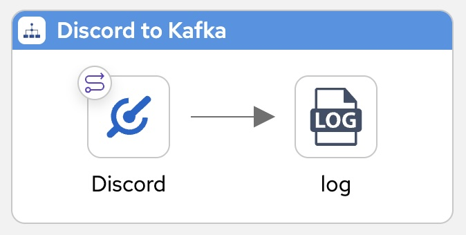

{empty} +

. Run the _Camel_ routes
+
Issue the following command:
+
--
{copypaste}
----
camel run d2k/* \
--properties discord.properties
----
--
+
NOTE: the command above loads your code under the directory `d2k` (discord-to-kafka) and picks your local `discord.properties`
+
{empty} +

. Send a message from _Discord_
+
[IMPORTANT]
====
Make sure you have selected in _Discord_ the channel: +
`# {user-username}` {room}
====
+
From your Discord browser tab, send a message, for example:
+
--
{copypaste}
----
test Camel listener
----
--
+
image::images/stage4-msg-d2k-test-local.png[align="left", width=30%]
+
{empty} + 
+
If all goes well you should see in your terminal an output similar to:
+
[subs=attributes]
++++
<pre style="line-height: 1;white-space: pre-wrap">2025-10-22 13:26:52.744 INFO 2134 --- [orker-thread-10] discord-source.camel.yaml:87 : Discord connection open and session ready.
2025-10-22 13:26:54.039 INFO 2134 --- [worker-thread-4] d2k.camel.yaml:11            : message from Discord: {"t":"MESSAGE_CREATE","s":3,"op":0,"d":{"type":0,"tts":false,"timestamp":"2025-10-22T13:26:33.903000+00:00","pinned":false,"nonce":"1430658109562421248","mentions":[],"mention_roles":[],"mention_everyone":false,"member":{"roles":[],"premium_since":null,"pending":false,"nick":null,"mute":false,"joined_at":"2025-10-20T13:44:22.302000+00:00","flags":0,"deaf":false,"communication_disabled_until":null,"banner":null,"avatar":null},"id":"1430658110573514966","flags":0,"embeds":[],"edited_timestamp":null,"content":"test Camel listener","components":[],"channel_type":0,"channel_id":"1033097985220952134","author":{"username":"{user-username}_29248","public_flags":0,"primary_guild":null,"id":"1429825714667913388","global_name":"{user-username}","display_name_styles":null,"discriminator":"0","collectibles":null,"clan":null,"avatar_decoration_data":null,"avatar":null},"attachments":[],"guild_id":"1019612394131030036"}}</pre>
++++
+
NOTE: Find the message content highlighted in yellow.
+
{empty} +

You have completed the definition of your **_Discord_ consumer**, the equivalent of the source _Kamelets_ for _Matrix/Rocket.Chat_. Now you can use it as your source of _Discord_ events.

{empty} +

=== Checkpoint

[type=verification]
Did you see the raw _Discord_ message showing up in your terminal?

[type=verificationSuccess]
Very good !

[type=verificationFail]
Inspect in the pod logs to troubleshoot.

TIP: Stop _Camel JBang_ when done +
Press kbd:[Ctrl+C], from your terminal, to stop the running _Camel_ process.

{empty} +

[time=5]
[id="discord-to-kafka"]
== Part 4 - Discord ⇒ Kafka
{style-all}

[type=taskResource]
.Credentials
****
* *username:* `{user-username}`
//* *password:* `{user-password}`
****
[type=taskResource]
.Red Hat OpenShift Dev Spaces
****
* link:{url-codeready}[Console, window="_blank"]
****
[type=taskResource]
.Red Hat OpenShift Developer Console
****
* link:{url-devconsole}[Topology View, window="_blank"]
****
[type=taskResource]
.Matrix
****
* link:{url-element}[Matrix Web Client, window="_blank"]
****
[type=taskResource]
.Rocket.Chat
****
* link:{url-rocketchat}[Rocket.Chat Web Client, window="_blank"]
****

Now that you have your _Discord_ consumer, it is time to complete the main processing flow to handle _Discord_ messages, transform them and push them to _Kafka_.

=== Clean up your environment

Before you start this lab, make sure you close in your editor all the tabs (source files) from the previous exercise.

. Close tabs
+
1) Click on the file explorer's `...` button +
2) Ensure your `Open Editors` is ticked [√] +
3) Click the `Close all Editors` button.
+
{blank}
+
image::images/crw-close-tabs.png[align="left", width=100%]
+
{blank}

{empty} +

=== Setup your Lab folder

* Next, prepare your lab by issuing the following command:
+
--
{copypaste}
[subs=attributes]
----
step 14
----
--
+
TIP: pass:[Run the command above anytime to reset the exercise. 

  

    
    Click for more information
  

The workshop includes handy helper scripts that let you jump to any step or reset the lab to a known good state:

  <ul>
    <li>
<strong>step N</strong>  – reset the lab to the beginning of step N
</li>
    <li><strong>steps</strong> – list all available steps in the lab</li>
    <li><strong>start</strong> or <strong>restart</strong> – go to the very beginning (equivalent to <code>step 1</code>)</li>
    <li><strong>ff</strong> – fast-forward to the <strong>next</strong> step</li>
    <li><strong>rw</strong> – rewind to the <strong>previous</strong> step</li>
  </ul>

]

{empty} +

=== Overview of work ahead

It helps using one of the existing flows as a base to construct the new _Discord to Kafka_ proces, given some of the steps are identical.

Only for reference, the _Matrix to Kafka_ flow (picture below) is a good starting point:

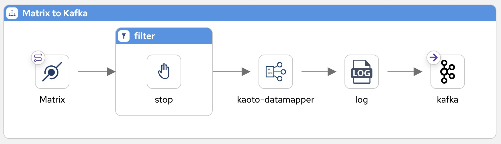

{blank}

Using the above process as a base, the changes you need to apply for the new flow are minimal:

1. Redefine the filter to prevent *Discord to Discord* loopback events.
1. Redefine the data mapping to use the common interface.

{blank}

To simplify the work you need to do, we've prepared the flow so that you just need to fill the blanks. +
The picture below illustrates the focus areas where you need to work on:

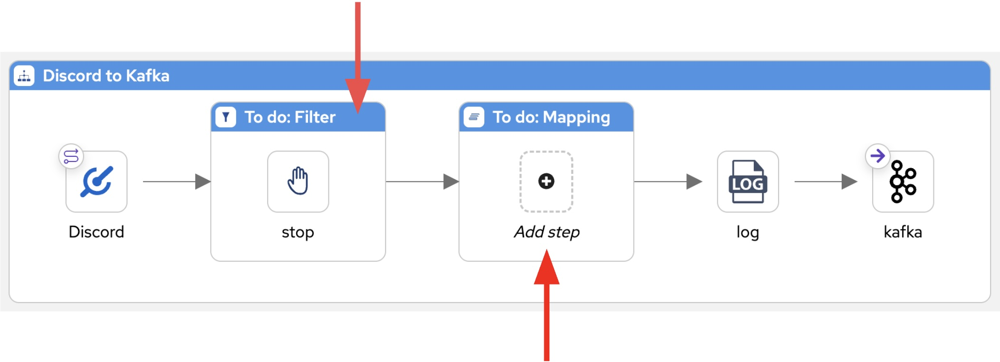

{blank}

=== Define the main Camel process

Follow the steps below to complete the base _Discord to Kafka_ process.

[TIP]
====
⏩ *Fast-Forward*

[.underline]#*Only*# if you want to skip (fast-forward) this section, execute in your terminal the commands below:

--
{copypaste}
----
ff
----
--
====

For a manual creation process:

. Find in your directory tree the following resource:
+
--
* `d2k.camel.yaml`
+
Click to open it in _Kaoto_.
--
+
{empty} +

. *Define the filter*
+
Once more, you need to prevent loopback events to block _Discord -> Discord_ circles. +
An advantage with Discord's API is that it provides a flag that signals the message was bot generated.
+
NOTE: As a reminder, a loopback in _Discord_ can happen when we push a message to _Discord_ using our sink _Kamelet_ and _Discord_ notifies our registered _Camel_ bot via websocket.
+
1. Click the bar pass:[<code style="background-color: #B0380C; color: white;">&nbsp;To do: Filter&nbsp;</code>]
+
You should see the `JQ` expression language selected by default.
+
1. copy and paste the following expression:
+
--
{copypaste}
----
.d.author.bot == true
----
--
+
NOTE: The expression is much simpler in contrast with _Matrix/Rocket.Chat_ where message pattern matching was necesary using regular expressions.
+
{empty} +

. *Define the data transformation*
+
In the new data transformation, the source will be defined with _Discord's_ schema while the target will use the common schema, as the data is to be shared with all other systems in the platform.
+
.. Include in your Camel route a Kaoto data transformation step
+
--
From Kaoto: 

. Click the kbd:[+] button inside the pass:[<code style="background-color: #4494E5; color: white;">&nbsp;To do: Mapping&nbsp;</code>] step
. Type `mapper` in the filter to find the _Kaoto DataMapper_
. Click the _Kaoto DataMapper_ tile
. Click the mapper to open the configuration panel
. Click the pass:a[{map-wrench}  Configure] button
--
+
{empty} +

.. Next, define the inputs and outputs
+
--
From the DataMapper editor: 

. Define the source:
.. On **Parameters** click the button kbd:[+] to add new parameter
.. Enter `discord` and click the checkmark button kbd:[{map-tick}]
.. Click kbd:[{map-att}] (Attach schema), next click 
pass:a[{map-import}] and then pick at the top of your screen: `support/schemas/*discord-in.json*`.
.. Click pass:a[Attach] to complete the action.
+
{blank}
+
. Define the target
.. On the right hand side of the DataMapper screen: +
Click kbd:[{map-att}] (Attach schema), next click 
pass:a[{map-import}] and then pick at the top of your screen: `support/schemas/*common.json*`.
.. Click pass:a[Attach] to complete the action.
+
{empty} +
--

.. Define the data mappings rules
+
====
Copy and Paste (in the *Target*) the values below to define the given field entries:

... `string[@key = timestamp]`: 
+
--
{copypaste}
----
format-dateTime(current-dateTime(),'[Y0001]-[M01]-[D01]T[H01]:[m01]:[s01].[f001]Z')
----
--
+
{blank}
+
... `string[@key = source]`: 
+
--
{copypaste}
----
"discord"
----
--
+
{blank}
+
... `string[@key = user]`: 
+
--
{copypaste}
----
$discord-x/fn:map/fn:map[@key='d']/fn:map[@key='author']/fn:string[@key='global_name']
----
--
+
{blank}
+
... `string[@key = text]`:
+
--
{copypaste}
----
$discord-x/fn:map/fn:map[@key='d']/fn:string[@key='content']
----
--

{empty} +

The rendering on the _DataMapper_ should be similar to:

image::images/new/mapping-discord_PENDING.png[align="left", width=70%]

{empty} +
====

That concludes the implementation phase for the main processing flow.

{empty} +

=== Test the flow

You've completed the definition of all the parts needed:

* the _Discord_ consumer
* the _"Discord -> Kafka"_ _Camel_ route

{blank}

Like you did before, use _Camel JBang_ to validate your implementation.

{empty} +

. Run _Camel_
+
_Camel JBang_ allows you to run your application in the background. +
Issue the following command:
+
--
{copypaste}
----
labrun d2k \
--properties discord.properties
----
--
+
NOTE: `labrun` executes `camel run` under the hood loading your code under the directory `d2k` (discord-to-kafka). +
An additional flag adds your local `discord.properties` configuration.
+
{empty} +

. Send a message from _Discord_
+
From _Discord_, send a message, for example:
+
[IMPORTANT]
====
Make sure you have selected in _Discord_ the channel: +
`# {user-username}` {room}
====
+
--
{copypaste}
----
Hello from Discord
----
--
+
{empty} + 
+
If all goes well you should see the message displayed both in _Rocket.Chat_ and _Matrix_, as the picture shown below:
+
image::images/stage4-msg-d2k-test-ocp.png[align="left", width=90%]
+
{empty} +
+
You should also see a log trace on your terminal similar to:
+
[subs=attributes]
++++
<pre style="line-height: 1;white-space: pre-wrap">2025-10-23 13:37:05.723 INFO 3261 --- [worker-thread-1] discord-source.camel.yaml:87 : Discord connection open and session ready.
2025-10-23 13:37:40.512 INFO 3261 --- [worker-thread-0] d2k.camel.yaml:11            : {"timestamp":"2025-10-23T13:37:40.49224044Z","source":"discord","user":"{user-username}","text":"Hello from Discord"}</pre>
++++
+
NOTE: Find the message content highlighted in yellow.
+
{empty} +

{empty} +

=== Deploy on OpenShift

When happy with your previous local run, proceed to deploy the flow on _OpenShift_.

{empty} +

. Run the deployment
+
Use the command below to deploy on _OpenShift_:
+
--
{copypaste}
----
labdeploy d2k \
discord.properties
----
--
+
[pass]

  

    
    Click for more information
  

We provide the script <code>labdeploy</code> to help you read the commands more clearly. 
Under the hood the script calls <i>Camel JBang</i> as per the snippet below:
<pre>
camel kubernetes run d2k/* \
discord.properties \
--name d2k \
--property quarkus.config.locations=discord.properties \
--local-kamelet-dir ../support/kamelets \
--cluster-type openshift
</pre>

+
{blank}
+
NOTE: Be patient, this action may take some time to complete.
+
{empty} +

. Inspect the deployment status
+
You can monitor the state of the resource with the following command:
+
--
{copypaste}
----
oc get deployment/d2k
----
--
+
When the deployment is ready, the command outputs something similar to:
+
----
NAME   READY   UP-TO-DATE   AVAILABLE   AGE
d2k    1/1     1            1           31s 
----
+
{empty} +
{empty} +
{empty} +

. Send a message from _Discord_
+
From _Discord_, send a message, for example:
+
[IMPORTANT]
====
Make sure you have selected in _Discord_ the channel: +
`# {user-username}` {room}
====
+
--
{copypaste}
----
Hello from Discord
----
--
+
{empty} + 
+
If all goes well you should see the message displayed both in _Rocket.Chat_ and _Matrix_, as the picture shown below:
+
image::images/stage4-msg-d2k-test-ocp.png[align="left", width=90%]
+
{empty} +

[type=verification]
Did you see the message displayed in _Rocket.Chat_?

[type=verificationSuccess]
Very good !

[type=verificationFail]
Inspect in the pod logs to troubleshoot.

[type=verification]
Did you see the message displayed in _Matrix_?

[type=verificationSuccess]
Very good !

[type=verificationFail]
Inspect in the pod logs to troubleshoot.
