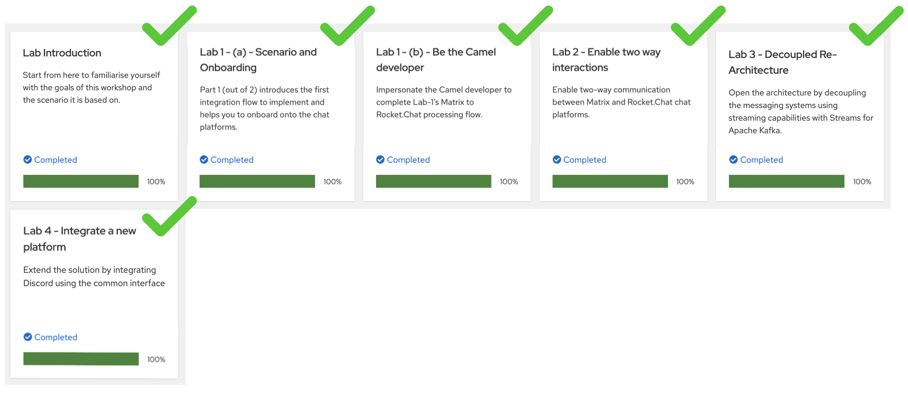
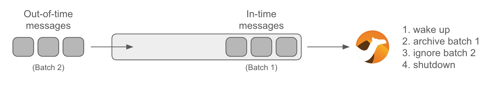
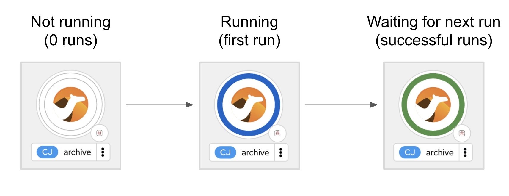
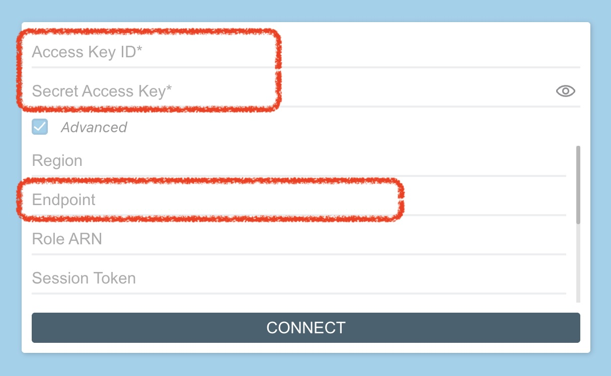

:walkthrough: Storage
:user-password: openshift
:namespace: {user-username}-devspaces

:url-codeready: http://devspaces.{openshift-app-host}/
:url-devconsole: {openshift-host}/topology/ns/{namespace}
:url-rocketchat: https://rocketchat-rocketchat.{openshift-app-host}
:url-filestash: https://filestash-filestash.{openshift-app-host}

:url-docserver: https://docserver-webapp.{openshift-app-host}
//:url-docserver: https://docserver-webapp.apps.cluster-d9jg6.dynamic.redhatworkshops.io

:experimental:

// WORKS
:style-kbd: kbd { \
  color: black; \
  background-color: lightgrey; \
  border: 1px solid black; \
  box-shadow: 0px 1px black; \
  font-size: .85em; \
  line-height: .85em; \
  display: inline-block; \
  font-weight: 600; \
  letter-spacing: .05em; \
  padding: 3px 5px; \
  white-space: nowrap; \
  border-radius:5px; \
} \

:cp-btn: pass:[<svg fill="currentColor" height="1em" width="1em" viewBox="0 0 448 512" aria-hidden="true" role="img" style="vertical-align: -0.125em;"> <path d="M320 448v40c0 13.255-10.745 24-24 24H24c-13.255 0-24-10.745-24-24V120c0-13.255 10.745-24 24-24h72v296c0 30.879 25.121 56 56 56h168zm0-344V0H152c-13.255 0-24 10.745-24 24v368c0 13.255 10.745 24 24 24h272c13.255 0 24-10.745 24-24V128H344c-13.2 0-24-10.8-24-24zm120.971-31.029L375.029 7.029A24 24 0 0 0 358.059 0H352v96h96v-6.059a24 24 0 0 0-7.029-16.97z"></path></svg>]

:style-summary: summary {cursor: pointer; list-style: none;}
:style-triangle: .triangle {margin-right: .5em;} summary:hover .sumtext {text-decoration: underline;}
:style-details:  .triangle::before {content: "▶";} details[open] .triangle::before {content: "▼";}
:style-open-close: {style-summary}{style-triangle}{style-details} 

:style-preview: pre {background-color: #272822; color: white; padding: 5px 15px; font-size: 15px}
:style-indent: .indent2 {padding-left: 2rem;}
:style-all: pass:a[]

:docserver-status: pass:a[ response.text()) \
        .then(data => this.parentElement.innerHTML = 'Status: 

&nbsp;
') \
        .catch(error => this.parentElement.innerHTML = 'Status: 

&nbsp;
') \
      ">]

:freplace: pass:[function replaceTokens(templateString, values) { \
    const valueArray = values.split(',').map(val => val.trim()); \
    let result = templateString; \
    let replaceIndex = 0; \
    while (result.includes('REPLACE') && replaceIndex < valueArray.length) { \
        result = result.replace('REPLACE', valueArray[replaceIndex]); \
        replaceIndex++; \
    } \
    return result; \
}]

:fdocserver: pass:a[function docserver(target,template,params) { \
    {freplace} \
    fetch('{url-docserver}'+params.trim()) \
        .then(response => response.text()) \
        .then(data => {target.firstChild.data=replaceTokens(text, data);}) \
        .catch(error => room = 'Error fetching data: ' + error.message); \
}]

:fcopy: pass:a[function copy(el) { \
  el.previousElementSibling.select(); \
  text = el.previousElementSibling.textContent; \
  console.log(text); \
  navigator.clipboard.writeText(text + '\n') \
        .then(response => console.log('Text with carriage return copied to clipboard!')) \
        .catch(err => console.error('Failed to copy: ', err)); \
}]

:copypaste: pass:a[ \

 \
  <textarea readonly style="field-sizing: content;border: none; background-color: #f0f0f0; width: 100%; resize: none; font-size:14px; font-family: monospace;padding: 5px 15px" rows="1">function example() { \
  console.log("Hello {replace-with-previous}!"); \
  return true; \
}</textarea> \
  <button class="mytooltip" onclick="{fcopy} copy(this);" style="border: none; background-color: white; padding: 5px 15px; border-bottom: 1px solid transparent; transition: border-bottom-color 0.2s;"> \
    <svg fill="currentColor" height="1em" width="1em" viewBox="0 0 448 512" aria-hidden="true" role="img" style="vertical-align: -0.125em;"> \
      <path d="M320 448v40c0 13.255-10.745 24-24 24H24c-13.255 0-24-10.745-24-24V120c0-13.255 10.745-24 24-24h72v296c0 30.879 25.121 56 56 56h168zm0-344V0H152c-13.255 0-24 10.745-24 24v368c0 13.255 10.745 24 24 24h272c13.255 0 24-10.745 24-24V128H344c-13.2 0-24-10.8-24-24zm120.971-31.029L375.029 7.029A24 24 0 0 0 358.059 0H352v96h96v-6.059a24 24 0 0 0-7.029-16.97z"></path> \
    </svg> \
    Copy to clipboard \
  </button> \
   \

 \
 \
]

:snippet: pass:a[ \

 \

 \
 \
]

:room: pass:a[ \
 \
]

ifdef::env-github[]
endif::[]

[id='lab5-storage']
= Lab 5 - Add Storage to the Architecture

Use OpenShift Data Foundation to provide storage capabilities and services to the MessageHub platform.

[type=walkthroughResource,serviceName=openshift]
.Doc System
****
[subs=attributes]
++++

{docserver-status}

++++
****

Prerequisites: +
--
* Ensure you have previously completed the following tiles:
+

{empty} +
--

All the lab stages you have completed so far have focussed on interconnecting independent instant messaging platforms. This lab however simulates the need to respond to government regulations (or policies alike) to meet legal and business data archival requirements.

Adding _Kafka_ in the architecture was a strategical decision. Any type of message broker would have qualified, except we chose _Kafka_ because of its ability to replay data streams.

In the context explained, the plan is to process data streams from room conversations and transfer them to a storage layer dedicated to meet the data retention requirements.

image::images/data-flow.png[align="center", width=60%]

In the diagram above we see a number of instant messaging platforms interacting together via _Kafka_. The depicted _Camel_ process represents the new integration to develop responsible to replay streams and push conversations to the storage system.

The clock in the diagram illustrates an on/off mechanism described as follows: the _OpenShift_ platform starts up the new _Camel_ process at scheduled intervals, for example once a day, to process and archive daily conversations. Once the job done, the platform shutdowns the _Camel_ process until the next scheduled run.

{empty} +

Difficulty level: +
--
* *MEDIUM/ADVANCED* +
{empty} +
--

Technical goals and milestones:

* Use of _Camel DSL_ and _Java_ for more advanced use cases.
* Coordination of multiple Camel routes
* Use of various  EIPs (_Enterprise Integration Patterns_)
* Use of _Camel JBang_ for fast prototyping
* Local execution and testing
* Resources optimisation in _OpenShift_
* Integration with _OpenShift's_ storage layer (_OpenShift Data Foundation_)

{empty} +

[time=5]
[id="daily-storage"]
== Understand the end-to-end process

The process to implement is not a trivial one, it requires to perform a series of well coordinated actions. To start with, the scheduler mechanism is based on _Kubernetes_ cronjobs, which can be leveraged with _Camel_ and _Quarkus_.

The _Kubernetes_ plugin (in _Camel JBang_) includes the concept of _'Traits'_. These are capabilities that can be enabled/disabled or configured to customise the behaviour of the final deployed integration. The `Cron` trait allows us to program scheduled runs of the integration, _OpenShift_ will automatically fire off an instance that will start processing _Kafka_ events. When the end of the data stream is reached, the process shuts down.

NOTE: The `cron` trait is pending to be finalised in the Kubernetes plugin. For now it needs to be manually activated.

{empty} +

=== Process overview

The diagram below describes the _Camel_ process to be implemented. This integration involves multiple EIPs (_Enterprise Integration Patterns_) in combination with _Java_ code to fully deliver the expected behaviour.

image::images/processing-flow-storage.png[align="center", width=100%]

There are 5 main steps involved:

====
* *A Kafka consumer* +
Consumes events from _Kafka_.

* *A custom controller* +
Java process responsible to coordinate the aggregator with the cronjob to accurately control the start/end of the data stream processing. +

* *A data transformer* +
Formats JSON messages into CSV entries in preparation for the aggregation action. +

* *An aggregator* +
Merges all the incoming messages into a single body that contains all the CSV entries of a daily digest of a chat room. +

* *An S3 producer* +
Uploads the daily digest into an S3 bucket.
====

{empty} +

=== The custom controller

One tricky scenario you must handle with care is how to prevent the cronjob from killing the _Camel_ instance too early. Let's explain it in more detail.

The cronjob knows when to kill a running instance once _Camel_ reports the number of _Exchanges_ in-flight (still executing) is nil.

NOTE: An `_Exchange_` is the Java object _Camel_ creates encapsulating the incoming message (and its context). It traverses the _Camel_ route (processing steps) from start to finish, at which point the exchange is disposed.

While an in-flight exchange walks the _Camel_ route from start to finish, the _Aggregator EIP_ creates and keeps a copy that is merged with other preceding and following exchanges. When all exchanges reach the end of transit, the _Camel_ instance informs the cronjob no live (in-flight) exchanges are in execution, however, the aggregator EIP may still be waiting for more exchanges to digest. What this all means is that the cronjob might kill the _Camel_ instance before the aggregation had time to be completed.

The controller, implemented as a Java class and integrated with _Camel_, will help to prevent the cronjob from shutting down _Camel_ too early. 

{empty} +

==== End of stream

Another consideration to have in mind is how to determine the end (in the current run) of the data stream. As far as the _Kafka_ consumer is concerned, it will keep creating _Camel_ exchanges as long as _Kafka_ messages are available, the listener is always active. As developers, we need to decide where the cut off point will be.

The adopted strategy in this lab (surely other strategies are possible) is to define a windowed time interval, inside which messages are accepted, and consider late arrivals as discarded. Meanwhile, our aggregator can operate in a similar time window and, when reaching its time limit, close the collection and push the aggregated data to storage.

{empty} +

==== Sequence diagram

To best understand all that was described above, look at the sequence diagram below depicting all the interactions between the different entities involved. 

{empty} +

image::images/seq-diagram-camel-run.png[align="center", width=60%]

{empty} +

[NOTE] 
--
Pay special attention to the following diagram highlights:

* For every incoming event, _Camel_ notifies the controller.
* The time window (in green) for accepting messages (to aggregate) starts when the controller gets its first notification.
* Subsequent notifications (new messages) reset the time window.
* All aggregated messages are committed to _Kafka_.
* When the time window closes (in yellow), late arrivals (like Message 3) are ignored.
* Non committed (in this run) events are reprocessed on subsequent cronjob runs.
* The controller ensures the `in-flight=0` is only reported when the aggregator completes and the data is pushed to storage. 
--

{empty} +

=== End of section

[type=verification]
Did you understand the role of the controller running with Camel?

[type=verificationSuccess]
Get ready to implement the Camel process !

[type=verificationFail]
Review the notes above and study the sequence diagram again.

[time=1]
[id="initialise"]
== Initialise the lab exercise
{style-all}

[type=taskResource]
.Credentials
****
* *username:* `{user-username}`
//* *password:* `{user-password}`
****
[type=taskResource]
.Red Hat OpenShift Dev Spaces
****
* link:{url-codeready}[Console, window="_blank"]
****
[type=taskResource]
.Red Hat OpenShift Developer Console
****
* link:{url-devconsole}[Topology View, window="_blank"]
****

=== Clean up your environment

Before you start this lab, make sure you close in your editor all the tabs (source files) from the previous exercise.

. Close tabs
+
1) Click on the file explorer's `...` button +
2) Ensure your `Open Editors` is ticked [√] +
3) Click the `Close all Editors` button.
+
{blank}
+
image::images/crw-close-tabs.png[align="left", width=100%]
+
{blank}

{empty} +

=== Setup your Lab folder

* Next, prepare your lab by issuing the following command:
+
--
{copypaste}
----
step 16
----
--
+
TIP: pass:[Run the command above anytime to reset the exercise. 

  

    
    Click for more information
  

The workshop includes handy helper scripts that let you jump to any step or reset the lab to a known good state:

  <ul>
    <li><strong>step N</strong>  – reset the lab to the beginning of step N</li>
    <li><strong>steps</strong> – list all available steps in the lab</li>
    <li><strong>start</strong> or <strong>restart</strong> – go to the very beginning (equivalent to <code>step 1</code>)</li>
    <li><strong>ff</strong> – fast-forward to the <strong>next</strong> step</li>
    <li><strong>rw</strong> – rewind to the <strong>previous</strong> step</li>
  </ul>

]

{empty} +

=== Your files

After initialisation, under the `lab` directory, you'll find the following source files:

--
[.indent2]
📁 workshop +
&nbsp;&nbsp;📁 lab +
&nbsp;&nbsp;&nbsp;&nbsp;📁 archive +
pass:[<mark style="padding-left: 2rem; background-color: white; color: grey"><b>⚙</b></mark>] application-dev.properties +
pass:[<mark style="padding-left: 2rem; background-color: white; color: grey"><b>⚙</b></mark>] application.properties +
pass:[<mark style="padding-left: 2rem; background-color: white; color: purple"><b><i>&nbsp;!&nbsp;&nbsp;</i></b></mark>]*archive.camel.yaml* +
pass:[<mark style="padding-left: 2rem; background-color: white; color: red"><b>J</b></mark>] *helper.java* +
pass:[<mark style="padding-left: 1rem; background-color: white; color: grey"><b>⚙</b></mark>] matrix.properties +
pass:[<mark style="padding-left: 1rem; background-color: white; color: grey"><b>⚙</b></mark>] rocketchat.properties +
--

{blank}

Make sure the files are visible in your file explorer in the left panel of _VSCode_. +
Feel free to inspect the files in your editor. +

{empty} +

[time=2]
[id="inspect-controller"]
== Inspect the Controller implementation
{style-all}

This lab provides the Java class `helper.java` containing the _Controller_ logic and the _Aggregation_ strategy. For now let's focus on the _Controller_ functionality.

In your Java file you will find the following code that implements the _Controller_ logic. +
Familiarise yourself with the *_Controller_*, inspect carefully the code below:

++++
<code style="font-family:Consolas,Monaco,'Courier New',monospace;font-size:14px;line-height:0.6;background:#1e1e1e;color:#d4d4d4;padding:12px;border-radius:6px;display:inline-block;overflow:auto;white-space:pre">
//Controller implementation 
return new Controller(){ 
 
    // Helper variables 
    boolean expiredTimeWindow = false; 
    CountDownLatch latch      = null; 
    long lastMessageTime      = 0; 
 
 
    public synchronized void newMessage(CamelContext context) { 
 
        //initialise when first message comes in 
        if(latch == null){ 
            lastMessageTime = System.currentTimeMillis(); 
            latch = new CountDownLatch(1); 
            context.createProducerTemplate().asyncSendBody("direct:wait-until-aggregation-done", null); 
        } 
 
        //calculate time split between last 2 messages 
        long now = System.currentTimeMillis(); 
        long elapsed = now - lastMessageTime; 
 
        //if message not in the time window, we stop processing messages. 
        if(elapsed &gt; cutoffTime){ 
            expiredTimeWindow = true; 
        } 
 
        //reset time 
        lastMessageTime = now; 
    } 
 
    public void waitUntilAggregationDone() throws Exception { 
        if(latch != null){ 
            latch.await(); 
        } 
    } 
 
    public void aggregationDone() throws Exception{ 
        latch.countDown(); 
    } 
 
    public boolean isTimeWindowExpired() { 
        return expiredTimeWindow; 
    } 
}; 
</code>
++++

{empty} +

In the code above you'll find:

* Helper variables used in the code:
** `expiredTimeWindow`: a flag indicating no more events are accepted.
** `latch`: the retain/release mechanism to keep the process alive.
** `lastMessageTime`: to monitor the time the last event arrived. +
{empty} +

* A method `newMessage` for _Camel_ to invoke on new event arrivals.
+
This method is responsible to create and maintain the time window.
+
[NOTE]
--
Upon first event arrival, this method will: +

* Set arrival time
* Initialise the latch
* Trigger the `wait-until-aggregation-done` Camel route. +
This action maintains an _Exchange_ always alive (in-flight) to prevent the cronjob from terminating _Camel_ too early. 
--

* A method `waitUntilAggregationDone` that waits for the latch to be released. +
This method is invoked from the `wait-until-aggregation-done` _Camel_ route. +
{empty} +

* A method `aggregationDone` to announce the run has completed. +
The aggregator logic invokes this method to signal completion. +
{empty} +

* A method `isTimeWindowExpired` to return the status of the variable. +
The method is invoked from the _Camel_ route to evaluate if an incoming event falls in or outside the time window. +
{empty} +

[time=2]
[id="inspect-aggregation-strategy"]
== Inspect the Aggregation strategy

The _Camel Aggregation EIP_ manages for you the coordination with the _Camel_ framework when aggregating data, and provides some common strategies out-of-the-box. However, data can be aggregated in many ways. Depending on your use case, you'll use one approach or another.

To customise the _Aggregation EIP_, _Camel_ allows you to define your own _Aggregation_ strategy in Java. In our case, we require some special handling, and therefore we need our own custom aggregation strategy.

TIP: If you want to know more about the inner workings of this EIP, take a look at Camel's https://camel.apache.org/components/3.18.x/eips/aggregate-eip.html[_Aggregate EIP_] documentation.

In the same Java class `helper.java` you will find the _Aggregation_ strategy used by the _EIP_ in the _Camel_ route.

Inspect carefully the code below to familiarise yourself with it:
++++
<code style="font-family:Consolas,Monaco,'Courier New',monospace;font-size:14px;line-height:0.6;background:#1e1e1e;color:#d4d4d4;padding:12px;border-radius:6px;display:inline-block;overflow:auto;white-space:pre">
@BindToRegistry 
public static AggregationStrategy msgStrategy(){ 
 
    return new AggregationStrategy() { 
 
        public Exchange aggregate(Exchange oldExchange, Exchange newExchange) { 
 
            // Manual Kafka commit 
            // Messages not commited will be retried and subsequent Cron runs 
            newExchange 
                .getIn() 
                .getHeader(KafkaConstants.MANUAL_COMMIT, KafkaManualCommit.class) 
                .commit(); 
 
            if (oldExchange == null) { 
                return newExchange; 
            } 
 
            String oldBody = oldExchange.getIn().getBody(String.class); 
            String newBody = newExchange.getIn().getBody(String.class); 
 
            oldExchange.getIn().setBody(oldBody + newBody); 
            return oldExchange; 
        } 
    }; 
} 
</code>
++++

{empty} +

In the code you'll find the following highlights:

* A Kafka commit is executed first to guarantee this incoming event will not be re-processed on subsequent cronjob runs.

* When the first message comes in, an `oldExchange` (from preceding iterations) does not exist, so the method returns without any extra processing.

* On normal aggregations (old and new exchanges provided), the method appends the new data to the already aggregated data from preceding iterations (handed in the `oldExchange`).

{empty} +

[time=5]
[id="create-camel-routes"]
== Define the Camel routes

Let's recap how the _Camel_ process workflow should shape up:

image::images/processing-flow-storage.png[align="center", width=100%]

There are 5 main steps involved:

====
* *A Kafka consumer* +
Consumes events from _Kafka_.

* *A custom controller* +
Java process responsible to coordinate the aggregator with the cronjob to accurately control the start/end of the data stream processing. +

* *A data transformer* +
Formats JSON messages into CSV entries in preparation for the aggregation action. +

* *An aggregator* +
Merges all the incoming messages into a single body that contains all the CSV entries of a daily digest of a chat room. +

* *An S3 producer* +
Uploads the daily digest into an S3 bucket.
====

{empty} +

NOTE: Do not hesitate to navigate back to previous chapters to have a second look to the detailed sequence diagram describing the interactions.

{empty} +

=== Accelerated Development

[type=taskResource]
.Credentials
****
* *username:* `{user-username}`
//* *password:* `{user-password}`
****
[type=taskResource]
.Red Hat OpenShift Dev Spaces
****
* link:{url-codeready}[Console, window="_blank"]
****
[type=taskResource]
.Red Hat OpenShift Developer Console
****
* link:{url-devconsole}[Topology View, window="_blank"]
****

Although the code required is small, the end-to-end process is not trivial, it has various parts at play that need to be well coordinated. To accelerate the development phase, a good developer would want to prototype and test locally, iterating over the code until its implementation is fully validated.

{empty} +

=== Process definition

Time to get started. +
Follow the steps below to create the route definitions.

[TIP]
======
⏩ *Fast-Forward*

[.underline]#*Only*# if you want to skip (fast-forward) this section, execute in your terminal the commands below:

--
{copypaste}
----
ff
----
--
======

For a manual creation process:

. Find in your directory tree the following resource:
+
--
* `archive.camel.yaml`
+
Click to open it in _Kaoto_. +
It will present a banner informing you no routes are defined.
--
+
{empty} +

[start=2]
. Create the Camel routes
+
Open the file in source code view (text mode). +
In your editor (upper-right corner), find and click the button pass:[<code style="background-color: black; color: white; padding: 10px; border-radius: 5px; font-family: console;"><b>&lt; / &gt;</b></code>]
+
The action above should open the empty source code file in text mode.
+
{empty} +
+
[start=1]
1. Include the main _Camel_ route 
+
Append in your `archive.camel.yaml` the main _Camel_ route.
+
Click the {cp-btn} button (Copy to clipboard), and paste the code in the text editor.
+
--
{copypaste}
----
- route:
    id: main
    from:
      uri: kafka
      parameters:
        topic: "{{kafka.topic}}"
        brokers: my-cluster-kafka-bootstrap:9092
      steps:
        - bean:
            method: newMessage
            ref: controller
        - filter:
            expression:
              simple:
                expression: "${bean:controller?method=isTimeWindowExpired}"
            steps:
              - log:
                  message: "time window closed, ignoring event: ${body}"
              - stop: {}
        - log:
            message: "got new message: ${body}"
        - unmarshal:
            json: {}
        - marshal:
            csv: {}
        - aggregate:
            steps:
              - bean:
                  method: aggregationDone
                  ref: controller
              - to:
                  uri: direct
                  parameters:
                    name: archive-data
            aggregationStrategy: "msgStrategy"
            completionTimeout: "{{message.aggregator.timeout}}"
            correlationExpression:
              constant:
                expression: "true"
----
--
+
[NOTE] 
--
In the Camel route above:

* The Kafka consumer pulls messages (from your Kafka cluster).

* The controller gets notified for every message that comes in.

* A `filter` clause is evaluated to determine if the event is accepted.

* The incoming JSON body is converted (`unmarshal`/`marshal`) to CSV using out-of-the-box transformers (known as _Camel DataFormats_).

* An aggregator, configured with the Java custom strategy `msgStrategy`:
** It signals the controller when the aggregation has concluded.
** It directs the result to another route in charge of storing the data.
--
+
{empty} +

1. Include the 'keep-alive' _Camel_ route 
+
The following route is triggered by the _Controller_ to ensure the _Camel_ instance is kept alive, preventing the cronjob from terminating it too early.
+
Append in your `archive.camel.yaml` the following _Camel_ route.
+
Click the {cp-btn} button (Copy to clipboard), and paste the code in the text editor.
+
--
{copypaste}
----
- route:
    id: keep-alive
    from:
      uri: direct
      parameters:
        name: wait-until-aggregation-done
      steps:
        - log:
            message: waiting for aggregation to finish...
        - bean:
            method: waitUntilAggregationDone
            ref: controller
        - log:
            message: Aggregation has completed.
----
--
+
[NOTE] 
--
In the Camel route above:

* The controller is invoked to force the _Exchange_ traversing this route to wait for the latch to be released.
--
+
NOTE: Keeping at least one exchange alive ensures the condition `in-flight = 0` is always `false`, thus preventing the instance from being terminated.
+
{empty} +

1. Include the _Camel_ route responsible to archive the data. 
+
NOTE: Remember, for simplicity, the route will bypass the action of pushing data to the storage layer. +
Later, before deploying on OpenShift, the S3 connector will be added.
+
The following route is triggered by the _Aggregator_ when the aggregation is closed.
+
Append in your `archive.camel.yaml` the following _Camel_ route.
+
Click the {cp-btn} button (Copy to clipboard), and paste the code in the text editor.
+
--
{copypaste}
----
- route:
    id: archive-data
    from:
      uri: direct
      parameters:
        name: archive-data
      steps:
        - log:
            message: "ready to archive aggregated data:\\n${body}"
        - log:
            message: archiving done.
----
--
+
NOTE: The actual S3 endpoint is missing to archive the data. This is on purpose to simplify testing in the next section.
+
NOTE: When the aggregator releases the latch, the retained _Exchange_ from the 'keep-alive' route completes and gets disposed. +
The condition `in-flight = 0` is however still `false` because a new _Exchange_ is in-flight to push the data to storage.
+
{empty} +
+
Make sure you save all the changes done (automatic by default in _OpenShift Dev Spaces_).
+
{empty} +

You should find in the Kaoto canvas all the routes rendered as follows:

PENDING IMAGE TO BE ADDED.

{empty} +

[type=verification]
Do you see all the routes rendered in the Kaoto canvas?

[type=verificationSuccess]
Excellent !

[type=verificationFail]
Review the steps and try again.

[time=5]
[id="run-test-locally"]
== Run and test locally
{style-all}

The technique you'll employ to simplify the development and testing cycle, will be to mock messages coming in and going out of the process: in this case _Kafka_ source events, and files created in _S3_ (storage layer).

image::images/processing-flow-with-mocks.png[align="center", width=60%]

The strategy to confidently validate the process will be to run it locally. +
You'll manually emit Kafka events and observe the behaviour of the system, bypassing the push to _S3_.

Follow the instructions below to recreate different execution scenarios which will allow you understand how the process works and validate its implementation.

{empty} +

[type=taskResource]
.Credentials
****
* *username:* `{user-username}`
//* *password:* `{user-password}`
****
[type=taskResource]
.Red Hat OpenShift Dev Spaces
****
* link:{url-codeready}[Console, window="_blank"]
****
[type=taskResource]
.Red Hat OpenShift Developer Console
****
* link:{url-devconsole}[Topology View, window="_blank"]
****

=== Check the configuration

Before you put the wheels in motion, inspect the configuration file provided:

* `applications-dev.properties`
+
NOTE: The `dev` profile indicates this configuration is used locally during the development phase.
+
++++
<code style="font-family:Consolas,Monaco,'Courier New',monospace;font-size:14px;line-height:0.6;background:#1e1e1e;color:#d4d4d4;padding:12px;border-radius:6px;display:inline-block;overflow:auto;white-space:pre">
# When idle, time Camel will wait before shutting down 
camel.main.duration-max-idle-seconds=5 
 
# Time the aggregator will wait for messages before the archiving process is triggered 
message.aggregator.timeout = 30000 
 
# Cut-off time the controller uses to allow messages to be aggregated. 
# Messages arriving after cut-off time will be aggregated in the next cron run 
# Attention: cut-off time should be less than aggregator timeout 
messege.controller.cutoff.time = 2000 
 
# Kafka configuration 
kafka.topic=dev 
</code>
++++
+
NOTE: The property `duration-max-idle-seconds` indicates Camel to shutdown when idle (needed for cron job executions).
+
[NOTE]
====
The values (millis) `30000` and `2000` are greatly exagerated for learning purposes. +
They've been purposefully chosen to allow you understand the execution.

* The property `message.aggregator.timeout` sets the time limit to wrap up the aggregation process.
* The property `messege.controller.cutoff.time` defines the time window to accept Kafka events.
====
+
NOTE: The property `kafka.topic` configures a topic dedicated to testing purposes.

{empty} +

=== First run: no Kafka events

In this first run, no _Kafka_ events are available, the _Kafka_ topic is empty. +
When _Camel_ starts, it connects to _Kafka_, initiates consumption and stays idle for a few seconds.

Because the configuration includes `duration-max-idle-seconds`, _Camel_ will stop and shutdown.

{blank}

. Run the process by issuing the following command:
+
--
{copypaste}
----
camel run archive/*
----
--
+
Observe in the logs Camel connecting to Kafka. Because no events are consumed Camel decides to shutdown.
+
Somewhere in the logs you should find following lines:
+
++++
<pre style="line-height: 1;">2025-11-05 20:21:36.489 INFO 11569 --- [pool-4-thread-1] camel.main.MainDurationEventNotifier : Duration max idle triggering shutdown of the JVM
2025-11-05 20:21:36.492 INFO 11569 --- [ownCamelContext] mel.impl.engine.AbstractCamelContext : Apache Camel 4.15.0 (archive) is shutting down (timeout:10s)
...
2025-11-05 20:21:41.624 INFO 11569 --- [ownCamelContext] mel.impl.engine.AbstractCamelContext : Apache Camel 4.15.0 (archive) shutdown in 5s331ms (uptime:10s)
2025-11-05 20:21:41.624 INFO 11569 --- [           main] org.apache.camel.main.MainSupport    : Apache Camel (JBang) 4.15.0 shutdown
</pre>
++++
+
{empty} +

=== Second run: consume and aggregate

This time, you want to recreate a scenario where _Camel_ consumes events from _Kafka_ and reacts.

{blank}

. First, use _Camel JBang_ to push sample events to _Kafka_. +
The following command sends several messages to _Kafka_:
+
--
{copypaste}
----
for i in {1..3}; do \
camel cmd send \
--body '{"user":"tester","text":"message '$i'"}' \
--uri kafka:dev?brokers=my-cluster-kafka-bootstrap:9092; \
done
----
--
+
You should see an output similar to:
+
++++
<pre style="line-height: 1;">2025-11-05 21:30:23.853  11812 --- kafka://dev?brokers=my-cluster-kafka-boo : Sent (success) (695ms)
2025-11-05 21:30:28.975  11912 --- kafka://dev?brokers=my-cluster-kafka-boo : Sent (success) (701ms)
2025-11-05 21:30:34.180  12019 --- kafka://dev?brokers=my-cluster-kafka-boo : Sent (success) (729ms)
</pre>
++++
+
{empty} +

. Now, run Camel and observe its behaviour.
+
--
{copypaste}
----
camel run archive/*
----
--
+
NOTE: Be patient, Camel will consume the messages and will wait `30` seconds before closing the aggregation.
+
Somewhere in the logs you should find following lines:
+
++++
<pre style="line-height: 1;">2025-11-05 21:46:23.839  INFO 12160 --- [kaConsumer[dev]] archive.yaml:20           : got new message: {"user":"tester","text":"message 1"}
2025-11-05 21:46:23.842  INFO 12160 --- [roducerTemplate] archive.yaml:48           : waiting for aggregation to finish...
2025-11-05 21:46:23.895  INFO 12160 --- [kaConsumer[dev]] archive.yaml:20           : got new message: {"user":"tester","text":"message 2"}
2025-11-05 21:46:23.907  INFO 12160 --- [kaConsumer[dev]] archive.yaml:20           : got new message: {"user":"tester","text":"message 3"}
2025-11-05 21:46:54.064  INFO 12160 --- [roducerTemplate] archive.yaml:53           : Aggregation has completed.
2025-11-05 21:46:54.065  INFO 12160 --- [#8 - Aggregator] archive.yaml:63           : ready to archive aggregated data:
tester,message 1
tester,message 2
tester,message 3

2025-11-05 21:46:54.065  INFO 12160 --- [#8 - Aggregator] archive.yaml:65           : archiving done.
2025-11-05 21:46:59.359  INFO 12160 --- [pool-4-thread-1] MainDurationEventNotifier : Duration max idle triggering shutdown of the JVM
2025-11-05 21:46:59.361  INFO 12160 --- [ownCamelContext] AbstractCamelContext      : Apache Camel 4.15.0 (archive) is shutting down (timeout:10s)
</pre>
++++
+
[NOTE]
====
Observe the following facts:

* All Kafka messages are consumed almost instantly.
* Camel waits approximately 30 seconds to close the aggregation process.
* The data to be archived has been transformed from CSV to JSON (yellow highlights).
====
+
Camel finishes this round and shutsdown.
+
{empty} +

=== Third run: events out of time window discarded

For this last local run, you want to see how the time window operates. +
You'll recreate a scenario where some events are consumed whithin the accepted time window, and others are consumed too late and get ignored.

{blank}

It's important to remember how these configuration properties affect the system:

++++
<code style="font-family:Consolas,Monaco,'Courier New',monospace;font-size:14px;line-height:0.6;background:#1e1e1e;color:#d4d4d4;padding:12px;border-radius:6px;display:inline-block;overflow:auto;white-space:pre">
# Time the aggregator will wait for messages before the archiving process is triggered 
message.aggregator.timeout = 30000 
 
# Cut-off time the controller uses to allow messages to be aggregated. 
# Messages arriving after cut-off time will be aggregated in the next cron run 
# Attention: cut-off time should be less than aggregator timeout 
messege.controller.cutoff.time = 2000 
</code>
++++

{blank}

Why the settings above?

* The value `2000` (2 seconds) is low to ensure the time window is closed early. 
* The value `30000` (30 seconds) is high to ensure you can send messages out of the time window before _Camel_ shutsdown.

{empty} +

==== Begin your test

{blank}

. One more time, use _Camel JBang_ to push sample events to _Kafka_. +
The following command sends several messages to _Kafka_:
+
--
{copypaste}
----
for i in {1..3}; do \
camel cmd send \
--body '{"user":"tester","text":"message '$i'"}' \
--uri kafka:dev?brokers=my-cluster-kafka-bootstrap:9092; \
done
----
--
+
NOTE: This first batch sends messages 1, 2 and 3.
+
You should see an output similar to:
+
++++
<pre style="line-height: 1;">2025-11-06 09:20:07.853  11812 --- kafka://dev?brokers=my-cluster-kafka-boo : Sent (success) (695ms)
2025-11-06 09:20:07.975  11912 --- kafka://dev?brokers=my-cluster-kafka-boo : Sent (success) (701ms)
2025-11-06 09:20:07.180  12019 --- kafka://dev?brokers=my-cluster-kafka-boo : Sent (success) (729ms)
</pre>
++++
+
{empty} +

. Prepare a second terminal.
+
If you don't already have one, open a second terminal. +
You'll use one terminal to run _Camel_, and another terminal to push more messages while Camel runs.
+
Be ready to run Camel on terminal 1, see the Kafka messages coming in, then switch to terminal 2 and send extra messages out of the time window.
+
{empty} +

. Run Camel to start consuming Kafka messages.
+
NOTE: When Camel starts it'll start consuming messages, be ready to switch to terminal 2.
+
--
{copypaste}
----
camel run archive/*
----
--
+
Wait to see the Kafka messages being consumed.
+
{empty} +

. Send another batch of messages
+
NOTE: By now, the time window (2 seconds) should have closed. +
New messages consumed from Kafka will get discarded.
+
Switch to the other terminal and run:
+
--
{copypaste}
----
for i in {4..6}; do \
camel cmd send \
--body '{"user":"tester","text":"message '$i'"}' \
--uri kafka:dev?brokers=my-cluster-kafka-bootstrap:9092; \
done
----
--
+
NOTE: The second batch sends messages 4, 5 and 6.
+
Terminal 1 should show an output similar to the following logs:
+
++++
<pre style="line-height: 1;">2025-11-06 09:21:07.839  INFO 2123 --- [kaConsumer[dev]] archive.yaml:20           : got new message: {"user":"tester","text":"message 1"}
2025-11-06 09:21:07.842  INFO 2123 --- [roducerTemplate] archive.yaml:48           : waiting for aggregation to finish...
2025-11-06 09:21:07.895  INFO 2123 --- [kaConsumer[dev]] archive.yaml:20           : got new message: {"user":"tester","text":"message 2"}
2025-11-06 09:21:07.907  INFO 2123 --- [kaConsumer[dev]] archive.yaml:20           : got new message: {"user":"tester","text":"message 3"}
2025-11-06 09:21:17.828  INFO 2123 --- [kaConsumer[dev]] archive.yaml:17           : time window closed, ignoring event: {"user":"tester","text":"message 4"}
2025-11-06 09:21:22.438  INFO 2123 --- [kaConsumer[dev]] archive.yaml:17           : time window closed, ignoring event: {"user":"tester","text":"message 5"}
2025-11-06 09:21:27.063  INFO 2123 --- [kaConsumer[dev]] archive.yaml:17           : time window closed, ignoring event: {"user":"tester","text":"message 6"}
2025-11-06 09:21:37.726  INFO 2123 --- [roducerTemplate] archive.yaml:53           : Aggregation has completed.
2025-11-06 09:21:37.727  INFO 2123 --- [#8 - Aggregator] archive.yaml:63           : ready to archive aggregated data:
tester,message 1
tester,message 2
tester,message 3

2025-11-06 09:21:37.727  INFO 2123 --- [#8 - Aggregator] archive.yaml:65           : archiving done.
2025-11-06 09:21:43.084  INFO 2123 --- [pool-4-thread-1] MainDurationEventNotifier : Duration max idle triggering shutdown of the JVM
2025-11-06 09:21:43.086  INFO 2123 --- [ownCamelContext] AbstractCamelContext      : Apache Camel 4.15.0 (archive) is shutting down (timeout:10s)
</pre>
++++
+
[NOTE]
====
Observe the following facts:

* The first batch of messages (1,2,3) is accepted (committed in Kafka).
* The second batch of messages (4,5,6) is ignored (not committed in Kafka).
* Only accepted messages (1,2,3) are transformed to CSV and sent for archiving.
====
+
Camel finishes this round and shutsdown.
+
{empty} +

. Consume and commit the second batch.
+
In the previous round, Camel ignored messages late outside the time window. They were consumed but were not committed in Kafka. Those messages are yet to be processed. In this last round you want to simulate another cron job run where pending messages are committed and sent for archiving.
+
Run Camel again with:
+
--
{copypaste}
----
camel run archive/*
----
--
+
NOTE: Be patient, Camel will consume the messages and will wait `30` seconds before closing the aggregation.
+
Somewhere in the logs you should find following lines:
+
++++
<pre style="line-height: 1;">2025-11-06 09:22:43.839  INFO 3277 --- [kaConsumer[dev]] archive.yaml:20           : got new message: {"user":"tester","text":"message 4"}
2025-11-06 09:22:43.842  INFO 3277 --- [roducerTemplate] archive.yaml:48           : waiting for aggregation to finish...
2025-11-06 09:22:43.895  INFO 3277 --- [kaConsumer[dev]] archive.yaml:20           : got new message: {"user":"tester","text":"message 5"}
2025-11-06 09:22:43.907  INFO 3277 --- [kaConsumer[dev]] archive.yaml:20           : got new message: {"user":"tester","text":"message 6"}
2025-11-06 09:23:14.064  INFO 3277 --- [roducerTemplate] archive.yaml:53           : Aggregation has completed.
2025-11-06 09:23:14.065  INFO 3277 --- [#8 - Aggregator] archive.yaml:63           : ready to archive aggregated data:
tester,message 4
tester,message 5
tester,message 6

2025-11-06 09:23:14.065  INFO 3277 --- [#8 - Aggregator] archive.yaml:65           : archiving done.
2025-11-06 09:23:19.359  INFO 3277 --- [pool-4-thread-1] MainDurationEventNotifier : Duration max idle triggering shutdown of the JVM
2025-11-06 09:23:19.361  INFO 3277 --- [ownCamelContext] AbstractCamelContext      : Apache Camel 4.15.0 (archive) is shutting down (timeout:10s)
</pre>
++++
+
[NOTE]
====
Observe the following facts:

* The second batch of messages (4,5,6) are consumed one more time (this time Camel commits them).
* The messages are processed, coverted to CSV and sent to be archived.
====
+
Camel finishes this round and shutsdown automatically.
+
{empty} +

[time=2]
[id="deploy-openshift"]
== Deploy in OpenShift
{style-all}

**WORK IN PROGRESS** +
PENDING TO BE DEFINED

[type=taskResource]
.Credentials
****
* *username:* `{user-username}`
//* *password:* `{user-password}`
****
[type=taskResource]
.Red Hat OpenShift Dev Spaces
****
* link:{url-codeready}[Console, window="_blank"]
****
[type=taskResource]
.Red Hat OpenShift Developer Console
****
* link:{url-devconsole}[Topology View, window="_blank"]
****
[type=taskResource]
.Rocket.Chat
****
* link:{url-rocketchat}[Rocket.Chat Web Client, window="_blank"]
****

While your deployed data flows with _Matrix_ and _Rocket.Chat_ are using _Kafka_ to exchange messages, during your previous local testing you simulated messages sending them to a `dev` _Kafka_ topic. You also bypassed the action of uploading the CSV data into the storage layer (powered by _OpenShift Data Foundation_).

Your next task is to complete the Camel route by adding the final integration step with S3, and to deploy the process on _OpenShift_.

{empty} +

. Include S3 integration
+
In your `archive.camel.yaml` file (in text mode), include at the very end the snippet below.
+
Click the {cp-btn} button (Copy to clipboard), and paste the code in the text editor.
+
--
{copypaste}
----
        - setHeader:
            name: CamelAwsS3Key
            simple:
              expression: myroom/${date:now:yyyy-MM-dd_HH-mm-ss}.csv
        - setHeader:
            name: CamelAwsS3ContentType
            constant:
              expression: text/csv
        - to:
            uri: aws2-s3
            parameters:
              bucketNameOrArn: "{{s3.bucket}}"
----
--
+
{empty} +

. Configure the integration
+
Include in your configuration the properties provided below:
+
IMPORTANT: Ensure you edit `application.properties` (deployment configuration).
+
--
{copypaste}/configuration/s3/access/secret
[subs=attributes]
----
# S3 credentials
camel.component.aws2-s3.accessKey=REPLACE
camel.component.aws2-s3.secretKey=REPLACE

# S3 bucket
s3.bucket=room-{user-username}
----
--
+
{empty} +

. Deploy the process
+
Execute the command below to deploy and run the integration:
+
--
{copypaste}
----
cronjob archive
----
--
+
NOTE: Be patient, this action will take some time to complete as the operator needs to download all the maven dependencies, build the application and create the image before the integration can be deployed.
+
NOTE: You will notice the use of the `cron` trait in the command. The trait instructs Camel K to deploy the integration as a _Cronjob_. It's configured to run every minute.
+
{blank}
+
Run the following command:
+
--
{copypaste}
----
oc get cronjob -w
----
--
+
{blank}
+
You'll see that _Camel K_ has materialized a cron job (it might take one minute to appear.). At first you should see something similar to:
+
----
NAME    SCHEDULE      SUSPEND   ACTIVE   LAST SCHEDULE   AGE
store   0/1 * * * ?   False     0        <none>          3s
----
+
And as time passes you'll see new entries (new executions).
+
When looking at the _Developer Console_ you will see the _Camel K_ instance transitioning through various colors (phases) indicating the state of the _Cronjob_.
+

+
After the first run (blue color), it will terminate and wait for the next run (green color). This cycle (start/stop) will continue at schedule intervals as per the cronjob configuration.
+
{empty} +

=== Viewing S3 object contents

When _Camel_ completes a run you should be able to see the S3 object in its bucket. Use an online web based S3 browser to visualise the data

. Open the S3 Browser from the link below:
+
* link:{url-filestash}[S3 Browser, window="_blank"]
+
{blank}

. Provide the following values:
+
====
* **Access Key ID**:
+
--
{copypaste}/configuration/s3/access/none
----
REPLACE
----
--

* **Secret Access Key**:
+
--
{copypaste}/configuration/s3/secret/none
----
REPLACE
----
--

* **Endpoint**:
+
--
{copypaste}
----
http://s3.openshift-storage.svc.cluster.local
----
--
+
{blank}
====
+
Paste them into the S3 login prompt:
+

+
{blank}
+
And click pass:[<code style="background-color: #456172; color: white;">&nbsp;CONNECT&nbsp;</code>]
+
{empty} +

. Once connected, navigate to your data, as per the image below: +
Ensure you select your bucket:
+
--
- `chatrooms-{user-username}`
--
+
{blank}
+
You should find a CSV file (comma separated values) containing the exchanges you triggered between the different chat platforms.
+
image::images/s3-browser-data.png[align="left", width=100%]
+
--
. Select your bucket: `chatrooms-{user-username}`
. Navigate the folders and open the CSV file.
--
+
{empty} +
+
NOTE: When no new Kafka messages are available, no aggregation occurs and therefore no upload to S3 takes place.

{empty} +

MAYBE HERE USE CAMEL JBANG ALSO TO CONSUME CSVs FROM S3

{empty} +

[type=verification]
Did you see objects created in your S3 bucket?

[type=verificationSuccess]
Excellent !

[type=verificationFail]
Review the steps and try again.
